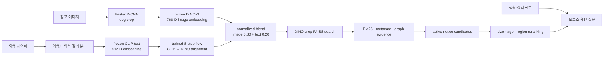

# 멍탐정 (MeongTamjeong)

> DINOv3 시각 표현과 CLIP 언어 표현을 학습된 정렬 공간에서 결합하는 유기견 멀티모달 검색 시스템

멍탐정은 참고 이미지와 자연어 외형 묘사를 함께 받아, 현재 보호 중인 유기견 공고에서 시각적으로 가까운 후보를 찾는 프로젝트입니다. 핵심 질문은 **언어에 강한 CLIP과 세밀한 시각 구조에 강한 DINOv3를 어떻게 한 검색 흐름에서 결합할 것인가**입니다.

두 모델의 임베딩은 원래 같은 공간이 아닙니다. 멍탐정은 frozen CLIP text encoder의 512차원 출력을 작은 학습형 flow head로 frozen DINOv3의 768차원 시각 공간에 정렬한 뒤, 참고 이미지 80%와 외형 텍스트 20%를 하나의 정규화된 질의 벡터로 결합합니다. 성격이나 생활 적합성처럼 사진에서 확인할 수 없는 정보는 순위에 추정해 넣지 않고, 후보 선택 후 보호소에 확인할 질문으로 전환합니다.

현재 저장소의 기본 실행은 안정적인 CLIP 경로를 사용하는 `off` 모드입니다. DINO 경로는 애플리케이션에 통합되어 있으며, 실제 전환 전에는 CLIP 결과를 그대로 제공하면서 DINO 후보와 지연시간을 함께 기록하는 `shadow` 모드를 권장합니다.

## 문제 정의

보호동물 공고는 사진 품질, 촬영 구도, 설명 길이와 작성 방식이 일정하지 않습니다. 사용자는 “이 사진과 닮은 강아지”와 “검고 흰 털의 작은 강아지”를 동시에 표현할 수 있지만, 일반적인 단일 인코더 검색은 다음 요구를 모두 만족시키기 어렵습니다.

- 참고 사진의 개체 수준 시각 특징을 충분히 보존할 것
- 한국어 외형 문장이 이미지 검색 방향을 부드럽게 조정할 것
- 공고에 없는 성격·사회성·가정 적합성을 만들어내지 않을 것
- 종료 공고와 근거가 불명확한 조건을 안전하게 처리할 것

멍탐정은 이를 하나의 예측 문제가 아니라 **시각 검색, 언어 정렬, 사실 기반 재정렬, 확인 질문 생성**의 단계적 문제로 다룹니다.

## 접근의 발전

이 프로젝트는 처음부터 현재 구조로 시작한 것이 아니라, 보호소 데이터의 라벨 불확실성을 확인하면서 문제 자체를 다시 정의해 왔습니다.

| 단계 | 처음 던진 질문 | 관찰과 결정 |
|---|---|---|
| MobileNetV2 기반 CNN 품종 분류 | “이 강아지는 어떤 품종인가?” | 순수 품종 데이터로 학습한 분류기를 검토했지만, 보호소에는 믹스견이 많고 공고 품종명도 외형 기반 추정인 경우가 있어 단일 정답 분류가 실제 탐색 목적과 맞지 않았음 |
| CLIP + FAISS 외형 유사도 검색 | “사용자가 찾는 이미지·문장과 어떤 후보가 닮았는가?” | 품종 정답 대신 이미지와 자연어의 임베딩 유사도로 후보를 찾도록 문제를 전환했으며, 이 경로는 현재도 기본 기준선과 fallback으로 유지됨 |
| DINOv3 + 정렬된 CLIP 텍스트 | “세밀한 시각 구조를 보존하면서 언어로 검색 방향을 조정할 수 있는가?” | DINOv3를 주 시각 표현으로 사용하고 CLIP 텍스트를 학습형 flow로 DINO 공간에 정렬하는 현재의 image+text 검색으로 확장 |

따라서 핵심 변화는 단순한 backbone 교체가 아니라 **품종 분류에서 외형 중심 retrieval로의 문제 재정의**입니다. 초기 MobileNetV2 학습 코드와 결과 artifact는 현재 저장소에 남아 있지 않으므로 해당 단계의 성능 수치는 주장하지 않습니다.

초기 MobileNetV2 분류기와 현재 사용하는 Faster R-CNN도 역할이 다릅니다. 전자는 품종 라벨을 예측하려던 초기 실험이고, 후자는 현재 파이프라인에서 배경으로부터 개 영역만 찾는 crop detector입니다. 실제 외형 유사도 순위는 CLIP 또는 DINOv3 임베딩이 계산합니다.

## 시스템 흐름



이미지 전처리에 쓰는 Faster R-CNN과 DINOv3의 역할은 다릅니다. Faster R-CNN은 배경에서 개 영역을 찾아 잘라내는 **위치 추정기**이고, DINOv3는 잘린 개의 형태·무늬·자세를 검색 가능한 벡터로 바꾸는 **표현 인코더**입니다.

### 공유 표현공간

외형 이미지 (x)와 외형 문장 (t)에 대해 질의는 다음처럼 구성됩니다.

```text
z_image = normalize(DINOv3(crop(x)))
z_text  = normalize(flow(CLIP_text(t)))
z_query = normalize(0.80 · z_image + 0.20 · z_text)
```

여기서 DINOv3와 CLIP의 foundation encoder는 고정되어 있고, `flow`만 이미지-텍스트 대응으로 학습합니다. 따라서 80:20은 두 모델의 신뢰 확률이 아니라 **정렬된 질의 벡터를 만드는 혼합 가중치**입니다. 권장 API는 이미지를 필수로 받으며, 분리된 실험 CLI에서는 정렬된 텍스트 단독 검색도 지원합니다.

이 head는 DINOde의 text-conditioned flow alignment 아이디어를 전역 dog-crop 검색에 맞게 독립적으로 적용한 것입니다. 원 논문의 segmentation 코드나 checkpoint를 현재 검색기에 그대로 가져온 것은 아닙니다. upstream 실행 재현과 본 프로젝트의 retrieval adaptation은 각각 [DINOde 재현 기록](experiments/dinode_reproduction/README.md)과 [flow 적용 결과](experiments/dino_fusion/DINODE_FLOW_RESULTS.md)로 분리해 두었습니다.

### 정보 사용 원칙

| 입력 정보 | 검색에서의 역할 | 시스템이 주장하지 않는 것 |
|---|---|---|
| 참고 이미지 | DINOv3 기반 외형 유사도 | 실제 성격, 건강, 공격성 |
| 색·털·귀·체형 등의 문장 | CLIP→DINO 정렬 후 외형 방향 보정 | 사진에 없는 생활 적합성 |
| 공고의 크기·나이·지역 | 후보 검색 후 사실 기반 재정렬 | 입양 적합도 |
| 성격·활동량·아동·다른 동물 선호 | 선택한 후보에 관한 보호소 질문 생성 | 자동 성격 판정 |
| 누락되거나 상충하는 정보 | `unknown`으로 유지 | 임의의 음성 또는 양성 라벨 |

`/search/appearance/image`에 “온순하고 아이와 잘 지내는 강아지”처럼 외형으로 확인할 수 없는 문장만 들어오면, 해당 문장은 이미지 순위를 바꾸지 않습니다. 공고문 약라벨로 학습한 행동 head도 외부 기관 분리 평가 기준을 통과하지 못해 기본 비활성화되어 있습니다.

## 실험 결과

아래 결과는 검색 표현의 가능성을 검토한 파일럿입니다. 내부 결과는 20~21개 질의의 작은 표본과 공고 메타데이터 기반 silver relevance를 사용하므로, 일반적인 성능 우월성이나 실제 입양 결과로 해석하면 안 됩니다.

| 평가 | 비교 | CLIP 기준선 | DINOv3 경로 | 관찰 |
|---|---|---:|---:|---|
| 내부 교차사진 21질의, 동일 1,002 crop | 같은 개체 Hit@1 | 80.95% | 90.48% | DINOv3 시각 표현의 후보 회수 신호 |
| 내부 이미지+텍스트 20질의 | 같은 개체 Hit@1 / MRR | 85% / 0.8932 | 95% / 0.9600 | 80:20 정렬 융합 |
| 내부 한국어 외형 20질의 | attribute nDCG@10 | 0.4058 | 0.5375 | flow 정렬 텍스트 포함 |
| PetFinder 기관 분리 test 77마리 | 같은 개체 Recall@10 | 0.557 | 0.877 | 외부 데이터의 시각 검색 개선 |

학습이 단순히 512차원을 768차원으로 맞춘 효과인지 확인하기 위해 random head와 text-image association을 섞어 학습한 shuffled head를 각각 5회 비교했습니다. 올바르게 대응시켜 학습한 flow의 text-only nDCG@10은 영어 0.5111, 한국어 0.7221이었고, random 평균은 0.1954/0.1512, shuffled 평균은 0.1140/0.1719였습니다. 이 통제 실험에서는 실제 이미지-텍스트 대응 학습이 필요했습니다.

반면 성격·생활 조건은 개선되지 않았습니다. 외부 203개 test 질의에서 DINO 이미지 단독 behavior nDCG@10은 0.533, 현재 정렬 텍스트 경로는 0.516이었고, 별도 학습 head의 multimodal macro ROC-AUC는 0.548이었습니다. 이 결과에 따라 성격 경로는 검색 순위에서 제외하고 질문 생성으로 분리했습니다.

세부 프로토콜과 실패 결과까지 다음 문서에 기록합니다.

- [DINOv3·CLIP 정렬 결과](experiments/dino_fusion/ALIGNMENT_RESULTS.md)
- [flow head 및 학습 통제 실험](experiments/dino_fusion/DINODE_FLOW_RESULTS.md)
- [외부 기관 분리 평가](experiments/dino_fusion_external_eval/RESULTS.md)
- [DINOv2/v3·crop/full·텍스트 비중 ablation](experiments/dino_fusion_external_eval/PERFORMANCE_ABLATION_RESULTS.md)
- [현재 시스템 결정과 적용 경계](experiments/dino_fusion/FINAL_DECISION.md)

## 무엇을 학습하는가

전체 foundation model을 fine-tuning하지 않습니다.

| 구성요소 | 상태 | 현재 규모 |
|---|---|---:|
| DINOv3 ViT-B/16 image encoder | frozen | 학습 없음 |
| OpenAI CLIP ViT-B/32 text encoder | frozen | 학습 없음 |
| CLIP→DINO hyperspherical flow | trainable | 621,984 parameters |
| 공고문 행동 head | 기본 비활성 | 검색 적용 안 함 |

2026-08-15 로컬 refresh에서는 정렬 가능한 공고 1,106건을 927 train / 179 validation으로 나눴고, flow head 학습은 CUDA에서 3.481초가 걸렸습니다. 이 시간은 RTX 4090과 이미 생성된 임베딩을 사용한 측정값입니다. 최초 모델 다운로드, dog crop 생성, DINO 인덱스 구축 시간은 포함하지 않으며 하드웨어와 데이터 수에 따라 달라집니다.

## 데이터와 재현 범위

주 데이터는 국가동물보호정보시스템 구조동물 조회 API의 공개 공고입니다.

| 스냅샷 | 공고 | 벡터 구성 | 용도 |
|---|---:|---|---|
| Git 추적 기준 스냅샷, 2026-07-26 | 기준일 active 1,516건 | CLIP text 1,516 + full image 1,228 + crop 1,002 | 기본 실행과 고정 회귀 |
| 로컬 shadow refresh, 2026-08-15 | active 1,212건 | CLIP 3,522 + DINO crop 1,138 | DINO 통합 검증 |

공고 상태는 시간이 지나면 달라지므로 검색 시 active 상태를 다시 확인해야 합니다. DINO 가중치, 생성 인덱스, 외부 평가 이미지와 로컬 refresh는 모델 약관·사진 권리·용량 문제 때문에 Git에 포함하지 않습니다. manifest에는 모델 ID, revision, 행 수, 차원, 원본 metadata와 artifact의 SHA-256을 기록하며 런타임이 이를 검증합니다.

자세한 출처, 필드, 결측 처리와 재배포 경계는 [데이터 카드](DATA_CARD.md), 모델 구성과 의도된 사용 범위는 [모델·시스템 카드](MODEL_CARD.md)를 확인하세요.

## 빠른 시작

Python 3.10을 기준으로 검증합니다.

```bash
git clone https://github.com/YuMinBee/meongtamjeong.git
cd meongtamjeong
conda env create -f environment.yml
conda activate dog-rag
```

환경 파일을 만들고 `API_KEY`를 로컬 값으로 바꿉니다. `.env`와 실제 API 키는 Git에 포함하지 않습니다.

```powershell
Copy-Item .env.example .env
```

```bash
uvicorn app.main:app --host 0.0.0.0 --port 8000
```

- 통합 데모: `http://localhost:8000/demo`
- API 문서: `http://localhost:8000/docs`
- 상태 확인: `http://localhost:8000/health`

처음 실행할 때 CLIP 또는 detector 가중치를 내려받을 수 있습니다. 기본 `DINO_FUSION_MODE=off`에서는 DINOv3와 Transformers를 로드하지 않습니다.

## 이미지와 자연어로 검색하기

권장 엔드포인트는 `POST /search/appearance/image`입니다. `ref_image`는 필수이고 `query`는 선택입니다.

```bash
curl -X POST "http://localhost:8000/search/appearance/image" \
  -H "x-api-key: <LOCAL_API_KEY>" \
  -F "ref_image=@sample-dog.jpg" \
  -F "query=검은색과 흰색 털이 섞인 작은 강아지" \
  -F "preferred_size=small" \
  -F "preferred_age=any" \
  -F "topk=5"
```

응답에는 사용된 modality, 정규화된 외형 질의, 제외된 비외형 조건, active 공고 정책, 후보별 근거가 포함됩니다. `shadow` 모드에서는 제공 순서는 CLIP 기준선 그대로 유지되고 `retrieval_upgrade`에 DINO 후보 ID, 겹침 정도와 단계별 latency가 추가됩니다.

후보를 선택한 뒤 `POST /adoption/contact_card`에 공고 ID와 생활·성격 선호를 보내면 보호소에 물어볼 질문과 문의 문구를 생성할 수 있습니다. 이는 자동 문의 전송이나 입양 신청이 아닙니다.

## DINO 경로 실행

DINOv3 모델 이용 승인을 받고 모델 약관을 확인한 뒤, 기존 환경 위에 실험 의존성을 설치합니다.

```bash
python -m pip install -r experiments/dino_fusion/requirements.txt
```

기본 crop 인덱스와 flow head는 다음 순서로 만듭니다. 정확한 crop 실험 재현에는 `dog_metas.json`의 `crop_path`에 대응하는 로컬 이미지가 필요하며, 원본 사진과 crop은 저장소에 포함되지 않습니다. 모델과 이미지 artifact를 준비하는 전체 절차는 [DINO fusion 재현 안내](experiments/dino_fusion/README.md)를 따릅니다. 모델을 이미 로컬 cache에 받은 뒤에는 `--local-files-only`를 추가해 실행 중 네트워크 접근을 막을 수 있습니다.

```powershell
python -m experiments.dino_fusion.build_index `
  --output-dir experiments/dino_fusion/artifacts/dinov3 `
  --source crop_image `
  --batch-size 16

python -m experiments.dino_fusion.train_alignment `
  --dino-index experiments/dino_fusion/artifacts/dinov3/dino.index `
  --dino-metas experiments/dino_fusion/artifacts/dinov3/dino_metas.json `
  --dino-manifest experiments/dino_fusion/artifacts/dinov3/dino_manifest.json `
  --output-dir experiments/dino_fusion/artifacts/dinode_flow `
  --architecture flow
```

그다음 `.env`에서 다음 값을 설정하고 API를 다시 시작합니다.

```dotenv
DINO_FUSION_MODE=shadow
DINO_FUSION_TEXT_WEIGHT=0.20
DINO_FUSION_BEHAVIOR_ENABLED=false
DINO_FUSION_LOCAL_FILES_ONLY=true
DINO_FUSION_FAIL_OPEN=true
DINO_FUSION_DINO_DIR=experiments/dino_fusion/artifacts/dinov3
DINO_FUSION_FLOW_DIR=experiments/dino_fusion/artifacts/dinode_flow
```

| 모드 | 동작 |
|---|---|
| `off` | CLIP 기준선만 실행하며 DINO 의존성과 artifact를 읽지 않음 |
| `shadow` | CLIP 순위를 제공하면서 동일 요청의 DINO 결과와 latency를 기록 |
| `active` | 정렬된 DINO 공간 점수를 hybrid retrieval의 주 시각 신호로 사용 |

`active`는 새로운 고정 질의와 독립적인 relevance 판정으로 `shadow` 결과를 비교한 뒤 전환해야 합니다. 같은 test 결과를 보며 가중치를 다시 조정하지 않습니다. 전체 생성·평가 명령은 [DINO fusion 재현 안내](experiments/dino_fusion/README.md)에 있습니다.

## 주요 API

| 경로 | 역할 |
|---|---|
| `POST /search/appearance/image` | 참고 이미지 + 외형 자연어 검색 |
| `POST /search/text` | 자연어 기반 검색 |
| `POST /search/profile` | 구조화 외형 조건을 포함한 검색 |
| `POST /adoption/contact_card` | 선택 후보에 대한 보호소 확인 질문 생성 |
| `GET /health` | 인덱스, release profile, DINO rollout 상태 확인 |
| `GET /rag/graph` | 검색 그래프와 근거 구조 확인 |
| `GET /demo` | 전체 사용자 흐름 데모 |

## 검증

```bash
ruff check .
pytest -q tests -k "dino_fusion or appearance_query or inquiry_helper or profile_rerank"
python scripts/evaluate_safety_contract.py --check
```

고정 검색 평가는 [검색 평가](docs/evaluation/retrieval_eval.appearance_v1.md), [독립 질의 holdout](docs/evaluation/query_holdout.appearance_v3.md), [교차사진 평가](docs/evaluation/heldout_image_retrieval.appearance_v1.md), [안전 계약](docs/evaluation/safety_contract.appearance_v1.md)에 분모·제외 사유·실패 사례와 함께 기록합니다.

## 저장소 구조

```text
app/                                  FastAPI, hybrid retrieval, reranking
data/                                 Git 추적 CLIP snapshot과 manifest
experiments/dino_fusion/              DINO index, 정렬 head, 통합 실험
experiments/dino_fusion_external_eval/  기관 분리 외부 평가와 ablation
docs/evaluation/                      고정 평가 프로토콜과 결과
scripts/                              데이터 갱신·검증·평가 CLI
tests/                                단위·통합·회귀 테스트
```

## 해석상의 한계

- 내부 DINO 파일럿은 표본이 작고 일부 질의와 relevance가 공고 메타데이터에서 만들어진 silver label입니다.
- 외부 PetFinder 평가는 기관 단위로 분리했지만 multimodal test는 77마리이며, 원본 이미지 archive는 재배포하지 않습니다.
- 유사도와 혼합 점수는 후보 순서를 위한 상대값이지 확률, 성격 점수 또는 입양 적합도가 아닙니다.
- 사진은 외형 단서만 제공합니다. 성격, 공격성, 건강, 아동 친화성, 다른 동물과의 사회성은 직접 관찰과 보호소 상담이 필요합니다.
- 업로드 이미지는 요청 처리 후 애플리케이션이 보존하지 않지만 multipart 처리 중 framework 수준의 임시 spooling이 발생할 수 있습니다.
- 공고 상태와 연락처는 변경될 수 있으므로 실제 문의 직전에 원문과 보호소를 다시 확인해야 합니다.

## 문서와 라이선스

- [모델·시스템 카드](MODEL_CARD.md)
- [데이터 카드](DATA_CARD.md)
- [제3자 모델·소프트웨어 고지](THIRD_PARTY_NOTICES.md)
- [기여 방법](CONTRIBUTING.md)
- [보안 정책](SECURITY.md)
- [Apache-2.0 라이선스](LICENSE)

Apache-2.0은 이 저장소의 코드에 적용됩니다. 공공 공고 데이터, 사진, 모델 가중치와 그 파생물에는 각각의 제공 조건이 별도로 적용될 수 있습니다.
