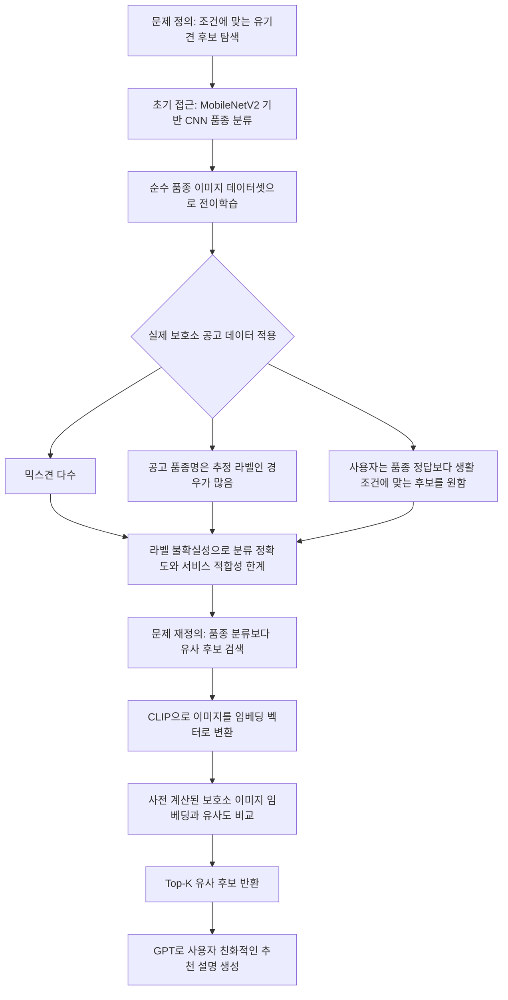

# dog_similarity_api

AI 기반 구조견·유기견 입양 매칭을 위한 FastAPI 프로젝트입니다. 사용자가 입력한 생활 조건과 참고 이미지를 바탕으로 GPT 추천 문장을 생성하고, CLIP 이미지 임베딩 유사도를 이용해 닮은 유기견 후보를 함께 반환합니다.

## 프로젝트 목표

기존 유기견 플랫폼은 공고 정보를 나열하는 방식이 중심이라 사용자가 자신의 생활 환경과 선호에 맞는 후보를 빠르게 비교하기 어렵습니다. 이 프로젝트는 보호소 공고 이미지와 사용자 입력을 활용해 입양 전 탐색 과정을 더 쉽게 만드는 것을 목표로 합니다.

단, 온라인에서 입양 결정을 대신하는 서비스가 아니라 보호소 방문과 상담 전에 후보를 좁히고 비교하는 보조 도구입니다.

## 기술 전환 흐름

초기에는 딥러닝 기반 품종 분류 모델로 접근했습니다. 하지만 실제 보호소 공고에는 믹스견이 많고, 품종명도 외형 기반 추정인 경우가 많아 순수 품종 라벨을 맞히는 방식이 서비스 목적과 잘 맞지 않았습니다. 그래서 "품종을 맞히는 모델"에서 "사용자 조건과 가장 비슷한 후보를 찾는 검색"으로 방향을 바꿨습니다.



## 왜 CLIP 기반 유사도 검색인가

| 구분 | CNN 품종 분류 | CLIP 기반 유사도 검색 |
| --- | --- | --- |
| 핵심 질문 | 이 강아지는 어떤 품종인가? | 사용자의 조건과 참고 이미지에 가까운 후보는 누구인가? |
| 데이터 전제 | 정답 품종 라벨이 명확해야 함 | 이미지 특징 벡터가 있으면 비교 가능 |
| 보호소 데이터와의 적합성 | 믹스견과 추정 라벨 때문에 한계가 큼 | 품종명이 불완전해도 외형적 유사성을 활용 가능 |
| 사용자 가치 | 품종명이 입양 적합성을 바로 설명하지 못함 | 이미지 분위기와 생활 조건을 함께 고려한 탐색 가능 |
| 확장성 | 새 품종·혼합 품종 대응에 재학습 부담 | 임베딩 데이터 추가로 후보군 확장 가능 |

결론적으로 이 프로젝트는 "정확한 품종명 하나를 맞히는 것"보다 "입양 희망자의 조건과 가장 잘 맞는 후보를 찾는 것"에 초점을 맞췄습니다.

## 주요 기능

- 사용자 생활 조건 입력 기반 GPT 추천 문장 생성
- 업로드 이미지의 CLIP 임베딩 생성
- 사전 저장된 유기견 이미지 임베딩과 코사인 유사도 비교
- 유사도가 높은 후보 이미지 URL Top-K 반환
- 깨진 이미지 URL을 제외하기 위한 생존 URL 확인
- FastAPI 기반 API 제공

## 파일 구조

```text
.
├── main.py                 # FastAPI 서버와 추천 API
├── similarity.py           # CLIP 임베딩 유사도 검색 로직
├── gpt.py                  # GPT 추천 테스트 스크립트
├── requirements.txt        # 실행 환경 패키지 목록
└── data/
    ├── dog_clip_embeddings.npy
    └── dog_image_urls.json
```

## 설치 및 실행

```bash
python -m venv .venv
source .venv/bin/activate
pip install -r requirements.txt
```

`.env` 파일을 만들고 OpenAI API 키를 설정합니다.

```env
OPENAI_API_KEY=your_openai_api_key
```

서버 실행:

```bash
uvicorn main:app --host 0.0.0.0 --port 8000
```

헬스체크:

```bash
curl http://localhost:8000/health
```

추천 및 유사 이미지 검색:

```bash
curl -X POST "http://localhost:8000/recommend-and-search" \
  -F "user_text=1인 가구이고 털 빠짐이 적은 소형견을 선호합니다" \
  -F "top_k=5" \
  -F "image=@/path/to/dog.jpg"
```

## API 응답 예시

```json
{
  "recommendation": "사용자 조건과 사진 속 특징을 고려하면...",
  "similar": [
    {
      "idx": 12,
      "sim": 0.84,
      "url": "https://example.com/dog.jpg"
    }
  ]
}
```

## 향후 확장 방향

- FAISS 인덱스를 적용해 대규모 이미지 검색 속도 개선
- 공고 텍스트까지 함께 임베딩하는 멀티모달 검색
- Gemma 또는 VLM 기반 공고 설명 보강
- 사용자 설문 기반 추천 가중치 조정
- 보호소·공공기관 데이터베이스와 연동
