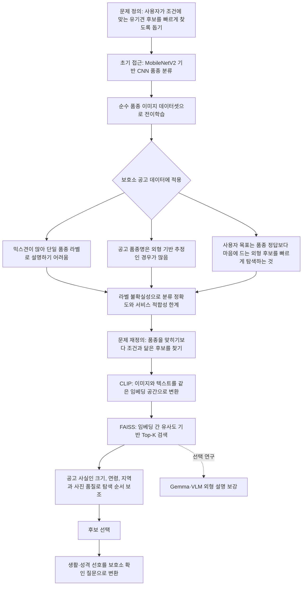
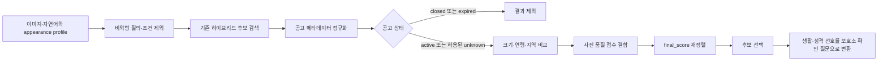

# 멍탐정 (MeongTamjeong)

이미지와 자연어로 마음에 드는 외형의 유기견 공고를 찾고, 확인 가능한 크기·나이·지역 조건으로 후보를 좁힌 뒤 실제 보호소 문의까지 준비하도록 돕는 오픈소스 멀티모달 탐색 도구입니다. 이 프로젝트는 개체의 성격이나 입양 적합성을 예측하거나 실제 입양 결정을 대신하지 않습니다.

## 30초 요약

| 1. 외형으로 찾기 | 2. 사실로 좁히기 | 3. 직접 확인하기 |
| --- | --- | --- |
| 참고사진·자연어를 CLIP/FAISS·BM25로 검색 | 공고에 있는 크기·연령·지역만으로 우선순위 보조 | 생활·성격 선호는 전화·이메일용 확인 질문으로 변환 |

기본 데모는 `http://localhost:8000/demo`입니다. 성격·공격성·아동 친화성·다른 동물과의 사회성을 사진이나 품종으로 추측하지 않고, 정보가 없으면 `unknown`으로 남깁니다.

### 검증 현황 한눈에 보기

| 검증 범위 | 현재 결과 | 해석 경계 |
| --- | ---: | --- |
| 2026-07-26 active-only 스냅샷 | 활성 공고 1,516건 · 벡터 3,746개 | 제출·시연 직전 반드시 재갱신 |
| 고정 자연어 12개·공고 사실 silver qrels | P@5 85.00% · nDCG@5 89.53% · Hit@5 100% | 사람의 주관적 외형·입양 적합성 평가가 아님 |
| 개발용 의미보존 질의 변형 48개 | P@5 90.00% · Hit@5 100% · Jaccard@10 100% | v2 실패를 본 뒤 보강한 회귀셋; 독립 성능 근거 아님 |
| 최종 독립 blind holdout 24개 | P@5 76.67% · nDCG@5 79.15% · Hit@5 100% · Jaccard@10 57.78% | frozen one-shot; 8/24개 실버 지표 하락도 공개 |
| 종료 공고 노출 / 비추론 안전 계약 | 0.00% / 4/4 PASS | 해당 고정 artifact의 회귀 결과 |
| 인덱스 미사용 두 번째 사진 | 평가 가능 29/최초 120건에서 Hit@5 96.55%; 전체 기준 23.33% | 동일 공고 찾기 대리 과제, 감사 커버리지 `partial` |
| 자동 회귀 | 569개 PASS | 깨끗한 고정 환경 기준; 브라우저 수동 QA와 사람 파일럿은 별도 |

상세 분모·실패 사례·해시는 [검색 평가](docs/evaluation/retrieval_eval.appearance_v1.md), [개발셋 질의 회귀](docs/evaluation/query_robustness.appearance_v1.md), [보강 전 역사적 v2 holdout](docs/evaluation/query_holdout.appearance_v2.md), [최종 독립 v3 holdout](docs/evaluation/query_holdout.appearance_v3.md), [교차사진 평가](docs/evaluation/heldout_image_retrieval.appearance_v1.md), [안전 계약](docs/evaluation/safety_contract.appearance_v1.md)에 공개합니다.

위 데이터·검색·교차사진 수치는 사진·crop 벡터를 포함한 현재 `full` 프로필에만 적용됩니다. 아래의 선택형 `public-text-only-v1` 배포본에는 이 수치를 재사용하지 않습니다.

- [데이터 카드](DATA_CARD.md)
- [모델·시스템 카드](MODEL_CARD.md)
- [3분 데모 런북](docs/demo-runbook.md)
- [3분 시연영상 대본](docs/demo-video-script.md)
- [대회 개발보고서 초안](docs/contest-development-report-draft.md)
- [대회 릴리스 런북](docs/contest-release-runbook.md)
- [공고 사진·파생 벡터 이용범위 확인 문안](docs/data-rights-inquiry-template.md)
- [공개 텍스트 전용 배포 가이드](docs/public-text-only-release.md)
- [다른 기관 공고 연결용 provider adapter](docs/provider-adapter.md)
- [공식 포털 대 멍탐정 후보 탐색 파일럿 프로토콜](docs/evaluation/PORTAL_CANDIDATE_SELECTION_PROTOCOL.md)
- [제3자 소프트웨어·모델 고지](THIRD_PARTY_NOTICES.md)
- [2026 오픈소스 개발자대회 제출 체크리스트](docs/contest-2026-checklist.md)
- [기여 방법](CONTRIBUTING.md)
- [보안 정책](SECURITY.md)
- [Apache-2.0 라이선스](LICENSE)

## 빠른 시작

Python 3.10을 기준으로 검증합니다.

```bash
git clone https://github.com/YuMinBee/meongtamjeong.git
cd meongtamjeong
conda env create -f environment.yml
conda activate dog-rag
uvicorn app.main:app --host 0.0.0.0 --port 8000
```

기존 환경이 있다면 `conda env update -n dog-rag -f environment.yml --prune`으로 맞출 수 있습니다. 기본 Conda 환경은 데모 실행과 테스트에 필요한 패키지만 설치하며, 최초 실행 시 CLIP 가중치를 내려받을 수 있습니다. 제출 데모의 `/search/profile` `appearance` 모드와 규칙 기반 문의 문구는 Gemma 없이 동작합니다. Gemma 추천 문장과 오프라인 VLM 보강은 선택 연구 기능이며, 현재 제출 인덱스와 평가에는 VLM이 생성한 행동·성격 속성을 포함하지 않습니다.

최종 출품물과 같은 정확한 Windows 검증 스냅샷을 재현할 때는 `conda env create -f environment.release.yml`로 `meongtamjeong-release` 환경을 만듭니다. 이 파일은 Python과 bootstrap 도구까지 고정하고 `requirements.lock.txt`를 설치합니다. 일반 개발·다른 운영체제에서는 위의 이식 가능한 `environment.yml`을 사용합니다.

Gemma/VLM 기능은 필요한 경우에만 별도로 설치합니다. 객체 영역 추출은 핵심 의존성의 TorchVision Faster R-CNN과 OpenCV로 실행되므로 별도 탐지 패키지가 필요하지 않습니다.

```bash
# Gemma 추천 문장·오프라인 VLM 보강
python -m pip install -r requirements-vlm.txt
```

객체 영역 보강을 처음 실행하면 TorchVision의 COCO 사전학습 가중치를 내려받을 수 있습니다. 가중치 출처와 이용 조건은 `MODEL_CARD.md`와 `THIRD_PARTY_NOTICES.md`를 확인하세요.

기본 API 키는 `.env.example` 기준 `change-me`이며 `APP_ENV=development`인 로컬 실행에서만 허용됩니다. 실제 배포나 제출용 실행에서는 `.env`에 별도 값을 넣어 사용하세요. `APP_ENV=contest` 또는 `production`에서는 키가 비어 있거나 `change-me`이면 서버가 시작되지 않습니다. CORS도 기본적으로 localhost 두 origin만 허용합니다. 대회 시연은 상태 unknown 공고를 제외하고 active-only artifact를 요구하는 `.env.contest.example`을 복사한 뒤 키를 교체해 준비합니다. 로컬에서 서버가 켜지면 아래 명령으로 상태를 확인할 수 있습니다.

```bash
curl -H 'x-api-key: change-me' http://localhost:8000/health
```

권장 흐름은 브라우저에서 `http://localhost:8000/demo`를 열어 외형 검색부터 후보 선택, 보호소 문의 문구 준비까지 이어서 확인하는 것입니다. 기존 텍스트 검색 API의 호환성은 다음처럼 확인할 수 있습니다.

```bash
curl -X POST 'http://localhost:8000/search/text' \
  -H 'x-api-key: change-me' \
  -H 'Content-Type: application/json' \
  -d '{"query":"작고 복슬복슬한 흰색 강아지","topk":5}'
```

현재 데이터가 대회 시연이나 운영에 적합한지 먼저 확인하려면 다음 명령을 사용합니다.

```bash
python scripts/check_contest_readiness.py \
  --metas data/dog_metas.json \
  --index data/dog_faiss.index
```

`--strict`를 추가하면 식별자 누락, 인덱스/메타 불일치, 공고 상태 커버리지 부재처럼 제출을 막는 항목이 있을 때 0이 아닌 종료 코드를 반환합니다.

## 선택 업그레이드: DINO 시각 검색 + 정렬된 CLIP 텍스트

기존 CLIP 경로를 유지한 채, 파일럿에서 검증한 DINOv3 시각 인코더와 flow 정렬 CLIP 텍스트를 선택적으로 실제 이미지 검색에 사용할 수 있습니다. 기본값은 `DINO_FUSION_MODE=off`이며 기존 API 결과를 바꾸거나 DINO 모델을 로드하지 않습니다.

| 모드 | 동작 |
|---|---|
| `off` | 기존 CLIP 검색만 실행 |
| `shadow` | CLIP 결과를 제공하면서 DINO 후보와 지연시간을 `retrieval_upgrade`에 함께 기록 |
| `active` | DINO 공유공간 후보를 실제 하이브리드 순위의 시각 벡터 신호로 사용 |

`/search/appearance/image`는 외형 전용 계약을 그대로 유지하여 DINO를 켜도 성격 문장을 순위에 사용하지 않습니다. 외부 기관 분리 평가에서 공고문 약라벨 행동 head가 적용 기준을 통과하지 못했기 때문에 `DINO_FUSION_BEHAVIOR_ENABLED=false`가 기본이며, 레거시 `/recommend_with_image`에서도 명시적으로 연구 설정을 켜지 않는 한 행동 점수를 사용하지 않습니다. 성격·생활 선호는 후보 선택 뒤 보호소에 확인할 질문으로 변환합니다.

내부 1,002-crop 파일럿에서 동일 개체 이미지 Hit@1은 CLIP 80.95%에서 DINOv3 90.48%로, 이미지+텍스트 Hit@1은 85%에서 95%로 개선됐습니다. 외부 PetFinder 기관 분리 test에서도 이미지 Recall@10은 CLIP 0.557, DINOv3 0.877이었습니다. 반면 성격 질의는 DINO 단독 nDCG 0.533보다 현재 융합 0.516이 낮았고 학습 head도 multimodal AUC 0.548로 실패했습니다. v2/v3·crop/full·텍스트 비중 추가 ablation에서도 적용 기준을 넘긴 변경이 없어 DINOv3 crop과 텍스트 20%를 유지합니다. [최종 결정](experiments/dino_fusion/FINAL_DECISION.md), [외부 평가](experiments/dino_fusion_external_eval/RESULTS.md), [성능 ablation](experiments/dino_fusion_external_eval/PERFORMANCE_ABLATION_RESULTS.md)에 전체 근거와 한계를 기록합니다.

가중치와 인덱스는 생성물이라 Git에서 제외됩니다. [실험 재현 안내](experiments/dino_fusion/README.md)에 따라 현재 `dog_metas.json`과 정확히 일치하는 artifact를 만든 뒤 `.env`에서 먼저 `shadow`로 켜세요. 런타임은 원본 메타데이터·DINO 인덱스·정렬 head와, 명시적으로 켠 경우에만 행동 head의 SHA-256와 행 수를 확인하며 불일치하면 CLIP으로 fail-open 합니다. `/health`의 `dino_fusion`과 검색 응답의 `retrieval_upgrade`를 확인한 뒤에만 `active` 전환을 별도로 결정합니다. 대회용 `.env.contest.example`은 계속 `off`입니다.

## 프로젝트 목적

본 프로젝트는 사용자가 유기견 입양을 온라인에서 바로 결정하도록 만들기 위한 서비스가 아닙니다. 실제 입양은 보호소 방문과 상담, 그리고 개체를 직접 확인하는 과정을 통해 신중하게 이루어져야 합니다. 다만 그 이전 단계에서 여러 공고를 탐색하고 비교하는 과정은 여전히 비효율적이며, 공고 원문 또한 짧거나 서술 방식이 일정하지 않아 필요한 정보를 빠르게 파악하기 어려운 경우가 많습니다.

따라서 본 프로젝트는 이미지와 텍스트 기반 유사도 검색으로 사용자가 마음에 드는 외형의 후보를 더 빠르게 탐색하도록 돕는 것을 목표로 합니다. 크기·나이·지역처럼 공고에서 확인 가능한 조건으로 우선 확인 순서를 조정하고, 후보를 고른 뒤에는 사용자의 성격·생활 선호를 보호소에 확인할 질문으로 바꿔 실제 상담까지 연결합니다. VLM 기반 외형 설명 보강은 공고 정보 품질을 연구하기 위한 선택 경로로만 남겨 두며 현재 제출 artifact와 성능 주장에는 사용하지 않습니다.

### 기본 데모 흐름: 외형 탐색 후 보호소 문의

기본 `/demo`는 `/search/profile`에 `ranking_scope=appearance`를 명시합니다. 외형을 나타내는 이미지·자연어 검색 점수를 유지한 채 공고 사실인 `preferred_size`, `preferred_age`, `preferred_region`과 사진 품질만 탐색 보조 점수에 반영합니다. 주거 형태, 부재 시간, 활동량, 반려견 경험, 아동·다른 동물 여부와 선호 성격은 사진·품종·짧은 설명으로 개체 특성을 예측하거나 후보 순위를 바꾸는 데 사용하지 않습니다.

```text
이미지·자연어로 외형 검색
→ 크기·나이·지역으로 우선 확인 순서 조정
→ 후보 선택
→ 생활·성격 선호를 실제 관찰 여부를 묻는 질문으로 변환
→ 전화 또는 복사 가능한 이메일·문의폼 문구로 보호소 문의 준비
```

권장 호출은 항상 `ranking_scope=appearance`를 명시합니다. 기존 클라이언트와 API 응답 호환성을 위해 `ranking_scope`의 생략값만 `profile`로 유지하며, 기본 데모·제출 평가·제품 설명은 모두 `appearance`를 기준으로 합니다.

### 하위 호환·실험용 `profile` scope

`ranking_scope=profile`은 이전 클라이언트를 깨뜨리지 않기 위해 보존한 하위 호환·실험 모드입니다. 이 모드만 9개 프로필 필드와 출처가 명시된 공고 행동 근거를 비교할 수 있으며, 제출 데모의 권장 검색 경로나 현재 성능 주장의 근거가 아닙니다.

- 성격, 아동·다른 동물과의 생활 가능성, 혼자 지낼 수 있는 시간은 허용된 출처의 명시적 공고 근거가 있을 때만 실험적으로 평가합니다.
- VLM·LLM이 만든 표시용 설명은 생활 적합도 근거로 쓰지 않습니다. 구조화된 행동 필드는 `behavior_evidence_source`가 `public_notice_reported`, `shelter_reported`, `shelter_verified`, `manual_verified`, `curated`처럼 허용된 출처일 때만 평가합니다.
- 정보가 없으면 임의로 추정하지 않고 `unknown_conditions`로 반환합니다.
- 사진 품질 점수는 온라인 공고의 탐색 편의성을 나타낼 뿐, 개체의 입양 적합성이나 건강 상태를 의미하지 않습니다.
- 공고 상태와 실제 보호 여부는 상세 공고와 보호소 상담으로 다시 확인해야 합니다.

> 이 결과는 입양 적합성을 확정하지 않으며, 실제 성격과 생활 적합성은 보호소 방문 및 상담을 통해 확인해야 합니다.

## 왜 필요한가

이 프로젝트의 필요성은 "입양을 온라인에서 대신 결정해주는가"가 아니라, "입양 전 탐색과 비교를 얼마나 효율적으로 도와줄 수 있는가"에 있습니다.

- [한국농촌경제연구원의 2024년 조사](https://repository.krei.re.kr/bitstream/2018.oak/31235/1/P298.pdf)에서는 반려동물 관련 정보 채널로 포털사이트와 유튜브가 높은 비중을 보였고, 양육 희망 가구 264명 중 48.1%가 향후 입양 경로로 보호소·유기동물 입양을 응답했습니다(표 4-147). 농림축산식품부의 [2025년 동물복지 국민의식조사](https://www.mafra.go.kr/bbs/home/792/576961/artclView.do)에서도 5,000명 온라인 조사 중 1년 이내 입양 의향 응답자의 88.3%가 유실·유기동물 입양을 고려한다고 보고했습니다.

- 농림축산식품부의 [2023년 반려동물 보호·복지 실태조사](https://mafra.go.kr/bbs/home/792/584544/download.do)에 따르면 유실·유기동물 등 113,072마리가 구조됐고, 동물보호센터 운영 비용은 전년보다 26.8% 증가했습니다.

- [미국 5개 보호소 입양자 1,491명을 분석한 연구](https://www.mdpi.com/2076-2615/2/2/144)에서는 전체 입양자의 주요 이유에 외형, 입양자를 향한 사회적 행동과 성격이 포함됐고, 어린 개·고양이 집단에서는 놀이 행동도 상위 이유에 포함됐습니다. 이는 공고 단계에서 사진과 설명이 초기 탐색에 영향을 줄 수 있음을 시사합니다.

- [Best Friends가 소개한 HeARTs Speak의 2018년 요약 자료](https://bestfriends.org/network/blog/photo-pros-share-tricks-trade)에서는 입양자의 65%가 입양 전 온라인 사진을 확인했고, 10명 중 9명은 후보 비교에 사진을 사용했으며, 64%는 온라인 사진이 매우 또는 극히 중요하다고 답했습니다. 링크된 글에는 원 조사의 표본과 방법이 제시되지 않아 보조 근거로만 사용합니다.

- [Lampe와 Witte의 보호견 온라인 사진 연구](https://pubmed.ncbi.nlm.nih.gov/25495493/)에서는 카메라를 향한 시선, 서 있는 자세, 적절한 사진 크기, 야외 배경, 흐리지 않은 사진이 더 빠른 입양과 관련됐습니다. 이는 상관관계 결과이며 개별 공고의 입양 가능성을 예측하는 근거로 사용하지 않습니다.

즉, 보호소 공고의 사진과 설명은 단순히 "올려두는 정보"가 아니라, 사용자가 후보를 고르고 비교하는 과정에서 중요한 탐색 자료입니다. 본 프로젝트는 바로 이 탐색 단계의 비효율을 줄이는 데 초점을 둡니다.

## 개발 흐름

이 프로젝트는 한 번에 현재 구조로 정해진 것이 아니라, 품종 분류에서 외형 검색으로 문제를 다시 정의하고 선택 연구와 하이브리드 검색을 더하는 순서로 발전했습니다.

1. 초기 실험: `MobileNetV2` 기반 CNN 품종 분류를 먼저 시도했습니다. 하지만 보호소 데이터에는 믹스견이 많고, 공고에 적힌 품종명도 외형 기반 추정인 경우가 많아 순수 품종 데이터셋으로 학습한 분류 모델을 실제 유기견 공고에 그대로 대응시키기 어려웠습니다. 결국 품종을 정확히 맞히는 접근은 서비스 문제 정의와도 어긋난다고 판단했습니다. 당시 학습 코드와 결과 artifact는 현재 저장소에 보존돼 있지 않으므로 이 단계의 성능 수치는 주장하지 않습니다.

2. 1차 개발: 품종 분류 대신 `CLIP + FAISS` 기반 벡터 유사도 검색으로 전환했습니다. 텍스트 질의와 이미지 질의를 같은 임베딩 공간에서 다루며, "어떤 종인지"보다 "사용자가 찾는 조건과 얼마나 닮았는지"를 기준으로 후보를 찾는 구조를 만들었습니다.

3. 선택 연구: 검색 결과의 해석 가능성을 높이기 위해 `Gemma 3` 기반 VLM 외형 설명 보강을 실험했습니다. 원문 설명과 보강 설명을 합친 `merged_desc` 경로를 만들었지만 관련 cache와 당시 결과 파일은 현재 HEAD·제출 artifact에서 제외했고 현재 성능 근거로 사용하지 않습니다. 일부 과거 Git 이력에는 관련 파일이 남아 있어 릴리스 전 데이터 권리·이력 처리 범위를 별도로 확인합니다. 이 경로는 현재 제출 인덱스·평가에서 제외하며 행동·성격을 생성하는 용도로 사용하지 않습니다.

## 기술 전환 흐름도



## 왜 CNN 분류에서 CLIP 유사도 검색으로 바꿨나

| 구분 | CNN 품종 분류 접근 | CLIP + FAISS 유사도 검색 접근 |
| --- | --- | --- |
| 핵심 질문 | 이 강아지는 어떤 품종인가? | 사용자의 조건과 가장 비슷한 후보는 누구인가? |
| 데이터 전제 | 정답 품종 라벨이 명확해야 함 | 이미지와 텍스트 특징이 충분하면 검색 가능 |
| 실제 보호소 데이터와의 차이 | 믹스견, 추정 품종명, 짧은 공고 설명 때문에 라벨 신뢰도가 낮음 | 품종명이 완벽하지 않아도 외형·텍스트 조건을 함께 반영 가능 |
| 사용자 관점 | 품종 분류 결과가 바로 입양 적합성을 의미하지 않음 | 외형, 색상, 공고 설명과 확인 가능한 크기·연령·지역 기반 탐색에 더 가까움 |
| 서비스 확장성 | 새 품종이나 혼합 품종이 늘면 재학습 부담이 큼 | 임베딩을 추가하고 인덱스를 갱신하는 방식으로 확장 가능 |

초기에는 `MobileNetV2`가 경량이고 전이학습이 쉬워 품종 분류 모델로 적합해 보였습니다. 하지만 입양 전 탐색에서 중요한 것은 "정확한 품종명 하나를 맞히는 것"보다 "마음에 드는 외형과 공고에서 확인 가능한 조건에 가까운 후보를 빠르게 찾는 것"이었습니다.

따라서 최종 구조는 품종 분류 모델이 아니라, 이미지와 텍스트를 함께 임베딩하고 FAISS로 가까운 후보를 찾는 검색 구조로 바뀌었습니다. 이 방식은 믹스견이 많고 공고 설명이 불균일한 보호소 데이터에 더 잘 맞으며, 이후 Gemma 추천 문장 생성과 VLM 설명 보강으로도 자연스럽게 확장할 수 있습니다.

## 1차 개발 결과물: 벡터 기반 유사도 검색

기존 시스템은 `data/dog_faiss.index`와 `data/dog_metas.json`을 기반으로 동작하는 CLIP + FAISS 검색 서비스였습니다.

- 텍스트 질의 또는 이미지 질의를 CLIP 임베딩으로 변환
- FAISS에서 유사한 유기견 후보 검색
- 선택적으로 검색 결과를 Gemma 기반 문장으로 요약
- FastAPI API 형태로 검색/추천 기능 제공

즉, "현재 저장된 임베딩 메타를 빠르게 검색하고 추천하는 시스템"이 기존 시스템의 핵심이었습니다.

## 1차 개발 한계

기존 시스템은 검색과 추천 자체는 가능했지만, 실제 서비스 관점에서는 몇 가지 한계가 있었습니다.

- 실제 공고 원문은 짧거나 서술 방식이 일정하지 않은 경우가 많아서, 개체의 특징이 충분히 드러나지 않거나 검색에 필요한 정보가 빠질 수 있었습니다.
- 기존 시스템은 이미지와 텍스트를 함께 활용하는 유사도 검색 구조이기 때문에, 더 구체적이고 일관된 설명 문장이 있을수록 검색과 추천 근거를 안정적으로 만들기 유리했습니다.
- 추천 품질은 정답이 하나로 고정된 문제가 아니기 때문에, 일반적인 분류 모델처럼 정확도 하나로 설명하기 어려웠습니다.

## 선택 연구 경로: 외형 설명 보강

다음 기능은 공고 사진의 외형 정보를 구조화할 수 있는지 확인한 연구 경로입니다. 현재 제출 artifact와 고정 평가에는 이 경로에서 생성한 필드가 없으며, 생성된 행동·성격 속성을 검색이나 후보 순위에 넣지 않습니다.

- Gemma 3 기반 VLM 설명 보강 스크립트 `scripts/enrich_live_descriptions.py`를 추가했습니다.
- 최신 VLM을 실시간 추천 요청마다 돌리지 않고, 보호소 공고 수집 후 오프라인 배치로 사진 속성을 구조화한 `vlm_attrs` JSON을 생성하도록 확장했습니다.
- 기존 공고 설명과 VLM 설명을 합친 `merged_desc` 필드를 생성하도록 구성했습니다.
- 연구 시 `vlm_attrs`는 색상, 털 길이, 귀 모양, 얼굴·전신 노출처럼 사진에서 관찰 가능한 외형만 다루며, 성격·공격성·아동 친화성·합사 가능성은 생성하지 않습니다.
- 실시간 요청마다 VLM을 호출하지 않고 오프라인 결과를 공고 원문과 분리해 감사할 수 있도록 설계했습니다.
- 연구 재현 순서는 `fetch_live_dogs.py`로 공고 수집, `enrich_live_descriptions.py --task attributes`로 외형 속성 JSON 생성, 별도 실험 인덱스에서 효과를 검증하는 방식입니다. 검증 전 결과를 제출 인덱스에 합치지 않습니다.
- 검색/추천 서비스는 `process_state`가 종료/입양/반환/자연사/안락사/기증이거나 `notice_end`가 지난 공고를 제외합니다. 기존 API는 원래 정책대로 unknown 공고를 기본 제외합니다. `/search/profile`만 상태 메타가 없는 기존 인덱스도 상담 필요 표시와 함께 기본 포함하며 별도 환경변수로 제어합니다.
- 지난 공고는 모델 평가, 회귀 테스트, 포트폴리오 지표 재현을 위해 백업/아카이브로 보존하고, 실제 추천 인덱스는 active-only로 재생성하는 운영 방식을 권장합니다.
- 설명 보강 전후 비교를 위한 `scripts/build_search_eval_report.py`를 추가했습니다.
- 종 코드별 사진을 브라우저에서 바로 볼 수 있는 `scripts/render_live_gallery.py`를 추가했습니다.
- 갤러리 검색에서 종 코드, 품종명, 공고번호를 함께 찾을 수 있도록 구성했습니다.
- 공고 상세 링크를 현재 국가동물보호정보시스템 라우팅에 맞게 보정했습니다.

## 3차 개발 내용: 하이브리드 외형 탐색

기존 CLIP·FAISS 후보 검색에 BM25, 공고 메타데이터, 경량 그래프 근거를 더해 짧고 표현이 다른 공고를 함께 찾도록 확장했습니다. 제출 데모에서는 외형과 공고 사실만 검색 신호로 사용합니다.

- `app/hybrid_rag.py`를 추가해 조건 파싱, BM25 키워드 검색, 선택적 외형 속성 필터, 메타데이터 매칭, 재랭킹 점수와 근거 생성을 분리했습니다.
- 색상, 털 길이, 귀 모양, 크기, 성별, 연령, 사진 품질처럼 관찰·확인 가능한 조건을 구조화합니다. 성격과 생활조건은 권장 검색 신호에서 제외합니다.
- `/search/text`, `/recommend`, 이미지 추천, 설문 추천이 모두 같은 하이브리드 검색/재랭킹 경로를 사용하도록 연결했습니다.
- `/rag/recommend`와 `/rag/recommend_form`은 기존 통합 입력과의 호환성을 위해 남긴 실험 API입니다. 제출 데모는 이 경로 대신 `appearance` 검색과 문의 카드 API를 분리해 사용합니다.
- `/visualize/dashboard`와 `/visualize/adoption-flow`는 이전 통합 탐색 동작을 확인하기 위한 개발용 실험 UI입니다. development에서만 경고와 함께 열리고, `contest`·`production`에서는 권장 `/demo`로 리디렉트합니다. 브라우저 키도 영구 저장하지 않고 현재 탭의 `sessionStorage`에만 둡니다.
- `app/graph_rag.py`를 추가해 `Dog -> Trait/Region/Shelter/Status` 경량 그래프를 만들고, FAISS/BM25 후보에 그래프 조건 후보를 합친 뒤 `graph_conditions`, `graph_expansion`, `graph_similarity` 점수로 재랭킹합니다.
- `care_name`, `process_state`, 지역처럼 공고에서 확인 가능한 필드는 그래프 근거로 사용할 수 있습니다. 하위 호환 그래프에는 공고 원문에서 추출한 `temperament:*` 엣지가 남아 있을 수 있지만, 권장 `appearance` 경로는 이를 후보 확장·조건 매칭·이웃 유사도에서 모두 제외합니다.

## 외형 중심 후보 재정렬과 문의 정보 분리

### 사용자 입력

권장 `ranking_scope=appearance`는 크기·연령과 선택 지역만 받는 최소 `AppearanceProfile`을 사용합니다. 사용자가 입력하지 않은 주거·부재·활동·경험·아동·다른 동물 값은 검색 요청이나 응답에 임의 기본값으로 넣지 않습니다. 이 생활·성격 선호는 후보를 고른 뒤 `/adoption/contact_card`의 선택 입력으로만 보내 보호소 확인 질문을 만듭니다. 기존 전체 9필드 요청도 `appearance`에서 계속 허용하지만 순위에는 크기·연령·지역만 반영합니다.

| 필드 | 형식 | 최소 `appearance` 요청 | 허용값 | `appearance`에서의 용도 |
| --- | --- | --- | --- | --- |
| `housing_type` | string enum | 보내지 않음 | `apartment`, `house`, `other` | 문의 질문에서만 선택 사용 |
| `daily_absence_hours` | number | 보내지 않음 | `0~24` | 문의 질문에서만 선택 사용 |
| `activity_level` | string enum | 보내지 않음 | `low`, `medium`, `high` | 활동 관찰 문의에서만 선택 사용 |
| `dog_experience` | string enum | 보내지 않음 | `none`, `some`, `experienced` | 관리 난이도 문의에서만 선택 사용 |
| `preferred_size` | string enum | 예 | `small`, `medium`, `large`, `any` | 공고상 크기 재정렬 |
| `preferred_age` | string enum | 예 | `puppy`, `adult`, `senior`, `any` | 공고상 연령 재정렬 |
| `preferred_region` | string 또는 null | 아니요 | 100자 이하, 빈 문자열은 `null` | 공고상 지역 재정렬 |
| `has_children` | boolean | 보내지 않음 | JSON `true`, `false` | 문의 질문에서만 선택 사용 |
| `has_other_pets` | boolean | 보내지 않음 | JSON `true`, `false` | 문의 질문에서만 선택 사용 |

하위 호환·실험용 `ranking_scope=profile`은 기존 `UserProfile` 계약을 유지해 `preferred_region`을 제외한 8개 필드가 필수입니다. 최소 프로필을 보내면서 `ranking_scope`를 생략하면 기본값이 `profile`이므로 HTTP 422가 반환됩니다. 요청에는 후보 생성에 사용할 `query` 또는 비어 있지 않은 `conditions` 중 하나가 반드시 있어야 하며, `topk` 기본값은 5이고 허용 범위는 1~20입니다.

### 재정렬 흐름



`ranking_scope=appearance`는 비외형 문구와 `personality` 같은 비외형 구조화 조건을 후보 생성 전에 제외합니다. 기존 CLIP/FAISS, BM25, 공고 메타와 그래프 점수로 `topk × PROFILE_CANDIDATE_MULTIPLIER`개의 후보를 먼저 검색하고 최대 50개 안에서 재정렬합니다. 후보 메타데이터는 나이, 체중/크기, 성별, 중성화 여부, 지역, 공고상 품종 표기, 설명, 사진 품질, 공고 상태로 보수적으로 정규화하며 근거가 없는 값은 `unknown`으로 둡니다. 선택 연구용 VLM 필드는 현재 제출 artifact와 평가에 포함하지 않습니다.

`ranking_scope=profile`은 같은 스키마를 사용하는 하위 호환·실험 모드입니다. 이 모드의 생활조건 점수나 행동 근거를 제출 데모의 추천 결과로 해석하지 마세요.

### 공고 원본 필드와 품종 처리

공공 API의 `kindNm`·`kindFullNm`, `colorCd`, `happenDt`, `popfile1~3`, `updTm`, `healthChk`, `vaccinationChk`, `sfeHealth`, `sfeSoci`를 각각 공고상 품종 표기, 색상, 발견일, 전체 사진 URL, 원본 갱신시각, 건강검사·예방접종 기록, 건강·사회성 관련 원문 메모로 보존합니다. 건강·접종 값은 검사 결과나 건강 상태로 해석하지 않고 원문 항목만 전달합니다. `updTm`은 기관의 원본 갱신시각인 `upstream_updated_at`으로 저장하며, 멍탐정이 공고를 확인한 `last_verified_at`과 구분합니다.

품종 정보는 보호소·공고 작성자가 기입한 표기이지 유전자 검사로 확인된 혈통 정보가 아닙니다. 따라서 화면과 API에서는 `breed_source=public_notice_reported`로 출처를 드러내고, `mixed_breed=true`는 원문에 믹스가 명시된 경우에만 설정합니다. 특정 품종명이 적혀 있어도 순종으로 단정하지 않아 `mixed_breed`는 `null`로 둡니다. 품종 표기는 정확한 품종명·코드 질의를 위한 BM25와 exact Graph edge, 결과 표시에는 사용할 수 있지만, 품종을 요청하지 않은 후보 유사도나 생활 적합도, 활동성·성격 추론에는 사용하지 않습니다. 구조화된 품종 필드는 CLIP 의미 임베딩 문장에서도 제외합니다.

새 필드는 다음 공공 API 재수집부터 캐시에 들어가며, 기존 FAISS 메타데이터에 반영하려면 아래 데이터 수집 및 인덱스 재생성 절차를 다시 실행해야 합니다.

### `appearance` 점수 구성과 탐색 근거

```text
final_score
  = retrieval_score
  + PROFILE_COMPATIBILITY_WEIGHT × compatibility_score
  + PROFILE_QUALITY_WEIGHT × quality_score
```

- `retrieval_score`: 기존 하이브리드 검색 점수를 0~1로 제한한 값
- `compatibility_score`: 크기·연령·지역 중 적용 가능한 조건에 대해 일치 1, 불일치 0으로 계산한 탐색 보조 점수
- `quality_score`: 0~1 사진 품질 점수. 정보가 없으면 `null`
- `final_score`: 정렬용 가산 점수이며 확률이 아니므로 1보다 클 수 있음

공고 정보가 부족한 조건은 일치나 주의로 단정하지 않고 가점을 주지 않습니다. `compatibility_score`는 확인된 일치 점수 합을 적용 가능한 크기·연령·지역 조건 수로 나누므로, 정보가 한 항목뿐인 후보가 그 한 번의 일치만으로 과도한 가점을 받지 않습니다. 모든 조건이 unknown이면 `compatibility_score=0`이며 음수 감점은 없습니다. 사진 품질이 unknown이면 품질 항도 더하지 않습니다. `preferred_size=any`, `preferred_age=any`, 빈 `preferred_region`은 평가 대상에서 제외합니다.

각 결과에는 `retrieval_score`, `compatibility_score`, `quality_score`, `final_score`, `applicable_count`, `evaluated_count`, `evidence_coverage`, `matched_conditions`, `caution_conditions`, `unknown_conditions`, 규칙 기반 `recommendation_reason`, 정규화된 `meta`, 실제 `source_url`이 포함됩니다. `appearance`에서 조건 근거는 크기·연령·지역에 한정됩니다. `final_score`는 방문 전에 먼저 볼 공고의 순서를 돕는 상대값일 뿐 입양 적합도나 개체 성격 확률이 아닙니다.

## 현재 데이터/시스템 지표

현재 추적 중인 스냅샷과 생성 조건은 [`data/snapshot_manifest.json`](data/snapshot_manifest.json)에 기록합니다. Python 의존성의 시점별 알려진 취약점 점검과 자동 점검 제외 범위는 [2026-07-26 dependency audit](docs/security/dependency-audit-2026-07-26.md)에 분리해 기록합니다.

| 항목 | 현재 값 |
| --- | ---: |
| 공공 API 확인 시각 | 2026-07-26 00:34 KST |
| 활성 고유 공고 | 1,516건 |
| FAISS/메타 행 | 3,746개 / 3,746개 |
| 벡터 구성 | 원본 사진 1,228 · 객체 crop 1,002 · 공고 텍스트 1,516 |
| 상태·종료일·지역·보호소·마지막 확인일 커버리지 | 100% |
| 사진 품질 공고 커버리지 | 1,228/1,516 (81.0026%) |
| 사진 다운로드·갱신 실패 / 텍스트 임베딩 실패 | 288건 / 0건 |
| strict readiness / artifact integrity | PASS / PASS |
| 현재 VLM 속성·설명 커버리지 | 0건 |

2026-07-26 기준 365일 범위의 공공 API 60,085건을 확인해 종료 58,568건과 사진 없는 1건을 제외한 active 공고 1,516건으로 동기화했습니다. 모든 active 공고에는 공개 공고 텍스트 벡터가 있으며, 사진 다운로드·갱신에 실패한 288건도 텍스트 검색 후보로 남습니다. FAISS 형식·차원·행 정렬·벡터 유한성·active 상태·금지 파생필드를 검사하는 strict readiness와 artifact integrity gate를 모두 통과했습니다. 상세 통계와 파일 SHA-256은 [동기화 리포트](data/active_index_sync_report.json)에 기록합니다. 공고 상태는 수시로 바뀌므로 제출·시연 직전에는 다시 확인해야 합니다.

이번 증분 임베딩은 로컬 GPU 환경의 `openai-clip 1.0.1`로 수행했습니다. 배포 환경은 공식 OpenAI CLIP 저장소의 commit `dcba3cb2e2827b402d2701e7e1c7d9fed8a20ef1`을 `requirements.lock.txt`에 고정하지만, 이 표기를 근거로 현재 증분 벡터가 해당 공식 commit에서 생성됐다고 주장하지 않습니다. 실행 provenance는 manifest와 동기화 리포트에 분리해 기록합니다.

현재 스냅샷에는 `vlm_attrs`, `vlm_desc`, `vlm_attr_text`가 채워진 공고가 없습니다. 따라서 VLM 보강 효과를 현재 출품 성능으로 주장하지 않습니다. 과거 설명 보강 관련 파일 일부는 Git 이력에만 남아 있지만 현재 HEAD·제출 artifact에는 포함하지 않으며, 아래 재현 평가와 섞어 사용하지 않습니다.

스냅샷 생성 시점 무결성은 다음처럼 재현합니다.

```bash
python scripts/check_contest_readiness.py \
  --metas data/dog_metas.json \
  --index data/dog_faiss.index \
  --reference-date 2026-07-26 \
  --max-age-days 0 \
  --strict
```

## 공고 사실 기반 자연어 조건 검색 회귀 평가

[`data/eval_queries.appearance_v1.json`](data/eval_queries.appearance_v1.json)의 고정 질의 12개와 동일한 active 인덱스·메타를 사용해 상태 필터를 적용한 `clip_active`와 자연어만 입력한 `hybrid_natural_graph`를 비교했습니다. 정답은 검색 전에 공고 원문의 색상·체중·연령·지역·상태만으로 만든 silver qrels이며, 결과 문장·순위·VLM 출력은 라벨 생성에 사용하지 않았습니다. 명시적 구조 조건을 주입한 oracle은 대표 수치에서 제외합니다.

| 지표 | `clip_active` | `hybrid_natural_graph` | 변화 |
| --- | ---: | ---: | ---: |
| Precision@5 | 11.67% | 85.00% | +73.33%p |
| Recall@10 | 0.77% | 41.89% | +41.12%p |
| nDCG@5 | 11.65% | 89.53% | +77.88%p |
| MRR | 0.211 | 0.917 | +0.706 |
| Hit@5 | 33.33% | 100.00% | +66.67%p |
| inactive exposure@10 | 0.00% | 0.00% | 0.00%p |
| 평균 검색 지연 | 20.6ms | 152.1ms | +131.5ms |

전체 JSON, 쿼리별 결과, 입력 SHA-256과 해석 제한은 [평가 리포트](docs/evaluation/retrieval_eval.appearance_v1.md)에서 확인할 수 있습니다. 재생성 명령은 다음과 같습니다.

```bash
python scripts/evaluate_retrieval.py
```

기본 재생성 명령은 자연어 대표 시스템에 `Precision@5 ≥ 70%`, `Hit@5 ≥ 90%`, inactive exposure `= 0%` 회귀 통과선을 적용합니다. 현재 추적 코퍼스가 이미 active-only이므로 표의 `0%`는 이 스냅샷의 무결성 결과이며, 종료 공고 필터 자체의 동작은 active·inactive가 섞인 별도 합성 회귀 테스트로 검증합니다.

CI는 `2026-07-26` 고정 기준일 검사로 추적 artifact의 결정성을 확인하는 동시에, 기준일을 생략한 별도 strict 검사에서 실행 당일 기준 14일이 넘은 스냅샷이나 이미 종료된 공고를 실패시킵니다. 따라서 녹색 CI가 과거 스냅샷의 영구적인 최신성을 뜻하지 않으며, 실패하면 공공 API 재수집·active 동기화·평가 보고서 갱신을 함께 수행해야 합니다.

[노출·대표성 및 증거 커버리지 진단](docs/evaluation/exposure_representation.appearance_v1.md)은 위 리포트의 저장된 Top-10을 재정렬 없이 후처리합니다. 12개 질의의 120개 노출 슬롯에서 고유 공고 수는 `clip_active` 50건, `hybrid_natural_graph` 116건이었고, 질의에 적용 가능한 공개 필드 증거는 각각 297/300(99%)과 300/300(100%) 확인됐습니다. corpus의 region은 공고 원문 기준 1,516/1,516건 정규화됐고, 사진 품질 288건은 추정하지 않고 `unknown`으로 남겼습니다. 이는 고정 질의의 기술적 노출 진단이지 규범적 공정성·차별·적정 노출 목표를 판정하는 수치가 아닙니다.

```bash
python scripts/evaluate_exposure_representation.py --check
```

이 평가는 공고 사실 기반 자연어 조건 검색 로직을 개발·회귀 확인하는 근사 벤치마크이며 독립된 미공개 테스트셋이나 주관적 외형 유사도 평가가 아닙니다. 공고 필드의 누락·오표기와 색상·체중 구간의 단순화가 라벨에 반영되며, 사람의 시각적 관련성 판단이나 입양 적합성·성격·사회성을 측정하지 않습니다. 독립 검수자를 위한 시스템명·원순위 비공개 과제 생성과 집계 절차는 [blind human relevance 프로토콜](docs/evaluation/BLIND_RELEVANCE_PROTOCOL.md)에 분리했습니다. 실제 사람이 작성한 라벨이 생기기 전에는 사람 평가 성능으로 주장하지 않습니다.

## 자연어 변형 강건성·실패 분석

[v1 질의 회귀 리포트](docs/evaluation/query_robustness.appearance_v1.md)는 위 12개 원 질의마다 동의어·바꿔쓰기, 어순 변경, 한 글자 오타, 생활·성격 노이즈를 하나씩 둔 의미보존 변형 48개와 부정 표현 12개를 진단합니다. 최초 실패와 [독립 v2 holdout](docs/evaluation/query_holdout.appearance_v2.md)의 낮은 결과를 본 뒤 정규화 코드를 보강해 다시 측정했으므로, 현재 P@5 `90.00%`, nDCG@5 `93.98%`, Hit@5 `100%`, Top-10 Jaccard `100%`는 **개발셋 회귀 결과**이지 독립 일반화 성능이 아닙니다.

보강 전 동결·one-shot v2 12개에서는 P@5 `48.33%`, nDCG@5 `51.46%`, Hit@5 `66.67%`, Top-10 Jaccard `21.99%`로 구어체·붙여쓰기·단위 표현의 큰 실패가 드러났습니다. 이 결과는 지우거나 현재 성능처럼 재실행하지 않고 역사적 실패 발견 근거로 보존합니다.

코드 보강 당시 v1·v2 문구와 구현을 보지 않은 별도 작성자가 24개 의미보존 문장과 6개 안전 진단을 먼저 동결한 [독립 blind holdout v3](docs/evaluation/query_holdout.appearance_v3.md)를 정확히 한 번 실행했습니다. P@5 `76.67%`, nDCG@5 `79.15%`, MRR `82.99%`, Hit@5 `100%`, Top-10 Jaccard `57.78%`였고 비활성 노출은 `0%`, 부정·미지원 진단은 `6/6` 통과했습니다. 24개 중 실버 지표 하락 8개와 순위만 달라진 13개도 모두 공개합니다. 이후 DINO 통합 브랜치의 검색 코드 해시가 달라졌으므로 v2·v3는 당시 시스템의 역사적 증거로 보존하며 현재 구현의 성능으로 재사용하지 않습니다. 이는 동일 저장소·공고 사실 silver qrels의 소규모 한국어 holdout이며 사람의 주관적 닮음이나 모든 표현의 일반화를 증명하지 않습니다.

```bash
python scripts/evaluate_query_robustness.py --check
```

[외형 프로필 재정렬 리포트](docs/evaluation/profile_rerank.appearance_v1.md)는 같은 12개 후보에서 두 프로필의 1위가 달라지고 unknown 중립성·근거 일관성이 유지되는지 확인한 **결정적 구현 계약**입니다. 같은 후보에서 사진 품질 가중치 `0.00`과 생산 기본값 `0.05`도 비교했으며, 두 프로필 모두 1위와 Top-5 구성은 바뀌지 않았고 Top-5 내부 순서만 A에서 3개 후보, B에서 0개 후보가 달라졌습니다. 품질 unknown 후보는 직접 감점되지 않았지만 known 후보의 가산으로 상대 순위가 불리해질 수 있음도 함께 기록합니다. 이는 12개 후보·2개 프로필의 민감도 검사이며 독립 검색 성능, 최적 가중치 또는 사용자 효용 평가가 아닙니다. [비추론 safety-contract](docs/evaluation/safety_contract.appearance_v1.md)는 외형 질의 정규화, 생활정보 순위 불변과 미입력 생활필드 무주입, 활동량을 포함한 문의 질문 분리, 금지 표현 누출 방지의 4개 계약을 모두 통과했습니다.

## 인덱스에 넣지 않은 두 번째 사진 평가

[Held-out 교차사진 리포트](docs/evaluation/heldout_image_retrieval.appearance_v1.md)는 활성 공고 1,228건에서 고정한 120건의 **서로 다른 두 번째 공고 사진 URL**을 질의로 사용하고, 첫 번째 사진·crop의 기존 CLIP 시각 벡터만으로 같은 공고를 찾는지 측정합니다. 텍스트 벡터는 검색 후보에서 제외했고 이미지 바이트는 저장하지 않았습니다. 실제 payload SHA-256가 primary와 같았던 26건은 URL만 다른 중복 사진으로 판정해 평가에서 제외했습니다.

| 측정 범위 | 결과 |
| --- | ---: |
| 시도한 고정 표본 | 120건 |
| primary 다운로드 / 감사 | 85건 / 70.83% |
| secondary 다운로드 | 55건 / 45.83% |
| 동일 payload 중복 제외 | 26건 |
| 최종 평가 가능 | 29건 / 24.17% |
| 평가 가능 질의 기준 Hit@1 / Hit@5 / Hit@10 | 82.76% / 96.55% / 96.55% |
| 평가 가능 질의 기준 MRR / 중앙 순위 | 0.8912 / 1위 |
| 전체 120건 기준 end-to-end Hit@1 / Hit@5 / Hit@10 | 20.00% / 23.33% / 23.33% |

조건부 Hit@K와 MRR의 분모는 다운로드·중복 검사를 통과한 29건이고, end-to-end Hit@K의 분모는 최초 표본 120건입니다. 공공 이미지 서버 timeout·404와 payload 중복 때문에 감사 상태는 `partial`이며, 96.55%를 전체 표본 성공률로 읽으면 안 됩니다. 이 평가는 **같은 공고를 다시 찾는 시각적 동일성 대리 과제**일 뿐 서로 다른 개의 주관적 외형 유사도, 입양 적합성, 성격 또는 사용자 만족도를 측정하지 않습니다. 질의 encoder의 공식 CLIP commit과 인덱스 artifact 선언은 확인했지만, 남겨 쓴 2,045개 기존 벡터에는 벡터별 encoder fingerprint가 없어 전체 인덱스 encoder를 증명했다고 주장하지 않습니다.

```bash
python scripts/evaluate_heldout_image_retrieval.py --check
```

## 후보 선택 시간 파일럿

[공식 포털 대 멍탐정 end-to-end 프로토콜](docs/evaluation/PORTAL_CANDIDATE_SELECTION_PROTOCOL.md)은 같은 외형 과제로 국가동물보호정보시스템과 멍탐정에서 서로 다른 활성 공고 3건을 확정하기까지의 완료율·capped 시간과 source-blind 후보 관련성을 비교합니다. 4명 권장 S1~S4 교차 배정, 300초 cap, 네트워크·기술 실패 분리, 공고 ID·실제 상세 URL·활성 상태 확인 규칙을 첫 참여자 전에 고정합니다. 이름·연락처·IP·자유서술·화면녹화는 수집하지 않습니다.

현재는 프로토콜·CSV 템플릿·freeze/검사/집계 도구만 준비됐고 실제 사람 결과는 없습니다. 따라서 사용자 효용 개선을 아직 주장하지 않습니다.

```powershell
conda run -n meong-contest-full python scripts/portal_candidate_selection_study.py validate-template
```

[로컬 후보 순서 A/B 프로토콜](docs/evaluation/CANDIDATE_SELECTION_PROTOCOL.md)은 동일한 고정 후보 pool 안에서 두 검색 순서를 가리는 보조 실험으로 유지하며, 공식 포털 비교 결과와 합치지 않습니다.

```powershell
conda run -n meong-contest-full python scripts/candidate_selection_study.py generate
conda run -n meong-contest-full python scripts/candidate_selection_study.py check `
  --key data/reports/candidate_selection/task_key.json
```

로컬 crop이 없는 clean clone은 권리 미확인 사진을 자동 다운로드하지 않고 실패하도록 설계했습니다. 공식 포털 비교의 freeze부터 익명 CSV 집계까지의 전체 명령과 로컬 A/B의 권리·출처 확인 절차는 각각의 프로토콜을 따릅니다.

## 디렉터리 구조

```text
.
├── app/                  # FastAPI 서버
├── scripts/              # 임베딩 생성/업데이트/분석/테스트 스크립트
├── tests/                # 프로필 재정렬, 메타 병합, API 회귀 테스트
├── data/                 # FAISS 인덱스, 메타, 캐시, 로그
├── assets/samples/       # 공공데이터 공고 이미지 검색 샘플과 출처 manifest
├── archive/              # 레거시 파일 보관
├── .env.example
├── README.md
├── requirements.txt          # 핵심 실행 의존성
├── requirements-vlm.txt      # 선택적 Gemma/VLM
├── requirements-dev.txt      # 테스트·정적 검사
└── requirements-analysis.txt # 선택적 pandas/Excel 분석
```

이미지 입력 예시는 [`assets/samples/`](assets/samples/)에 있습니다. 각 샘플은 2026-07-17 활성 공고 스냅샷에서 골랐고, 원본 공고·사진 URL과 변환 방식·파일 해시는 [`assets/samples/manifest.json`](assets/samples/manifest.json)에 기록했습니다. 샘플은 검색 기능 시연용이며 입양 추천이나 현재 공고 상태 보증을 의미하지 않습니다.

## 다른 컴퓨터로 옮길 때

`.env`, Conda 환경, 모델 가중치와 로컬 cache를 직접 압축하지 마세요. 제출 패키지는 Git에 추적된 파일만 읽고 비밀 패턴을 검사하는 스크립트로 만듭니다. `.gitignore`로 제외되지 않은 새 파일이 아직 untracked이면 핵심 기능이 ZIP에서 조용히 빠지지 않도록 패키징을 중단합니다. 먼저 `git status`로 제출 범위를 검토하고 의도한 파일을 stage·commit한 뒤 실행하세요.

## 설치/실행

### 1) 압축해서 이동(권장)

```bash
python scripts/package_release.py --check-only
# 최종본은 annotated tag를 만든 뒤 아래 전체 gate가 생성합니다.
python scripts/verify_contest_release.py --required-tag <RELEASE_TAG>
```

새 컴퓨터에서는 ZIP을 푼 뒤 환경을 새로 만들고, `.env.example`을 복사해 로컬 키를 직접 입력합니다. `.env` 파일은 이동하거나 제출하지 않습니다.

```bash
conda env create -f environment.release.yml
conda activate meongtamjeong-release
cp .env.example .env
```

### 2) 환경변수

`.env.example`를 참고해서 `.env`를 만드세요.

| 환경변수 | 기본값 | 역할 |
| --- | --- | --- |
| `APP_ENV` | `development` | `contest`·`production`에서는 안전한 API 키를 강제 |
| `API_KEY` | `change-me` | `x-api-key` 헤더 값. `contest`·`production`은 24자 이상으로 교체해야 시작 |
| `CORS_ALLOW_ORIGINS` | localhost 두 origin | 쉼표로 구분한 브라우저 허용 출처 |
| `NOTICE_FILTER_INACTIVE` | `true` | 하이브리드 후보 생성에서 closed/expired 공고 제외 |
| `NOTICE_INCLUDE_UNKNOWN` | `false` | 기존 검색 API에서 상태 unknown 공고를 후보로 허용할지 결정 |
| `PROFILE_INCLUDE_UNKNOWN_NOTICES` | `true` | 하위 호환 `ranking_scope=profile`에서만 상태 unknown 공고를 허용할지 결정. 권장 `appearance`는 항상 제외 |
| `PROFILE_COMPATIBILITY_WEIGHT` | `0.25` | compatibility 가중치, 0 이상 |
| `PROFILE_QUALITY_WEIGHT` | `0.05` | 사진 품질 가중치, 0 이상 |
| `PROFILE_CANDIDATE_MULTIPLIER` | `5` | 프로필 재정렬 전 후보군 배수, 1 이상 |
| `INDEX_PATH` | `./data/dog_faiss.index` | FAISS 인덱스 경로 |
| `METAS_PATH` | `./data/dog_metas.json` | 인덱스 행과 순서가 일치하는 메타데이터 경로 |
| `NOTICE_LOOKUP_TIMEOUT_SECONDS` | `12` | 문의 카드에서 최신 공고 재조회에 쓰는 전체 시간 예산 |
| `NOTICE_LOOKUP_CACHE_TTL_SECONDS` | `300` | 최신 공고 조회 성공/없음 결과의 메모리 캐시 시간 |
| `NOTICE_LOOKUP_MAX_CONCURRENCY` | `2` | 브라우저 취소 뒤에도 남을 수 있는 공공 API 조회의 서버 동시 실행 상한(1~8) |
| `IMAGE_UPLOAD_MAX_BYTES` | `8388608` | 업로드 이미지 최대 바이트(기본 8MiB) |
| `IMAGE_UPLOAD_MAX_PIXELS` | `25000000` | 디코딩한 이미지의 최대 픽셀 수 |
| `DINO_FUSION_MODE` | `off` | 선택 DINO 롤아웃: `off`, `shadow`, `active` |
| `DINO_FUSION_TEXT_WEIGHT` | `0.20` | 같은 DINO 공간에서 이미지와 섞는 정렬 CLIP 텍스트 비율 |
| `DINO_FUSION_BEHAVIOR_ENABLED` | `false` | 실패한 공고문 약라벨 행동 head의 연구용 명시적 opt-in |
| `DINO_FUSION_BEHAVIOR_WEIGHT` | `0.25` | 명시적 행동 선호가 있을 때의 행동 보조 점수 비율 |
| `DINO_FUSION_LOCAL_FILES_ONLY` | `true` | 요청 처리 중 모델을 내려받지 않고 로컬 snapshot만 사용 |
| `DINO_FUSION_FAIL_OPEN` | `true` | 선택 런타임 오류 시 기존 CLIP 결과로 복귀. `false`면 503 |

기존 API의 `NOTICE_INCLUDE_UNKNOWN` 기본값은 변경하지 않았습니다. 하위 호환 `ranking_scope=profile`은 `PROFILE_INCLUDE_UNKNOWN_NOTICES=true`일 때 상태 정보가 없는 기존 메타도 반환하되 `unknown_conditions`에 상태 확인 안내를 추가합니다. 권장 `ranking_scope=appearance`와 사진 검색 API는 설정과 관계없이 closed/expired뿐 아니라 status unknown 공고도 제외합니다. 대회 설정은 active-only artifact와 `PROFILE_INCLUDE_UNKNOWN_NOTICES=false`를 함께 사용합니다.

- `GEMMA3_ENABLED`: Gemma 기반 선택 API 활성화 여부(기본 `false`, 명시적 opt-in). `false`면 모델을 다운로드하거나 로드하지 않으며, 기존 추천·이미지 검색 API는 검색 결과와 규칙 기반 안내문을 반환
- `GEMMA3_MODEL_PATH`: 로컬 Gemma 3 snapshot 경로
- `GEMMA3_MODEL_ID`: 로컬 경로가 없을 때 사용할 Gemma 모델 ID
- `GEMMA3_GPU_MAX_MEMORY`: Gemma 실행 시 GPU 최대 메모리
- `GEMMA3_CPU_MAX_MEMORY`: Gemma 실행 시 CPU 오프로드 메모리
- `VLM_MODEL_PATH`: 속성 추출용 로컬 VLM snapshot 경로(`GEMMA3_MODEL_PATH`보다 우선)
- `VLM_MODEL_ID`: 속성 추출용 VLM 모델 ID(`GEMMA3_MODEL_ID`보다 우선)
- `VLM_MODEL_CLASS`: `gemma3` 또는 `auto`. Qwen 계열처럼 범용 image-text 모델은 `auto`를 사용
- `ANIMAL_API_KEY`: 공공 유기동물 API 키(임베딩 생성/업데이트 시 사용 가능)

### 3) API 실행

```bash
uvicorn app.main:app --host 0.0.0.0 --port 8000
```

헬스체크:

```bash
curl -H 'x-api-key: change-me' http://localhost:8000/health
```

## API 엔드포인트

모든 API 요청에는 헤더 `x-api-key`가 필요합니다. 로컬 `development`의 기존 GET 화면만 쿼리 파라미터 `api_key`를 호환 경로로 허용하며, URL 기록·로그·Referer 노출을 막기 위해 `contest`와 `production`에서는 헤더 인증만 허용합니다.

외형 중심 검색과 보호소 문의 도우미를 시연하는 한국어 데모 화면은 로컬 서버 실행 후 아래 주소에서 열 수 있습니다. 화면 자체는 키 없이 열리며, 우측 상단의 연결 설정에서 API 키를 입력하면 `/health`로 인증 성공을 확인한 뒤에만 `연결됨`으로 표시합니다. 키는 현재 탭의 세션에만 보관됩니다. `autostart=1`은 같은 탭에서 이미 검증해 둔 세션 키가 있을 때 예시 검색을 바로 실행합니다.

```text
http://localhost:8000/demo
http://localhost:8000/demo?autostart=1
```

공모전 발표 순서와 네트워크 장애 대비 동선은 [3분 데모 런북](docs/demo-runbook.md)에 정리했습니다.

| 메서드 | 경로 | 설명 |
| --- | --- | --- |
| `GET` | `/health` | 인덱스 크기, 실행 디바이스, 종 코드 그룹 수 확인 |
| `GET` | `/demo` | `ranking_scope=appearance`를 사용하는 외형 중심 검색·문의 도우미 데모 |
| `POST` | `/search/text` | 기존 범용 텍스트 하이브리드 검색 |
| `POST` | `/search/profile` | 권장 `appearance`는 외형 검색 후 크기·연령·지역과 사진 품질만 반영. 생략값 `profile`은 하위 호환·실험 모드 |
| `POST` | `/search/appearance/image` | 참고사진 단독 또는 참고사진+자연어로 외형 중심 검색. 요청 처리 후 업로드를 영구 보관하지 않음 |
| `POST` | `/adoption/contact_card` | 서버가 공고 ID를 대조한 뒤 생활·성격 선호를 확인 질문과 복사 문구로 변환 |
| `POST` | `/recommend` | Gemma 문장 생성을 포함한 선택·레거시 API |
| `POST` | `/rag/recommend` | 기존 통합 입력과 호환되는 실험 API. 제출 데모에서는 사용하지 않음 |
| `POST` | `/rag/recommend_form` | 기존 FormData 입력과 호환되는 실험 API. 제출 데모에서는 사용하지 않음 |
| `GET` | `/visualize/dashboard`, `/visualize/adoption-flow` | development 전용 레거시 실험 UI. `contest`·`production`에서는 `/demo`로 리디렉트 |
| `GET` | `/rag/graph` | Graph-enhanced RAG 인덱스 요약과 feature 예시 |
| `POST` | `/shelter/notice_draft` | `vlm_attrs`와 공고 정보를 바탕으로 보호소 공고 초안 생성 |
| `POST` | `/recommend_with_image` | 기존 이미지·프로필 통합 입력용 레거시 API |
| `POST` | `/recommend_with_survey_json` | 기존 설문 JSON 입력용 레거시 API |
| `POST` | `/recommend_with_survey_form` | 기존 설문 FormData 입력용 레거시 API |
| `POST` | `/chat` | 공고 기반 탐색을 돕는 간단한 상담 응답 생성 |
| `GET` | `/breeds` | 저장된 임베딩 메타 기준 종 코드 요약 |
| `GET` | `/breeds/{breed_code}/images` | 특정 종 코드의 이미지 목록 |
| `GET` | `/visualize/breeds` | 저장된 임베딩 메타 기준 종 코드 갤러리 HTML |
| `GET` | `/live/breeds` | 개발 환경 전용 최신 공고 캐시 기준 종 코드 요약 |
| `GET` | `/live/breeds/{breed_code}/images` | 개발 환경 전용 특정 종 코드 이미지 목록 |
| `GET` | `/visualize/live-breeds` | 개발 환경 전용 종 코드 갤러리 HTML |

### 1단계: 외형 중심 검색

```bash
curl -X POST 'http://localhost:8000/search/profile' \
  -H 'x-api-key: change-me' \
  -H 'Content-Type: application/json' \
  -d '{
    "query": "복슬복슬한 흰색 털에 귀가 접힌 강아지",
    "ranking_scope": "appearance",
    "profile": {
      "preferred_size": "small",
      "preferred_age": "adult",
      "preferred_region": "서울"
    },
    "topk": 5
  }'
```

기본 데모와 위 최소 `appearance` 호출의 요청·응답에는 사용자가 고른 외형 선호만 포함됩니다. 하위 호환을 위해 전체 `UserProfile`을 보낸 클라이언트에는 그 입력을 그대로 돌려주지만 생활필드는 순위에 사용하지 않습니다. 생활정보는 검색과 분리되어 보호소 문의 질문을 만들 때만 선택적으로 사용합니다. 응답 상단에는 `ranking_scope`, `candidate_count`, 실제 `count`, 사용한 `weights`, `notice_policy`, `disclaimer`가 포함되고 각 후보에는 네 점수와 크기·연령·지역 근거, 실제 공고 링크가 포함됩니다.

참고사진이 있다면 같은 외형 중심 계약으로 이미지 단독 또는 이미지와 자연어를 함께 검색할 수 있습니다. `ref_image`는 JPEG·PNG·WebP만 허용하며 최대 8 MiB·2,500만 화소로 제한됩니다. 서버는 파일명이나 외부 URL을 신뢰하지 않고 실제 바이트를 검사하며, 요청 처리 후 업로드를 영구 보관하거나 공고 데이터에 합치지 않습니다. 다만 multipart 파싱 중 프레임워크가 운영체제 임시 파일에 일시적으로 spool할 수 있으므로 “메모리 전용”을 보장하지는 않습니다.

```bash
curl -X POST 'http://localhost:8000/search/appearance/image' \
  -H 'x-api-key: change-me' \
  -F 'ref_image=@my-reference-dog.jpg' \
  -F 'query=복슬복슬한 흰색 털' \
  -F 'preferred_size=small' \
  -F 'preferred_age=adult' \
  -F 'preferred_region=서울' \
  -F 'topk=5'
```

생활·성격 문구가 `query`에 섞여 있어도 이 엔드포인트는 외형 검색어만 남겨 후보를 생성합니다. 응답의 `retrieval_query`와 `nonappearance_query_terms_excluded`로 실제 사용된 검색 문구와 제외 여부를 확인할 수 있습니다. `query_policy`에는 보수적으로 적용한 한 글자 오타 보정, 동의어 정규화, 미지원 조건과 사용자 경고가 들어가며 데모도 이를 표시합니다. “갈색이 아닌” 같은 부정 외형 조건은 반대 의미를 구현한 것처럼 가장하지 않고 해당 조건만 검색 신호에서 제외합니다. 같은 필드를 `conditions`나 외형 프로필로 다시 양성 주입하면 모호한 검색을 수행하지 않고 HTTP 422로 거부합니다.

### 2단계: 선택 후보의 보호소 문의 준비

`POST /adoption/contact_card`는 선택한 공고의 `desertion_no`와 선택적 `preferences`, `refresh_latest`를 받습니다. `refresh_latest`의 기본값은 `true`여서 기존 호출은 최신 공공 API를 확인합니다. 데모는 `false`로 서버 스냅샷의 문의 문구와 실제 공고 링크를 먼저 즉시 표시한 뒤 `true` 요청을 백그라운드로 이어 최신 상태를 갱신하므로, 외부 API가 느리거나 실패해도 사용자가 준비한 문구를 잃지 않습니다. 클라이언트가 보낸 보호소명·연락처를 신뢰하지 않고 공고 ID를 서버 스냅샷 및 최신 공공 API와 대조합니다. 성격·생활 선호는 개체 특성을 추정하는 입력이 아니라 보호 기간에 실제로 관찰된 내용이 있는지 묻는 질문으로만 변환됩니다.

문의 선호는 `desired_temperaments`의 `calm`, `friendly`, `active`, `independent`, 주거 형태, 하루 부재 시간, 반려견 경험, 아동·다른 반려동물 여부와 개인정보 없는 추가 질문을 지원합니다. 이 입력은 검색 프로필과 별도 요청이며 점수 필드는 없습니다.

직접 전화·메일 링크는 신뢰할 수 있는 서버측 레코드의 상태가 `active`일 때만 제공합니다. 공공 API에 이메일 주소가 없으면 메일 작성 링크는 만들지 않고, 보호소의 공식 문의폼이나 다른 연락 수단에 붙여 넣을 수 있는 복사 양식만 제공합니다. 최신 공공 API에서도 해당 공고가 active로 확인된 경우에만 `status_verified=true`, `connectable=true`가 됩니다. 조회 실패·API 키 누락·미발견 시에는 보호 중이라고 단정하지 않고 원문 공고에서 상태를 다시 확인하도록 안내합니다.

이 API는 전화 스크립트와 이메일·문의폼에 붙여 넣을 제목·본문만 생성합니다. 이메일이나 입양 신청을 자동 전송하지 않고, 공식 입양 신청·상담 예약·입양 확정을 대신하지 않습니다. 이름·주소·연락처를 위한 별도 입력 필드는 없고 요청 내용을 서버에 저장하지 않습니다. 자유 입력란에는 개인정보를 넣지 않아야 하며, 정식 개인정보와 입양 신청서는 실제 보호소 절차에서 처리해야 합니다.

요청 예시:

```json
{
  "desertion_no": "411313202600123",
  "preferences": {
    "desired_temperaments": ["calm", "friendly"],
    "housing_type": "apartment",
    "daily_absence_hours": 6,
    "dog_experience": "none",
    "has_children": true,
    "has_other_pets": false
  }
}
```

응답 예시(일부 필드 생략):

```json
{
  "inquiry_questions": [
    "현재 보호 중인지와 방문 상담이 가능한 시간은 언제인가요?",
    "낯선 사람과 익숙한 보호자를 만났을 때 각각 어떤 반응이 관찰되나요?"
  ],
  "phone_script": "안녕하세요. 예시동물보호센터 담당자님께 입양 상담을 문의드립니다. ...",
  "email_template": {
    "subject": "[입양 문의] [411313202600123]",
    "body": "안녕하세요, 예시동물보호센터 담당자님. ..."
  },
  "actions": {
    "tel": "tel:0200000000",
    "mailto": "mailto:shelter@example.org?...",
    "detail_url": "https://www.animal.go.kr/.../publicDtl.do?desertionNo=411313202600123",
    "map_url": "https://map.naver.com/p/search/..."
  },
  "preference_usage": {
    "ranking": false,
    "inquiry_questions_only": true,
    "scored_fields": []
  },
  "manual_contact_only": true
}
```

기존 `/recommend*`·`/rag/recommend*` API는 호환성을 위해 남아 있지만, 생활·성격 정보를 검색 신호로 넣는 플로우는 제출 데모와 권장 사용법에서 제외합니다.

## 자주 쓰는 스크립트

제출용 스냅샷은 충분한 조회 범위의 공공 API cache를 기준으로 `reuse_image_enrichment.py`와 `sync_active_index.py`를 거쳐 임시 출력에 생성한 뒤 검증합니다. 상세한 갱신·교체 정책은 [데이터 카드](DATA_CARD.md)를 따릅니다.

```bash
python scripts/fetch_live_dogs.py --days 365
python scripts/check_contest_readiness.py --metas data/dog_metas.json --index data/dog_faiss.index --strict
python scripts/evaluate_retrieval.py
python scripts/evaluate_profile_reranking.py
python scripts/evaluate_safety_contract.py
python scripts/evaluate_exposure_representation.py --check
python scripts/generate_blind_relevance_task.py --systems clip_active hybrid_natural_graph
python scripts/render_live_gallery.py --input data/local_dog_cache.json
python scripts/local_dog_search.py
```

다른 보호소·단체의 공개 공고는 검색·상태·정규화 로직을 복제하지 않고
provider 경계에서 연결할 수 있습니다. 기존 공공 API가 기본값이며, 아래
합성 JSON smoke는 같은 실제 수집 경로와 상태 필터를 네트워크 없이 검증합니다.

```bash
python scripts/fetch_live_dogs.py --provider local-json --input-json data/examples/notice-provider.synthetic.json --species dog --out tmp/provider-smoke.json
```

최소 필드, 출처 기록, 상태 원문 보존과 기관별 Python adapter 예시는
[provider adapter 가이드](docs/provider-adapter.md)에 있습니다. 합성 예제는
실제 공고·사진·개인정보가 아니며 운영 인덱스에 합치지 않습니다.

다음은 제출 기본 경로와 분리된 객체 crop·VLM 외형 설명 연구 도구입니다. 생성 행동·성격 속성은 제출 artifact에 합치지 않습니다.

```bash
python scripts/enrich_image_crops.py --input data/local_dog_cache.json --output data/local_dog_cache_enriched.json --crop-dir data/image_crops_fasterrcnn --limit 0 --device auto
python scripts/enrich_live_descriptions.py --task attributes --limit 20
python scripts/run_offline_vlm_pipeline.py --limit 100 --target 1000 --text-only
python scripts/enrich_live_descriptions.py --task both --model-class auto --model-path /path/to/local/vlm
python scripts/build_embeddings.py --input data/local_dog_cache_enriched.json --text-only
python scripts/render_live_gallery.py --input data/local_dog_cache_enriched.json
```

`enrich_image_crops.py`의 기본 탐지기는 `fasterrcnn_mobilenet_v3_large_fpn`입니다. 모델을 교체한 뒤에는 `--retry-missing-only`를 사용하지 말고 새 output·crop 경로에서 전체를 다시 생성해야 서로 다른 탐지기의 결과가 섞이지 않습니다. `--device auto`는 CUDA가 있으면 GPU를, 없으면 CPU를 사용합니다.

원격 사진을 읽는 `sync_active_index.py`, `enrich_image_crops.py`, `build_embeddings.py`, legacy `update_embeddings.py`는 같은 제한형 downloader를 사용합니다. 기본적으로 `openapi.animal.go.kr`만 허용하고 redirect를 따르지 않으며, 응답 크기·실제 이미지 포맷·화소 수·decompression bomb를 검사합니다. 다른 공개 provider의 사진을 연구 도구에서 처리할 때만 검토한 정확한 DNS 호스트를 `--allowed-image-host images.example.org`처럼 반복해서 추가합니다. 스킴이나 경로, localhost·사설 IP는 허용하지 않습니다. `build_embeddings.py --text-only`는 원격 사진을 요청하지 않습니다.

### 선택 연구 인덱스 메타데이터 보강

```bash
python scripts/merge_dog_metadata.py \
  --metas data/dog_metas.json \
  --cache data/local_dog_cache.json \
  --enriched data/local_dog_cache_enriched.json \
  --output data/dog_metas.enriched.json
```

`desertionNo` 또는 `desertion_no`를 기준으로 일반 cache를 적용한 뒤 enriched cache를 적용합니다. 빈 값과 Unknown 계열 값은 기존의 유효한 값을 덮지 않습니다. 출력 파일은 원본 메타의 개수, 순서, 식별자와 `type`을 유지하므로 기존 FAISS 인덱스를 그대로 두고 `METAS_PATH=./data/dog_metas.enriched.json`로 사용할 수 있습니다. 선택 cache 파일이 없으면 경고 후 계속하지만 `--metas`가 없거나 JSON 최상위가 list가 아니면 오류로 종료합니다.

보강된 외형 설명을 실험하려면 운영 artifact가 아닌 별도 경로에 인덱스를 생성합니다.

```bash
python scripts/build_embeddings.py \
  --input data/local_dog_cache_enriched.json \
  --species dog \
  --target 10000 \
  --exclude-unknown \
  --index-out data/dog_faiss.experiment.index \
  --metas-out data/dog_metas.experiment.json
```

기본 재생성은 기존 호환성을 위해 closed/expired를 제외하되 상태 unknown은 포함합니다. 위 연구 예시도 `--exclude-unknown`으로 active-only를 요구하며, 평가·감사 없이 제출용 `dog_faiss.index`와 `dog_metas.json`을 교체하지 않습니다. 필요에 따라 `--text-only`로 이미지 벡터 생성을 생략하거나, 보존 목적일 때만 `--include-closed`를 사용할 수 있습니다.

## 권리 노출 최소화 공개판 (선택)

공고 사진·crop·사진 파생 벡터의 공개 재배포 범위를 서면으로 확인하지 못할 경우를 위해 `public-text-only-v1` 대안을 구현했습니다. 현재 스냅샷에서 공고별 `public_notice_text` 행만 검증해 활성 공고 1,516건의 텍스트 벡터 1,516개를 결정론적으로 파생하고, 사진 1,228개·crop 1,002개 벡터, 원격 사진 URL, 사진 품질·VLM·detector 필드와 샘플 사진을 제외합니다. 런타임도 marker와 index·metadata의 SHA-256·행 수·차원·allowlist가 어긋나면 시작하지 않고 공고 gallery·crop·audit 경로와 사진 표시를 닫습니다.

```powershell
python scripts/build_public_text_release.py --output-dir dist/public-text-only
python scripts/smoke_full_runtime.py --profile public-text-only --index dist/public-text-only/dog_faiss.index --metas dist/public-text-only/dog_metas.json --release-profile-marker dist/public-text-only/release_profile.json
```

최종 패키지는 의도한 변경을 commit하고 annotated tag를 만든 clean HEAD에서 전체 게이트로 만듭니다. 게이트는 text-only artifact에서 retrieval·질의 강건성·노출·재정렬·안전 평가를 다시 실행하고, 실행 시각·latency·로컬 경로를 제외한 결정적 요약을 index·metadata SHA-256에 묶어 ZIP에 포함합니다.

```powershell
python scripts/verify_contest_release.py --profile public-text-only --required-tag <RELEASE_TAG>
```

이 프로필의 이미지 업로드 API는 호환성을 위해 남지만 업로드 이미지를 공고 **텍스트** 벡터와 비교하므로 `full` 멀티모달 검색 품질을 주장하지 않습니다. `full`용 독립 holdout 수치도 재사용하지 않으며, held-out 교차사진 평가는 시각 벡터가 없어 `N/A`이고 PASS로 세지 않습니다. 최종 출품에서 이 프로필을 선택하면 ZIP의 `docs/evaluation/public-text-only.summary.md`를 기준으로 README·개발보고서·3분 영상의 사진 품질과 성능 수치를 함께 교체해야 합니다.

또한 이 대안은 새 ZIP의 사진 관련 노출을 줄일 뿐 이미 공개된 Git 이력의 샘플 사진·사진 파생 artifact 권리나 회수 조치를 해결하는 법적 판단이 아닙니다. GitHub URL을 출품하려면 서면 권리 근거가 있는 `full` 프로필과 이력이 없는 text-only 공개 저장소 중 하나를 최종 선택해야 합니다. 상세 계약은 [공개 텍스트 전용 배포 가이드](docs/public-text-only-release.md)를 따릅니다.

## 테스트

가벼운 테스트·정적 검사 전용 환경은 애플리케이션의 GPU/VLM 의존성을 설치하지 않고 구성할 수 있습니다.

```bash
python -m pip install -r requirements-dev.txt
```

프로젝트 루트에서 다음 명령을 실행합니다.

```bash
python -m pytest -q
ruff check app scripts tests
python scripts/smoke_full_runtime.py
python scripts/package_release.py --check-only
```

자동 테스트는 외형 프로필별 순위 변화, 생활·성격 정보의 순위 격리, 문의 질문 변환, unknown의 중립 처리, 종료 공고 제외, 점수와 근거 일관성, 기존 텍스트·이미지 API 회귀, 업로드 제한, 메타 병합, 평가 지표, freshness gate와 비밀 없는 제출 패키징을 검증합니다. `smoke_full_runtime.py`는 깨끗한 전체 환경에서 실제 CPU CLIP·FAISS로 텍스트 검색, 메모리 내 합성 이미지 검색과 문의 흐름을 실행하며 외부 API나 재배포 샘플 사진을 요구하지 않습니다. `pytest.ini`는 `tests/`만 수집하므로 `scripts/test_api.py` 같은 기존 실행용 스크립트는 자동 수집하지 않습니다.

최종 출품 commit에서는 [릴리스 런북](docs/contest-release-runbook.md)에 따라 현재 날짜 freshness, 평가 리포트 6종, Git 이력 비밀 검사, clean-HEAD 패키지, 정확한 의존성 스냅샷, Ruff, 전체 테스트, 실제 runtime, Git clean 상태를 한 명령으로 검사합니다. annotated tag가 주어지면 실제 제출 ZIP을 만들고, ZIP 내부 manifest의 파일별 SHA-256과 release identity를 검증한 뒤 안전한 임시 경로에 풀어 그 안의 runtime smoke까지 실행합니다. 하나라도 실패하거나 느린 단계를 생략하면 `ready=false`로 종료합니다.

```bash
python scripts/verify_contest_release.py --required-tag <RELEASE_TAG>
```

## 의존성 재현과 감사

과거 PC 전체를 `pip freeze`해 ROS·미선언 패키지가 섞였던 lock은 제거하고, 2026-07-26 깨끗한 Windows Conda 검증 환경에서 다시 만든 `requirements.lock.txt`로 교체했습니다. 다른 OS와 일반 설치에는 portable 직접 의존성인 `requirements.txt`를 사용합니다. 정확한 출품 검증 환경은 `environment.release.yml`이 Python 3.10.20과 `pip==25.2`·`setuptools==80.10.2`·`wheel==0.47.0`을 고정하고 `requirements.lock.txt`를 설치합니다. 기본 데모·개발 환경은 `environment.yml`, Gemma/VLM은 `requirements-vlm.txt`, 테스트 전용 경량 설치는 `requirements-dev.txt`, 선택 분석은 `requirements-analysis.txt`를 기준으로 합니다.

대회 릴리스는 새 Conda 환경에서 설치한 뒤 아래 명령으로 직접 의존성과 그 환경에 설치된 전이 패키지 전체의 버전·라이선스 메타데이터·원문 URL을 기록합니다. 이 보고서는 법률 자문이나 의존성 그래프 해석을 대신하지 않으며, Windows 검증 환경의 정확한 버전 목록은 `requirements.lock.txt`를 기준으로 합니다.

```bash
python scripts/generate_dependency_report.py \
  --include-installed-environment \
  --json-out docs/dependency-report.json \
  --markdown-out docs/dependency-report.md \
  --fail-on-missing
python scripts/check_dependency_snapshot.py
```

두 번째 명령은 현재 환경이 보고서의 canonical 75개 패키지와 정확히 일치하고, lock 72개 및 bootstrap 3개와 고정 CLIP Git origin·revision까지 맞는지 실패 폐쇄로 확인합니다.

## 라이선스

프로젝트 소스코드는 [Apache License 2.0](LICENSE)으로 배포하며 저작권자는 `YuMinBee`입니다. 공공 API 데이터, 공고 사진, 사전학습 모델과 제3자 패키지는 프로젝트 코드 라이선스와 별개의 출처·약관이 적용되므로 `DATA_CARD.md`, `MODEL_CARD.md`, `THIRD_PARTY_NOTICES.md`를 함께 확인해야 합니다. 공고 텍스트·메타데이터는 공식 API의 `제한 없음` 표시와 출처를 근거로 사용하며, 촬영자 정보가 없는 사진·crop과 사진 파생 FAISS 벡터의 공개 재배포 범위는 출품 릴리스 전 제공기관 확인이 남아 있습니다.
