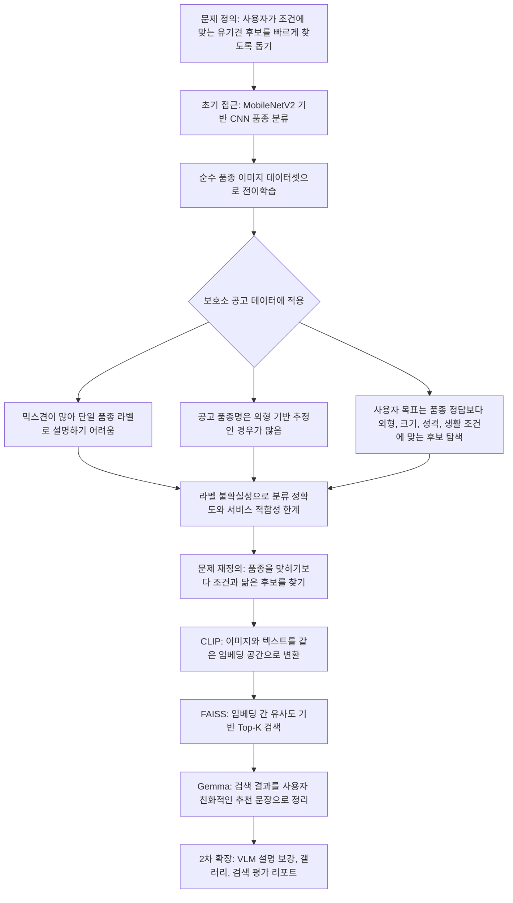
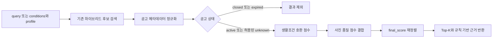

# 멍탐정 (MeongTamjeong)

이미지와 자연어로 유기견 공고를 찾고, 공고에서 확인된 정보와 사용자의 생활조건을 바탕으로 보호소 방문 전 후보를 좁히는 오픈소스 멀티모달 탐색 도구입니다. 이 프로젝트는 입양 적합성을 확정하거나 실제 입양 결정을 대신하지 않습니다.

- [데이터 카드](DATA_CARD.md)
- [모델·시스템 카드](MODEL_CARD.md)
- [제3자 소프트웨어·모델 고지](THIRD_PARTY_NOTICES.md)
- [2026 오픈소스 개발자대회 제출 체크리스트](docs/contest-2026-checklist.md)
- [기여 방법](CONTRIBUTING.md)
- [보안 정책](SECURITY.md)
- [Apache-2.0 라이선스](LICENSE)

## 빠른 시작

Python 3.10을 기준으로 검증합니다.

```bash
git clone https://github.com/YuMinBee/meongtamjeong.git
cd meongtamjeong
python -m venv .venv
source .venv/bin/activate
pip install -r requirements.txt
uvicorn app.main:app --host 0.0.0.0 --port 8000
```

Windows PowerShell에서는 가상환경 활성화 명령으로 `.venv\Scripts\Activate.ps1`을 사용합니다. 최초 실행 시 CLIP 가중치를 내려받을 수 있습니다. `/search/text`, `/search/profile`과 규칙 기반 추천 근거는 Gemma 없이 동작하며, Gemma 추천 문장과 오프라인 VLM 보강은 선택 기능입니다.

Gemma/VLM 기능은 필요한 경우에만 별도로 설치합니다. 객체 영역 추출은 핵심 의존성의 TorchVision Faster R-CNN과 OpenCV로 실행되므로 별도 탐지 패키지가 필요하지 않습니다.

```bash
# Gemma 추천 문장·오프라인 VLM 보강
python -m pip install -r requirements-vlm.txt
```

객체 영역 보강을 처음 실행하면 TorchVision의 COCO 사전학습 가중치를 내려받을 수 있습니다. 가중치 출처와 이용 조건은 `MODEL_CARD.md`와 `THIRD_PARTY_NOTICES.md`를 확인하세요.

기본 API 키는 `.env.example` 기준 `change-me`입니다. 실제 배포나 제출용 실행에서는 `.env`에 별도 값을 넣어 사용하세요. 대회 시연은 상태 unknown 공고를 제외하고 active-only artifact를 요구하는 `.env.contest.example`을 기준으로 준비합니다. 로컬에서 서버가 켜지면 아래 명령으로 상태를 확인할 수 있습니다.

```bash
curl -H 'x-api-key: change-me' http://localhost:8000/health
```

텍스트 검색은 다음처럼 호출합니다.

```bash
curl -X POST 'http://localhost:8000/search/text' \
  -H 'x-api-key: change-me' \
  -H 'Content-Type: application/json' \
  -d '{"query":"작고 차분한 흰색 강아지","topk":5}'
```

현재 데이터가 대회 시연이나 운영에 적합한지 먼저 확인하려면 다음 명령을 사용합니다.

```bash
python scripts/check_contest_readiness.py \
  --metas data/dog_metas.json \
  --index data/dog_faiss.index
```

`--strict`를 추가하면 식별자 누락, 인덱스/메타 불일치, 공고 상태 커버리지 부재처럼 제출을 막는 항목이 있을 때 0이 아닌 종료 코드를 반환합니다.

## 프로젝트 목적

본 프로젝트는 사용자가 유기견 입양을 온라인에서 바로 결정하도록 만들기 위한 서비스가 아닙니다. 실제 입양은 보호소 방문과 상담, 그리고 개체를 직접 확인하는 과정을 통해 신중하게 이루어져야 합니다. 다만 그 이전 단계에서 여러 공고를 탐색하고 비교하는 과정은 여전히 비효율적이며, 공고 원문 또한 짧거나 서술 방식이 일정하지 않아 필요한 정보를 빠르게 파악하기 어려운 경우가 많습니다.

따라서 본 프로젝트는 짧고 불균일한 공고 정보를 보완하고, 이미지와 텍스트 기반 유사도 검색을 통해 사용자가 자신의 환경과 조건에 맞는 후보를 더 빠르게 탐색할 수 있도록 돕는 것을 목표로 합니다. 또한 보호소가 모든 공고를 상세하게 작성하기 어려운 현실을 고려하여, VLM 기반 설명 보강을 통해 정보 품질을 높이고 공고 작성 부담을 줄일 수 있는 방향을 함께 제안합니다.

### 생활조건 기반 검색의 역할과 한계

`POST /search/profile`은 기존 하이브리드 검색으로 후보군을 먼저 찾은 뒤, 사용자의 생활조건과 공고에 명시된 정보를 비교해 후보 순서를 다시 정렬합니다. 이 기능은 입양 적합성을 확정하거나 개체의 실제 성격을 예측하지 않습니다.

- 성격, 아동·다른 동물과의 생활 가능성, 혼자 지낼 수 있는 시간은 공고에 명시된 근거가 있을 때만 평가합니다.
- 정보가 없으면 임의로 추정하지 않고 `unknown_conditions`로 반환합니다.
- 사진 품질 점수는 온라인 공고의 탐색 편의성을 나타낼 뿐, 개체의 입양 적합성이나 건강 상태를 의미하지 않습니다.
- 공고 상태와 실제 보호 여부는 상세 공고와 보호소 상담으로 다시 확인해야 합니다.

> 이 결과는 입양 적합성을 확정하지 않으며, 실제 성격과 생활 적합성은 보호소 방문 및 상담을 통해 확인해야 합니다.

## 왜 필요한가

이 프로젝트의 필요성은 "입양을 온라인에서 대신 결정해주는가"가 아니라, "입양 전 탐색과 비교를 얼마나 효율적으로 도와줄 수 있는가"에 있습니다.

- [한국농촌경제연구원의 2024년 조사](https://repository.krei.re.kr/bitstream/2018.oak/31235/1/P298.pdf)에서는 반려동물 관련 정보 채널로 포털사이트와 유튜브가 높은 비중을 보였고, 향후 입양 희망자 264명 중 48.1%가 보호소·유기동물 입양을 선호했습니다. 농림축산식품부의 [2025년 동물복지 국민의식조사](https://www.mafra.go.kr/bbs/home/792/576961/artclView.do)에서도 5,000명 온라인 조사 중 1년 이내 입양 의향 응답자의 88.3%가 유실·유기동물 입양을 고려한다고 보고했습니다.

- 농림축산식품부의 [2023년 반려동물 보호·복지 실태조사](https://mafra.go.kr/bbs/home/792/584544/download.do)에 따르면 유실·유기동물 등 113,072마리가 구조됐고, 동물보호센터 운영 비용은 전년보다 26.8% 증가했습니다.

- [미국 5개 보호소 입양자 1,491명을 분석한 연구](https://www.mdpi.com/2076-2615/2/2/144)에서는 외형, 입양자와의 사회적 행동, 놀이 행동이 주요 입양 이유로 나타났습니다. 이는 공고 단계에서 사진과 설명이 초기 탐색에 영향을 줄 수 있음을 시사합니다.

- [Best Friends가 소개한 HeARTs Speak의 2018년 요약 자료](https://bestfriends.org/network/blog/photo-pros-share-tricks-trade)에서는 입양자의 65%가 입양 전 온라인 사진을 확인했고, 10명 중 9명은 후보 비교에 사진을 사용했으며, 64%는 온라인 사진이 매우 또는 극히 중요하다고 답했습니다. 링크된 글에는 원 조사의 표본과 방법이 제시되지 않아 보조 근거로만 사용합니다.

- [Lampe와 Witte의 보호견 온라인 사진 연구](https://pubmed.ncbi.nlm.nih.gov/25495493/)에서는 카메라를 향한 시선, 서 있는 자세, 적절한 사진 크기, 야외 배경, 흐리지 않은 사진이 더 빠른 입양과 관련됐습니다. 이는 상관관계 결과이며 개별 공고의 입양 가능성을 예측하는 근거로 사용하지 않습니다.

즉, 보호소 공고의 사진과 설명은 단순히 "올려두는 정보"가 아니라, 사용자가 후보를 고르고 비교하는 과정에서 중요한 탐색 자료입니다. 본 프로젝트는 바로 이 탐색 단계의 비효율을 줄이는 데 초점을 둡니다.

## 개발 흐름

이 프로젝트는 한 번에 현재 구조로 정해진 것이 아니라, 아래와 같은 흐름으로 두 차례 개발 방향이 확장되었습니다.

1. 초기 실험: `MobileNetV2` 기반 CNN 품종 분류를 먼저 시도했습니다. 하지만 보호소 데이터에는 믹스견이 많고, 공고에 적힌 품종명도 외형 기반 추정인 경우가 많아 순수 품종 데이터셋으로 학습한 분류 모델을 실제 유기견 공고에 그대로 대응시키기 어려웠습니다. 결국 품종을 정확히 맞히는 접근은 서비스 문제 정의와도 어긋난다고 판단했습니다.

2. 1차 개발: 품종 분류 대신 `CLIP + FAISS` 기반 벡터 유사도 검색으로 전환했습니다. 텍스트 질의와 이미지 질의를 같은 임베딩 공간에서 다루며, "어떤 종인지"보다 "사용자가 찾는 조건과 얼마나 닮았는지"를 기준으로 후보를 찾는 구조를 만들었습니다.

3. 2차 개발: 검색 결과의 해석 가능성을 높이기 위해 `Gemma 3` 기반 VLM 설명 보강을 추가했습니다. 원문 설명과 보강 설명을 합친 `merged_desc`를 생성하고, 설명 길이 증가와 샘플 질의 기반 검색 적합도 같은 설명 중심 지표를 별도로 측정했습니다. 당시 로컬 실험에서는 VLM 설명 보강 `1,639`건, 평균 설명 길이 `20.1자 -> 147.5자`, 샘플 질의 10개 기준 `top1 hit rate 0.0 -> 0.4`, `avg hit@5 0.02 -> 0.30`을 기록했습니다. 당시 cache와 생성 report는 현재 Git에 포함되어 있지 않으므로 출품 성능 근거로 쓰기 전 재현 artifact가 필요합니다.

## 기술 전환 흐름도



## 왜 CNN 분류에서 CLIP 유사도 검색으로 바꿨나

| 구분 | CNN 품종 분류 접근 | CLIP + FAISS 유사도 검색 접근 |
| --- | --- | --- |
| 핵심 질문 | 이 강아지는 어떤 품종인가? | 사용자의 조건과 가장 비슷한 후보는 누구인가? |
| 데이터 전제 | 정답 품종 라벨이 명확해야 함 | 이미지와 텍스트 특징이 충분하면 검색 가능 |
| 실제 보호소 데이터와의 차이 | 믹스견, 추정 품종명, 짧은 공고 설명 때문에 라벨 신뢰도가 낮음 | 품종명이 완벽하지 않아도 외형·텍스트 조건을 함께 반영 가능 |
| 사용자 관점 | 품종 분류 결과가 바로 입양 적합성을 의미하지 않음 | 크기, 색상, 분위기, 설명, 생활 조건 기반 탐색에 더 가까움 |
| 서비스 확장성 | 새 품종이나 혼합 품종이 늘면 재학습 부담이 큼 | 임베딩을 추가하고 인덱스를 갱신하는 방식으로 확장 가능 |

초기에는 `MobileNetV2`가 경량이고 전이학습이 쉬워 품종 분류 모델로 적합해 보였습니다. 하지만 유기견 입양 서비스에서 중요한 것은 "정확한 품종명 하나를 맞히는 것"보다 "사용자가 감당할 수 있는 생활 조건과 선호에 맞는 후보를 찾는 것"이었습니다.

따라서 최종 구조는 품종 분류 모델이 아니라, 이미지와 텍스트를 함께 임베딩하고 FAISS로 가까운 후보를 찾는 검색 구조로 바뀌었습니다. 이 방식은 믹스견이 많고 공고 설명이 불균일한 보호소 데이터에 더 잘 맞으며, 이후 Gemma 추천 문장 생성과 VLM 설명 보강으로도 자연스럽게 확장할 수 있습니다.

## 1차 개발 결과물: 벡터 기반 유사도 검색

기존 시스템은 `data/dog_faiss.index`와 `data/dog_metas.json`을 기반으로 동작하는 CLIP + FAISS 검색 서비스였습니다.

- 텍스트 질의 또는 이미지 질의를 CLIP 임베딩으로 변환
- FAISS에서 유사한 유기견 후보 검색
- 검색 결과를 바탕으로 Gemma 기반 추천 문장 생성
- FastAPI API 형태로 검색/추천 기능 제공

즉, "현재 저장된 임베딩 메타를 빠르게 검색하고 추천하는 시스템"이 기존 시스템의 핵심이었습니다.

## 1차 개발 한계

기존 시스템은 검색과 추천 자체는 가능했지만, 실제 서비스 관점에서는 몇 가지 한계가 있었습니다.

- 실제 공고 원문은 짧거나 서술 방식이 일정하지 않은 경우가 많아서, 개체의 특징이 충분히 드러나지 않거나 검색에 필요한 정보가 빠질 수 있었습니다.
- 기존 시스템은 이미지와 텍스트를 함께 활용하는 유사도 검색 구조이기 때문에, 더 구체적이고 일관된 설명 문장이 있을수록 검색과 추천 근거를 안정적으로 만들기 유리했습니다.
- 추천 품질은 정답이 하나로 고정된 문제가 아니기 때문에, 일반적인 분류 모델처럼 정확도 하나로 설명하기 어려웠습니다.

## 2차 개발 내용: 설명 보강과 탐색 확장

이번 작업에서는 "실제 공고를 더 쉽게 확인하고, 검색에 필요한 설명 정보를 보강하고, 보호소 사용자 입장에서도 추가 입력 부담을 줄일 수 있는 흐름을 만드는 것"에 집중했습니다.

- Gemma 3 기반 VLM 설명 보강 스크립트 `scripts/enrich_live_descriptions.py`를 추가했습니다.
- 최신 VLM을 실시간 추천 요청마다 돌리지 않고, 보호소 공고 수집 후 오프라인 배치로 사진 속성을 구조화한 `vlm_attrs` JSON을 생성하도록 확장했습니다.
- 기존 공고 설명과 VLM 설명을 합친 `merged_desc` 필드를 생성하도록 구성했습니다.
- `vlm_attrs`에서 만든 색상, 털 길이, 귀 모양, 크기 힌트, 얼굴/전신 노출, 사진 품질 정보를 검색 임베딩과 추천 이유에 함께 반영합니다.
- 실시간 추천 요청에서는 VLM을 다시 호출하지 않고, 오프라인 배치로 저장된 `vlm_attrs`와 `vlm_attr_text`를 검색 임베딩, 그래프 재랭킹, 추천 이유, 공고문 작성 보조에 재사용합니다.
- 운영 순서는 `fetch_live_dogs.py`로 공고 수집, `enrich_live_descriptions.py --task attributes`로 사진 속성 JSON 생성, `build_embeddings.py --input data/local_dog_cache_enriched.json`로 FAISS 인덱스 재생성입니다.
- 검색/추천 서비스는 `process_state`가 종료/입양/반환/자연사/안락사/기증이거나 `notice_end`가 지난 공고를 제외합니다. 기존 API는 원래 정책대로 unknown 공고를 기본 제외합니다. `/search/profile`만 상태 메타가 없는 기존 인덱스도 상담 필요 표시와 함께 기본 포함하며 별도 환경변수로 제어합니다.
- 지난 공고는 모델 평가, 회귀 테스트, 포트폴리오 지표 재현을 위해 백업/아카이브로 보존하고, 실제 추천 인덱스는 active-only로 재생성하는 운영 방식을 권장합니다.
- 설명 보강 전후 비교를 위한 `scripts/build_search_eval_report.py`를 추가했습니다.
- 종 코드별 사진을 브라우저에서 바로 볼 수 있는 `scripts/render_live_gallery.py`를 추가했습니다.
- 갤러리 검색에서 종 코드, 품종명, 공고번호를 함께 찾을 수 있도록 구성했습니다.
- 공고 상세 링크를 현재 국가동물보호정보시스템 라우팅에 맞게 보정했습니다.

## 3차 개발 내용: 하이브리드 멀티모달 RAG

기존 구조는 CLIP 임베딩과 FAISS로 후보를 찾고 Gemma가 추천 문장을 만드는 RAG 구조였습니다. 이번 단계에서는 단일 벡터 검색만 쓰지 않고, 사용자 조건을 구조화한 뒤 여러 근거를 합쳐 재랭킹하는 하이브리드 멀티모달 RAG로 확장했습니다.

- `app/hybrid_rag.py`를 추가해 조건 파싱, BM25 키워드 검색, VLM 속성 필터, 메타데이터 매칭, 재랭킹 점수와 근거 생성을 분리했습니다.
- `query_expansion.py`의 하드코딩 alias 확장 대신 `coat_color`, `fur_length`, `ear_shape`, `body_size_hint`, `sex`, `personality`, `photo_quality` 같은 구조화 조건을 검색 문장으로 변환합니다.
- `/search/text`, `/recommend`, 이미지 추천, 설문 추천이 모두 같은 하이브리드 검색/재랭킹 경로를 사용하도록 연결했습니다.
- `/rag/recommend`와 `/rag/recommend_form`을 추가해 생활환경, 외형 조건, 추가 텍스트, 참고 이미지를 하나의 사용자 플로우로 처리합니다.
- `/visualize/adoption-flow`에서 통합 탐색 UI를 제공하고, 각 후보마다 벡터/BM25/조건 매칭 근거와 사진 보완 조언을 함께 보여줍니다.
- `app/graph_rag.py`를 추가해 `Dog -> Trait/Region/Shelter/Status` 경량 그래프를 만들고, FAISS/BM25 후보에 그래프 조건 후보를 합친 뒤 `graph_conditions`, `graph_expansion`, `graph_similarity` 점수로 재랭킹합니다.
- 현재 저장된 `dog_metas.json`에는 보호소/지역 필드가 없어 해당 엣지는 0개지만, `care_name`, `process_state`, 지역 필드가 들어온 메타로 임베딩을 재생성하면 그래프에 자동 반영됩니다.

## 생활조건 기반 후보 재정렬

### 사용자 입력

`/search/profile`의 `profile`은 아래 9개 필드를 사용합니다. 정의되지 않은 필드는 허용하지 않으며, 잘못된 enum 값이나 문자열 형태의 boolean은 HTTP 422로 거절됩니다.

| 필드 | 형식 | 필수 | 허용값 또는 의미 |
| --- | --- | --- | --- |
| `housing_type` | string enum | 예 | `apartment`, `house`, `other` |
| `daily_absence_hours` | number | 예 | 하루 평균 부재 시간, `0~24` |
| `activity_level` | string enum | 예 | `low`, `medium`, `high` |
| `dog_experience` | string enum | 예 | `none`, `some`, `experienced` |
| `preferred_size` | string enum | 예 | `small`, `medium`, `large`, `any` |
| `preferred_age` | string enum | 예 | `puppy`, `adult`, `senior`, `any` |
| `preferred_region` | string 또는 null | 아니요 | 희망 지역. 빈 문자열은 `null` 처리 |
| `has_children` | boolean | 예 | JSON boolean `true` 또는 `false` |
| `has_other_pets` | boolean | 예 | JSON boolean `true` 또는 `false` |

요청에는 후보 생성에 사용할 `query` 또는 비어 있지 않은 `conditions` 중 하나가 반드시 있어야 합니다. `topk` 기본값은 5이며 허용 범위는 1~20입니다.

### 재정렬 흐름



기존 CLIP/FAISS, BM25, VLM 속성, 그래프 점수로 `topk × PROFILE_CANDIDATE_MULTIPLIER`개의 후보를 먼저 검색하고 최대 50개 안에서 재정렬합니다. 후보 메타데이터는 나이, 체중/크기, 성별, 중성화 여부, 지역, 품종/믹스 여부, 설명, VLM 속성, 사진 품질, 공고 상태로 보수적으로 정규화합니다. 근거가 없는 값은 추정하지 않고 unknown으로 둡니다.

### 점수 구성과 추천 근거

```text
final_score
  = retrieval_score
  + PROFILE_COMPATIBILITY_WEIGHT × compatibility_score
  + PROFILE_QUALITY_WEIGHT × quality_score
```

- `retrieval_score`: 기존 하이브리드 검색 점수를 0~1로 제한한 값
- `compatibility_score`: 일치 1, 주의 0을 적용 가능한 전체 조건 수로 나눈 근거 커버리지 반영 점수
- `quality_score`: 0~1 사진 품질 점수. 정보가 없으면 `null`
- `final_score`: 정렬용 가산 점수이며 확률이 아니므로 1보다 클 수 있음

공고 정보가 부족한 조건은 일치나 주의로 단정하지 않고 호환성 가점을 주지 않습니다. `compatibility_score`는 확인된 일치 점수 합을 적용 가능한 전체 조건 수로 나누므로, 정보가 한 항목뿐인 후보가 그 한 번의 일치만으로 과도한 가점을 받지 않습니다. 모든 조건이 unknown이면 `compatibility_score=0`이며 음수 감점은 없습니다. 사진 품질이 unknown이면 품질 항도 더하지 않습니다. `preferred_size=any`, `preferred_age=any`, 빈 `preferred_region`, `has_children=false`, `has_other_pets=false`처럼 비교가 필요 없는 조건은 평가 대상에서 제외합니다.

각 결과에는 `retrieval_score`, `compatibility_score`, `quality_score`, `final_score`, `applicable_count`, `evaluated_count`, `evidence_coverage`, `matched_conditions`, `caution_conditions`, `unknown_conditions`, 규칙 기반 `recommendation_reason`, 정규화된 `meta`, 실제 `source_url`이 포함됩니다. 점수와 함께 근거 커버리지를 확인해야 합니다. 성격, 공격성, 아동 친화성, 다른 동물과의 사회성은 명시적 공고 근거가 없으면 판단하지 않습니다.

## 현재 데이터/시스템 지표

현재 Git에 추적된 검색 artifact에서 직접 확인되는 값은 다음과 같습니다.

- 임베딩 메타 총 개수: `17,838`
- 이미지 메타: `9,826`
- 텍스트 메타: `8,012`
- 고유 공고 식별자 수: `12,934`
- FAISS 벡터 수: `17,838` (메타 행 수와 일치)
- 상태·종료일·지역·보호소 커버리지: `0%`

아래 값은 이전 로컬 cache와 enriched cache로 수행한 과거 설명 보강 실험 기록입니다. 해당 원본 cache와 생성 report는 현재 Git에 포함되어 있지 않으므로, 출품 성능 근거로 사용하려면 같은 스냅샷 또는 새 공개 평가 artifact를 먼저 추가해야 합니다.

- 당시 활성 공고 캐시 개수: `1,665`
- 당시 종 코드 수: `41`
- VLM 설명 보강 완료 개수: `1,639`
- 당시 `vlm_error` 개수: `0`
- 설명 보강 전 평균 설명 길이: `20.1자`
- 설명 보강 후 평균 설명 길이: `147.5자`
- 설명 길이 증가 배수: 약 `7.35배`
- 샘플 질의 10개 기준 `top1 hit rate`: `0.0 -> 0.4`
- 샘플 질의 10개 기준 `avg hit@5`: `0.02 -> 0.30`

> 현재 추적 중인 `data/dog_metas.json`은 검색 동작 확인에는 사용할 수 있지만, active 공고만 보여주는 대회 시연 데이터나 위 Before/After 수치의 완전한 재현 자료로는 충분하지 않습니다. 시연 전 최신 공고 cache를 수집해 active-only 인덱스를 다시 생성하고 readiness 검사를 통과해야 합니다.

이 숫자 중 임베딩 메타 개수와 공고 수는 운영 규모를 보여주는 지표에 가깝고, 설명 길이와 샘플 질의 기반 hit rate는 VLM 설명 보강 전후 비교를 위한 보조 평가 지표입니다.

## 실험 방법

과거 설명 보강 관련 수치는 아래 방식으로 계산했습니다. 현재 저장소에는 `eval_queries.sample.json`과 계산 스크립트는 있지만 당시 두 cache와 생성 report가 없으므로, 아래 절차는 방법 기록이며 현재 checkout만으로 같은 숫자를 재생성할 수 있다는 뜻은 아닙니다.

1. 운영 규모 지표
- `data/dog_metas.json`에서 전체 메타 수, 이미지 메타 수, 텍스트 메타 수를 집계했습니다.
- `data/local_dog_cache.json`에서 활성 공고 수와 종 코드 수를 집계했습니다.
- `data/local_dog_cache_enriched.json`에서 `vlm_desc`가 존재하는 항목 수와 `vlm_error` 개수를 집계했습니다.

2. 설명 길이 비교
- 원본 공고 파일 `data/local_dog_cache.json`과 보강 파일 `data/local_dog_cache_enriched.json`을 `desertionNo` 기준으로 매칭했습니다.
- 보강 전은 원본 `desc`의 문자열 길이 평균, 보강 후는 `merged_desc`의 문자열 길이 평균으로 계산했습니다.
- 설명 길이 증가 배수는 `평균(merged_desc 길이) / 평균(desc 길이)`로 계산했습니다.

3. 샘플 질의 기반 규칙 평가
- `data/eval_queries.sample.json`에 정의한 샘플 질의 10개를 사용했습니다.
- 각 질의에는 `match_groups`를 두고, 예를 들어 `흰색 소형견`이면 `흰색/하얀/백색`과 `소형견/작은/소형`처럼 질의 의도를 대표하는 단어 그룹을 지정했습니다.
- `scripts/build_search_eval_report.py`로 원본 설명 버전과 보강 설명 버전 각각에 대해 검색 결과를 생성했습니다.
- 상위 결과 설명 안에 각 단어 그룹에서 하나 이상이 포함되면 `hit`로 보고, 그 기준으로 `top1 hit rate`와 `avg hit@5`를 계산했습니다.

이 평가는 정답 레이블이 고정된 정확도 평가가 아니라, 설명 보강 전후를 빠르게 비교하기 위한 샘플 질의 기반 규칙 평가입니다.

## Before / After 확인 포인트

설명 보강 예시는 파이프라인을 실행해 `data/local_dog_cache_enriched.json`을 새로 생성하거나 당시 artifact를 복원한 뒤 확인할 수 있습니다. 이 파일은 현재 Git에 포함되어 있지 않습니다.

- `desc`: 보호소 공고 원문 설명
- `vlm_desc`: Gemma 3 VLM이 사진을 바탕으로 생성한 보강 설명
- `merged_desc`: 원문 설명과 VLM 보강 설명을 합쳐 실제 탐색에 쓰기 좋게 정리한 필드

즉, Before / After는 `desc -> merged_desc` 또는 `desc -> vlm_desc`를 비교해 보면 되고, 이 차이가 바로 README에 적은 설명 보강 효과의 근거가 됩니다.

## 정량 평가가 어려운 이유

이 프로젝트는 일반적인 분류 모델처럼 정답 레이블과 정확도 하나로 설명하기 어려운 구조입니다.

- 검색 결과에 대한 절대 정답이 고정되어 있지 않습니다.
- 추천 문장에는 사용자의 생활 조건과 선호 해석이 함께 들어가므로 정성 평가 비중이 큽니다.
- 유기견 공고 데이터는 시점에 따라 계속 바뀌기 때문에 동일 조건 재현이 어렵습니다.
- VLM 설명 보강 또한 "정답 문장"이 있는 문제가 아니므로 자동 점수화에 한계가 있습니다.

따라서 현재 단계에서는 응답 시간이나 정확도 하나보다, 검색 결과가 사용 의도에 맞는지와 설명 보강이 실제 탐색에 도움이 되는지를 중심으로 보는 편이 더 적절합니다.

## 향후 평가 계획

향후에는 단일 성능 수치를 억지로 만들기보다, 서비스 품질을 설명할 수 있는 평가 축을 분리해서 보는 것이 목표입니다.

- 대표 사용자 질의 세트를 정하고 추천 결과를 샘플 기반으로 검토
- 검색 결과의 상위 후보가 사용자의 의도와 얼마나 맞는지 정성 비교
- 기존 설명과 VLM 보강 설명을 비교해 정보 추가 여부를 검토
- 종 코드별 갤러리에서 실제 공고 탐색 편의성이 개선되었는지 확인
- 필요하면 이후에 사용자 피드백 기반 만족도 지표를 별도로 설계

## 디렉터리 구조

```text
.
├── app/                  # FastAPI 서버
├── scripts/              # 임베딩 생성/업데이트/분석/테스트 스크립트
├── tests/                # 프로필 재정렬, 메타 병합, API 회귀 테스트
├── data/                 # FAISS 인덱스, 메타, 캐시, 로그
├── assets/samples/       # 샘플 이미지
├── archive/              # 레거시 파일 보관
├── .env.example
├── README.md
├── requirements.txt
└── requirements.lock.txt
```

## 다른 컴퓨터로 옮길 때

필수(실행에 필요):
- 코드/설정: `app/`, `scripts/`, `requirements.txt`, `.env`(또는 `.env.example` 참고)
- 데이터: `data/dog_faiss.index`, `data/dog_metas.json`
- 임베딩을 재생성하지 않을 거면: `data/all_dog_embeddings.npz`

불필요(다시 생성됨):
- `.venv/`, `__pycache__/`

## 설치/실행

### 1) 압축해서 이동(권장)

```bash
cd /path/to/meongtamjeong
tar --exclude='.venv' --exclude='__pycache__' -czf meongtamjeong.tar.gz .
```

새 컴퓨터에서:

```bash
tar -xzf meongtamjeong.tar.gz
python -m venv .venv
source .venv/bin/activate
pip install -r requirements.txt
```

### 2) 환경변수

`.env.example`를 참고해서 `.env`를 만드세요.

| 환경변수 | 기본값 | 역할 |
| --- | --- | --- |
| `NOTICE_FILTER_INACTIVE` | `true` | 하이브리드 후보 생성에서 closed/expired 공고 제외 |
| `NOTICE_INCLUDE_UNKNOWN` | `false` | 기존 검색 API에서 상태 unknown 공고를 후보로 허용할지 결정 |
| `PROFILE_INCLUDE_UNKNOWN_NOTICES` | `true` | 프로필 검색에서 상태 unknown 공고를 확인 필요 표시와 함께 허용 |
| `PROFILE_COMPATIBILITY_WEIGHT` | `0.25` | compatibility 가중치, 0 이상 |
| `PROFILE_QUALITY_WEIGHT` | `0.05` | 사진 품질 가중치, 0 이상 |
| `PROFILE_CANDIDATE_MULTIPLIER` | `5` | 프로필 재정렬 전 후보군 배수, 1 이상 |
| `INDEX_PATH` | `./data/dog_faiss.index` | FAISS 인덱스 경로 |
| `METAS_PATH` | `./data/dog_metas.json` | 인덱스 행과 순서가 일치하는 메타데이터 경로 |

기존 API의 `NOTICE_INCLUDE_UNKNOWN` 기본값은 변경하지 않았습니다. 프로필 검색은 `PROFILE_INCLUDE_UNKNOWN_NOTICES=true`일 때 상태 정보가 없는 기존 메타도 반환하되 `unknown_conditions`에 상태 확인 안내를 추가합니다. active 상태가 포함된 메타데이터로 인덱스를 재생성한 운영 환경에서는 이 값도 `false`로 바꿀 수 있습니다. `/search/profile`의 최종 결과는 설정과 관계없이 closed/expired를 다시 제외합니다.

- `API_KEY`: 요청 헤더 `x-api-key` 값
- `GEMMA3_ENABLED`: Gemma 기반 선택 API 활성화 여부. `false`면 모델을 다운로드하거나 로드하지 않음
- `GEMMA3_MODEL_PATH`: 로컬 Gemma 3 snapshot 경로
- `GEMMA3_MODEL_ID`: 로컬 경로가 없을 때 사용할 Gemma 모델 ID
- `GEMMA3_GPU_MAX_MEMORY`: Gemma 실행 시 GPU 최대 메모리
- `GEMMA3_CPU_MAX_MEMORY`: Gemma 실행 시 CPU 오프로드 메모리
- `VLM_MODEL_PATH`: 속성 추출용 로컬 VLM snapshot 경로(`GEMMA3_MODEL_PATH`보다 우선)
- `VLM_MODEL_ID`: 속성 추출용 VLM 모델 ID(`GEMMA3_MODEL_ID`보다 우선)
- `VLM_MODEL_CLASS`: `gemma3` 또는 `auto`. Qwen 계열처럼 범용 image-text 모델은 `auto`를 사용
- `ANIMAL_API_KEY`: 공공 유기동물 API 키(임베딩 생성/업데이트 시 사용 가능)

### 3) API 실행

```bash
uvicorn app.main:app --host 0.0.0.0 --port 8000
```

헬스체크:

```bash
curl -H 'x-api-key: change-me' http://localhost:8000/health
```

## API 엔드포인트

모든 API 요청에는 헤더 `x-api-key`가 필요합니다. `GET` 요청은 쿼리 파라미터 `api_key`로도 전달할 수 있지만, 로컬 테스트가 아니라면 헤더 방식을 권장합니다.

| 메서드 | 경로 | 설명 |
| --- | --- | --- |
| `GET` | `/health` | 인덱스 크기, 실행 디바이스, 종 코드 그룹 수 확인 |
| `POST` | `/search/text` | 텍스트 질의를 구조화하고 벡터/BM25/VLM 속성 기반 하이브리드 검색 |
| `POST` | `/search/profile` | 기존 하이브리드 후보를 9개 생활조건, 공고 상태, 사진 품질로 재정렬 |
| `POST` | `/recommend` | 하이브리드 검색 결과를 바탕으로 Gemma 추천 문장 생성 |
| `POST` | `/rag/recommend` | 생활환경, 외형 조건, 추가 텍스트를 하나의 JSON 플로우로 추천 |
| `POST` | `/rag/recommend_form` | 생활환경, 외형 조건, 참고 이미지를 FormData로 받아 멀티모달 추천 |
| `GET` | `/visualize/adoption-flow` | 통합 입양 탐색 UI |
| `GET` | `/rag/graph` | Graph-enhanced RAG 인덱스 요약과 feature 예시 |
| `POST` | `/shelter/notice_draft` | `vlm_attrs`와 공고 정보를 바탕으로 보호소 공고 초안 생성 |
| `POST` | `/recommend_with_image` | 기준 이미지와 사용자 프로필을 함께 사용해 추천 |
| `POST` | `/recommend_with_survey_json` | 설문 JSON과 추가 텍스트로 추천 |
| `POST` | `/recommend_with_survey_form` | 설문 JSON 문자열, 추가 텍스트, 선택 이미지로 추천 |
| `POST` | `/chat` | 공고 기반 탐색을 돕는 간단한 상담 응답 생성 |
| `GET` | `/breeds` | 저장된 임베딩 메타 기준 종 코드 요약 |
| `GET` | `/breeds/{breed_code}/images` | 특정 종 코드의 이미지 목록 |
| `GET` | `/visualize/breeds` | 저장된 임베딩 메타 기준 종 코드 갤러리 HTML |
| `GET` | `/live/breeds` | 최신 공고 캐시 기준 종 코드 요약 |
| `GET` | `/live/breeds/{breed_code}/images` | 최신 공고 캐시 기준 특정 종 코드 이미지 목록 |
| `GET` | `/visualize/live-breeds` | 최신 공고 캐시 기준 종 코드 갤러리 HTML |

추천 API 예시:

```bash
curl -X POST 'http://localhost:8000/recommend' \
  -H 'x-api-key: change-me' \
  -H 'Content-Type: application/json' \
  -d '{"query":"1인 가구이고 산책은 하루 30분 가능해요. 얌전한 소형견을 찾고 있어요.","topk":6}'
```

생활조건 기반 검색 예시:

```bash
curl -X POST 'http://localhost:8000/search/profile' \
  -H 'x-api-key: change-me' \
  -H 'Content-Type: application/json' \
  -d '{
    "query": "서울에서 차분한 소형 성견을 찾고 있어요",
    "profile": {
      "housing_type": "apartment",
      "daily_absence_hours": 6,
      "activity_level": "low",
      "dog_experience": "none",
      "preferred_size": "small",
      "preferred_age": "adult",
      "preferred_region": "서울",
      "has_children": false,
      "has_other_pets": false
    },
    "topk": 5
  }'
```

응답 상단에는 `candidate_count`, 실제 `count`, 사용한 `weights`, `notice_policy`, `disclaimer`가 포함되고 각 후보에는 네 점수와 조건별 근거, 실제 공고 링크가 포함됩니다.

설문 JSON 추천 예시:

```bash
curl -X POST 'http://localhost:8000/recommend_with_survey_json?topk=5' \
  -H 'x-api-key: change-me' \
  -H 'Content-Type: application/json' \
  -d '{
    "survey": {
      "living": "아파트",
      "family": "1인 가구",
      "walk_time": "하루 30분",
      "dog_size": "소형견",
      "preferred_personality": "차분하고 사람을 좋아하는"
    },
    "extra_text": "처음 반려견을 키우는 사람에게 맞는 후보를 보고 싶어요."
  }'
```

이미지 기반 추천 예시:

```bash
curl -X POST 'http://localhost:8000/recommend_with_image?topk=5' \
  -H 'x-api-key: change-me' \
  -F 'profile=20대 1인 가구, 평일 야근이 있고 주말 산책 가능' \
  -F 'ref_image=@/path/to/sample.jpg'
```

## 자주 쓰는 스크립트

```bash
python scripts/build_embeddings.py
python scripts/update_embeddings.py
python scripts/fetch_live_dogs.py --years 3
python scripts/enrich_image_crops.py --input data/local_dog_cache.json --output data/local_dog_cache_enriched.json --crop-dir data/image_crops_fasterrcnn --limit 0 --device auto
python scripts/enrich_live_descriptions.py --task attributes --limit 20
python scripts/run_offline_vlm_pipeline.py --limit 100 --target 1000 --text-only
python scripts/enrich_live_descriptions.py --task both --model-class auto --model-path /path/to/local/vlm
python scripts/build_embeddings.py --input data/local_dog_cache_enriched.json --text-only
python scripts/render_live_gallery.py --input data/local_dog_cache_enriched.json
python scripts/local_dog_search.py
python scripts/analyze_meta_text_freq.py
python scripts/test_api.py
```

`enrich_image_crops.py`의 기본 탐지기는 `fasterrcnn_mobilenet_v3_large_fpn`입니다. 모델을 교체한 뒤에는 `--retry-missing-only`를 사용하지 말고 새 output·crop 경로에서 전체를 다시 생성해야 서로 다른 탐지기의 결과가 섞이지 않습니다. `--device auto`는 CUDA가 있으면 GPU를, 없으면 CPU를 사용합니다.

### 기존 인덱스 메타데이터 보강

```bash
python scripts/merge_dog_metadata.py \
  --metas data/dog_metas.json \
  --cache data/local_dog_cache.json \
  --enriched data/local_dog_cache_enriched.json \
  --output data/dog_metas.enriched.json
```

`desertionNo` 또는 `desertion_no`를 기준으로 일반 cache를 적용한 뒤 enriched cache를 적용합니다. 빈 값과 Unknown 계열 값은 기존의 유효한 값을 덮지 않습니다. 출력 파일은 원본 메타의 개수, 순서, 식별자와 `type`을 유지하므로 기존 FAISS 인덱스를 그대로 두고 `METAS_PATH=./data/dog_metas.enriched.json`로 사용할 수 있습니다. 선택 cache 파일이 없으면 경고 후 계속하지만 `--metas`가 없거나 JSON 최상위가 list가 아니면 오류로 종료합니다.

보강된 설명 자체를 검색 벡터에도 반영하려면 인덱스를 재생성합니다.

```bash
python scripts/build_embeddings.py \
  --input data/local_dog_cache_enriched.json \
  --species dog \
  --target 10000 \
  --exclude-unknown \
  --index-out data/dog_faiss.index \
  --metas-out data/dog_metas.json
```

기본 재생성은 기존 호환성을 위해 closed/expired를 제외하되 상태 unknown은 포함합니다. 운영·대회 시연용 active-only artifact는 위 예시처럼 `--exclude-unknown`을 사용합니다. 필요에 따라 `--text-only`로 이미지 벡터 생성을 생략하거나, 보존 목적일 때만 `--include-closed`를 사용할 수 있습니다.

## 테스트

가벼운 테스트·정적 검사 전용 환경은 애플리케이션의 GPU/VLM 의존성을 설치하지 않고 구성할 수 있습니다.

```bash
python -m pip install -r requirements-dev.txt
```

프로젝트 루트에서 다음 명령을 실행합니다.

```bash
python -m pytest -q
ruff check app/profile_rerank.py app/notice_status.py app/graph_rag.py scripts/fetch_live_dogs.py scripts/enrich_image_crops.py scripts/merge_dog_metadata.py scripts/check_contest_readiness.py tests
```

자동 테스트는 프로필별 순위 변화, unknown의 중립 처리, 종료 공고 제외, 점수와 근거 일관성, 기존 텍스트·이미지 API 회귀, 메타 병합의 개수·순서·식별자 보존과 우선순위를 검증합니다. `pytest.ini`는 `tests/`만 수집하므로 `scripts/test_api.py` 같은 기존 실행용 스크립트는 자동 수집하지 않습니다.

## 정확히 같은 환경(현재 PC 기준)

`requirements.lock.txt`는 과거 시스템 전체 환경에서 생성된 참고용 freeze이며 ROS·CUDA 패키지까지 포함합니다. 현재 프로젝트의 clean install 기준으로 사용하지 마세요. 핵심 검색과 객체 영역 추출은 `requirements.txt`, Gemma/VLM은 `requirements-vlm.txt`, 테스트·CI는 `requirements-dev.txt`, 전체 GPU 환경은 `environment.yml`을 기준으로 합니다. 제출용 lockfile은 clean 환경에서 별도로 다시 생성할 예정입니다.

## 라이선스

프로젝트 소스코드는 [Apache License 2.0](LICENSE)으로 배포하며 저작권자는 `YuMinBee`입니다. 공공 API 데이터, 공고 사진, 사전학습 모델과 제3자 패키지는 프로젝트 코드 라이선스와 별개의 출처·약관이 적용되므로 `DATA_CARD.md`, `MODEL_CARD.md`, `THIRD_PARTY_NOTICES.md`를 함께 확인해야 합니다.
