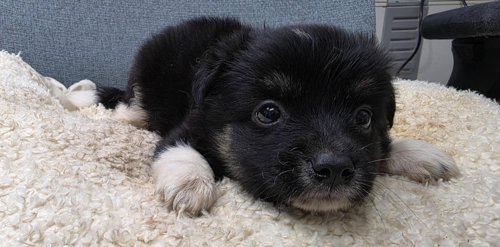
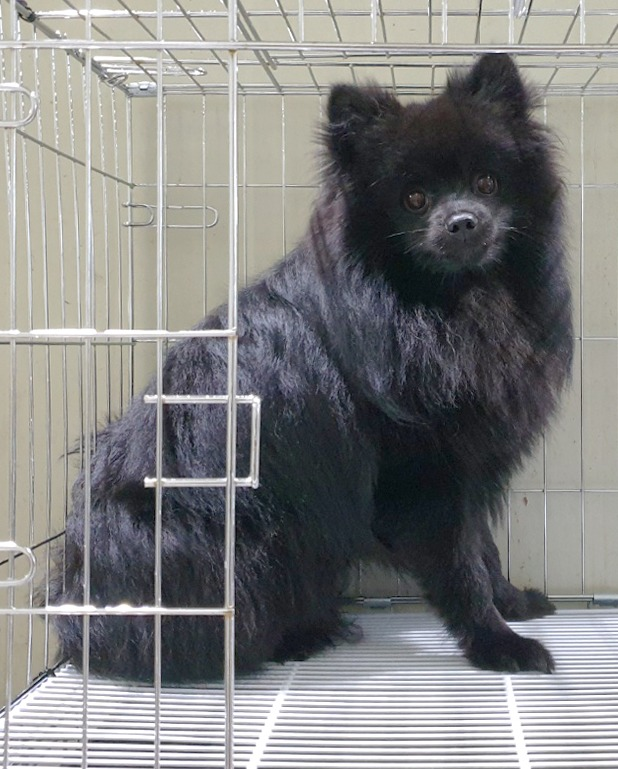
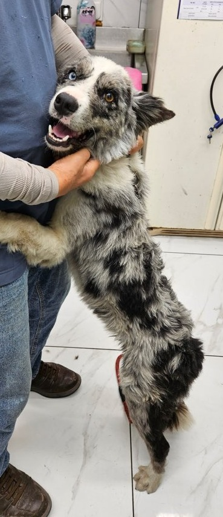
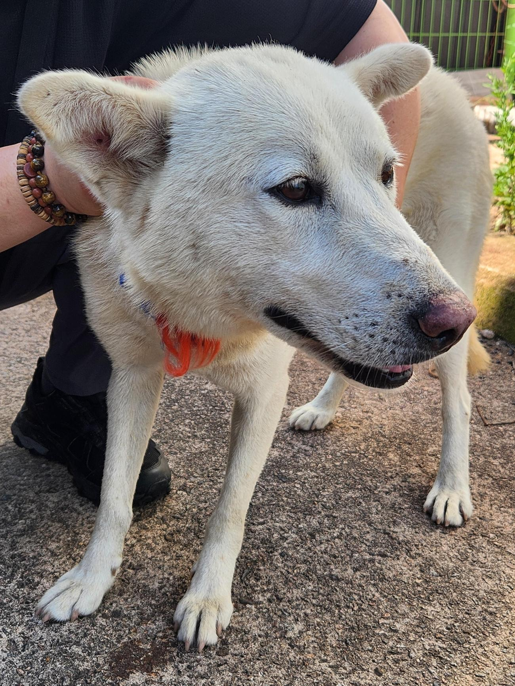

# 이미지 검색 샘플

공공 유기동물 공고 사진에서 개 영역을 잘라 만든 이미지 검색 입력 예시입니다. 생성형 AI로 만들거나 보정한 사진이 아니며, 샘플 포함 자체가 특정 개체에 대한 입양 추천을 뜻하지 않습니다.

| 샘플 | 스냅샷 정보 |
| --- | --- |
|  | 충남 부여 · 60일 미만 · 1kg |
|  | 경기 이천 · 2024년생 · 3.5kg |
|  | 인천 영종 · 2024년생 · 17kg |
|  | 경북 영덕 · 2023년생 · 20kg |

각 파일의 공고번호, 원본 이미지 URL, 실제 공고 링크, 수집·확인 시각, 변환 방식과 SHA-256은 [`manifest.json`](manifest.json)에 기록했습니다. 네 공고 모두 2026-07-17 스냅샷에서 `보호중`이었지만 공고 상태와 링크는 이후 변경될 수 있습니다.

사진은 권장 외형 검색 API인 `POST /search/appearance/image`의 `ref_image` 입력 예시로 사용할 수 있습니다.

```bash
curl -X POST "http://localhost:8000/search/appearance/image" \
  -H "x-api-key: $API_KEY" \
  -F "ref_image=@assets/samples/notice_428349202600501.jpg" \
  -F "query=검은 털의 중형견" \
  -F "preferred_size=medium" \
  -F "preferred_age=any" \
  -F "topk=5"
```

공공데이터포털에는 해당 API의 이용허락범위가 `제한 없음`으로 표시되어 있습니다. 다만 API 응답에는 개별 사진의 촬영자나 별도 사진 라이선스가 없으므로, 이 파일들은 프로젝트 소스의 Apache-2.0으로 재허가하지 않습니다. 권리 관련 요청이 접수되면 파일을 제거하고 원격 공고 링크 방식으로 전환합니다.

출품 릴리스 전에는 제공기관에 이 crop의 공개 재배포 가능 범위를 서면으로 확인해야 합니다. 확인하지 못하면 네 파일을 릴리스에서 제외하고 사용자가 공식 공고 링크에서 직접 고른 사진을 업로드하는 예시로 대체합니다. 네 파일을 제거하더라도 사진 파생 벡터가 포함된 `data/dog_faiss.index`의 권리 검토는 별도로 남으므로 [`DATA_CARD.md`](../../DATA_CARD.md)의 전체 산출물 경계를 함께 확인해야 합니다.
