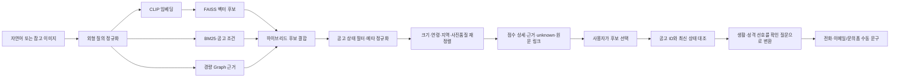

# 2026 오픈소스 개발자대회 개발보고서 초안 — 멍탐정

> 문서 상태: **출품 전 검토용 초안**
>
> 근거 기준일: **2026-07-26**
>
> 작성 원칙: 저장소에 남아 있는 코드·manifest·평가 리포트로 확인할 수 있는 내용만 기술했다. 대회의 세부 채점 기준, 수상 가능성, 아직 수행하지 않은 사람 평가나 입양 성과는 가정하지 않았다.

## 1. 요약

멍탐정(MeongTamjeong)은 자연어 또는 참고 이미지로 마음에 드는 **외형의 실제 유기견 공고**를 찾고, 공고에서 확인 가능한 크기·연령·지역 조건으로 보호소 방문 전에 먼저 확인할 후보를 좁히는 오픈소스 멀티모달 탐색 도구다. 핵심은 AI가 “이 개가 사용자에게 적합하다”고 판정하는 것이 아니라, 정보가 불균일한 공고를 더 효율적으로 탐색하고 다음 행동인 원문 확인과 보호소 문의를 준비하도록 돕는 데 있다.

시스템은 FastAPI 위에서 OpenAI CLIP, FAISS, BM25, 공고 사실 기반 규칙과 경량 그래프를 결합한다. 권장 제출 경로인 `ranking_scope=appearance`의 검색 이후 재정렬은 크기·연령·희망 지역과 사진의 기술적 사용성만 반영한다. 이 경로에서는 주거 형태, 부재 시간, 활동량, 반려견 경험, 아동·다른 동물 여부와 선호 성격을 순위나 개체 특성 추정에 사용하지 않고, 사용자가 후보를 고른 뒤 보호소에 실제 관찰 내용을 묻는 질문으로만 변환한다. 하위 호환용 `profile` scope는 별도 실험 경로로 유지한다. 핵심 검색과 문의 문구 생성은 특정 유료 LLM 없이 동작한다.

현재 고정 스냅샷은 활성 공고 1,516건, FAISS/메타 3,746행으로 strict readiness와 artifact integrity 검사를 통과했다. 보강이 끝난 뒤 시스템을 보지 않은 별도 작성자가 동결한 최종 one-shot 24문장에서 Precision@5는 76.67%, nDCG@5는 79.15%, Hit@5는 100.00%, 비활성 노출은 0%였다. 실버 지표 하락 8건도 숨기지 않고 공개한다. 이는 사람의 주관적 외형 판단이나 입양 성과가 아니라 같은 스냅샷의 공고 사실 silver qrels에 대한 제한된 기술 지표다. 개발용 12질의의 단계별 비교에서는 CLIP, BM25, 자연어 조건, Graph의 변화를 별도로 공개한다. 인덱스에 넣지 않은 두 번째 사진 평가는 최초 120건 중 네트워크 다운로드와 중복 검사를 통과한 29건만 평가할 수 있었고, 그 29건에서 Hit@5는 96.55%였지만 전체 120건 기준 end-to-end Hit@5는 23.33%였다. 이 분모 차이와 `partial` 감사 상태를 함께 공개한다.

### 심사위원 60초 요약

| 질문 | 답 |
| --- | --- |
| 어떤 문제인가 | 지역·품종 필터만으로 표현하기 어려운 외형을 실제 활성 공고에서 찾고 비교하는 탐색 비용 |
| 사용자는 무엇을 하나 | 자연어·참고사진으로 후보를 찾고, 확인 가능한 크기·연령·지역으로 순서를 좁힌 뒤 원문과 문의 문구로 직접 확인 |
| 기술 핵심은 무엇인가 | CLIP·FAISS + BM25 + 공고 사실 정규화 + 경량 Graph + 규칙 기반 재정렬 |
| 무엇이 안전 경계인가 | 성격·공격성·아동/동물 친화성·입양 적합성을 사진이나 품종에서 추정하지 않고 `unknown` 또는 문의 질문으로 분리 |
| 검증 가능한 핵심 증거는 무엇인가 | frozen one-shot 24문장, 단계별 ablation, 비추론 계약 4/4, 자동 회귀와 실제 CLIP/FAISS runtime smoke |
| 왜 오픈소스인가 | 가중치·상태 판정·unknown 규칙·고정 입력·실패·artifact hash·기관 연결 계약까지 공개해 제3자가 감사·재현·확장 가능 |
| 아직 입증하지 않은 것은 무엇인가 | 사람의 주관적 외형 만족도, 후보 탐색 시간 개선, 입양·파양 성과와 사진 기반 성격 판단 |

핵심 기능과 결정적 안전 계약은 구현됐지만, 이 문서는 아직 최종 출품본이 아니다. 현재 스냅샷의 가장 늦은 공고 종료일이 2026-08-07이므로 2026-08-27 제출 전에 데이터·인덱스·평가를 모두 다시 만들어야 한다. 사진·crop 및 사진 파생 벡터의 재배포 범위 확인, 과거 비밀키 폐기 확인, clean-clone 검증, 사람 관련성 평가와 후보 선택 시간 파일럿, 브라우저 수동 QA, 시연영상과 릴리스 태그도 남아 있다. 상세 현황은 [대회 체크리스트](contest-2026-checklist.md)와 [릴리스 런북](contest-release-runbook.md)에 기록한다.

## 2. 해결하려는 사회문제와 문제 정의

### 2.1 입양 결정보다 먼저 존재하는 탐색 비용

실제 입양은 보호소 방문, 상담, 건강·행동 확인을 거쳐야 한다. 온라인 공고만으로 결정을 끝내려 해서는 안 된다. 그러나 방문 전 단계에서도 사용자는 많은 공고를 열어 사진과 짧고 형식이 다른 설명을 하나씩 비교해야 한다. 지역·품종 중심 필터만으로는 “복슬복슬한 흰색 털”, “귀가 접힌 중형견”, “참고사진과 비슷한 인상” 같은 시각적 의도를 직접 표현하기 어렵다. 멍탐정은 이 **후보 탐색과 비교 비용**을 줄이는 문제에 범위를 한정한다.

프로젝트 필요성을 뒷받침하는 공개 근거는 다음과 같다. [한국농촌경제연구원의 2024년 조사](https://repository.krei.re.kr/bitstream/2018.oak/31235/1/P298.pdf)에서 양육 희망 가구 264명 중 48.1%가 향후 입양 경로로 보호소·유기동물 입양을 응답했고(표 4-147), 농림축산식품부 [2025년 동물복지 국민의식조사](https://www.mafra.go.kr/bbs/home/792/576961/artclView.do)에서는 5,000명 온라인 조사 중 1년 이내 입양 의향 응답자의 88.3%가 유실·유기동물 입양을 고려한다고 보고했다. 농림축산식품부 [2023년 반려동물 보호·복지 실태조사](https://mafra.go.kr/bbs/home/792/584544/download.do)에는 유실·유기동물 등 113,072마리가 구조됐고 동물보호센터 운영 비용이 전년보다 26.8% 증가한 것으로 기록돼 있다. 이 수치들은 멍탐정의 효과를 측정한 결과가 아니라, 유기동물 입양 정보 탐색이 다룰 가치가 있는 영역임을 보여 주는 배경 근거다. 출처와 해석 범위는 [README의 필요성 정리](../README.md#왜-필요한가)에 함께 기록했다.

외형은 입양 적합도의 대리값이 아니지만 초기 탐색에서 무시할 수도 없다. 미국 5개 보호소 입양자 1,491명을 분석한 [공개 연구](https://www.mdpi.com/2076-2615/2/2/144)에서는 전체 입양자의 주요 이유에 외형, 입양자를 향한 사회적 행동과 성격이 포함됐고, 어린 개·고양이 집단에서는 놀이 행동도 상위 이유에 포함됐다. 보호견 온라인 사진과 입양 속도의 관계를 살핀 [Lampe와 Witte의 연구](https://pubmed.ncbi.nlm.nih.gov/25495493/)도 사진 표현과 입양 속도 사이의 연관성을 보고했다. 모두 관찰 연구이므로 멍탐정은 사진으로 입양 가능성이나 성격을 예측하지 않는다. 프로젝트가 취하는 결론은 더 제한적이다. **사진과 공고 설명이 초기 후보 탐색 자료라면, 그것을 검색 가능하게 만드는 도구가 필요하다.**

### 2.2 해결 범위와 비해결 범위

| 구분 | 멍탐정이 다루는 것 | 멍탐정이 다루지 않는 것 |
| --- | --- | --- |
| 탐색 | 자연어·참고사진으로 실제 공고 후보 검색 | 온라인에서 입양 대상 확정 |
| 조건 | 공고에 적힌 크기·연령·지역으로 우선순위 보조 | 사진·품종으로 성격·건강·공격성 판단 |
| 정보 부족 | `unknown`으로 표시하고 확인 항목 제공 | 결측값을 모델 추정으로 채워 사실처럼 표시 |
| 후속 행동 | 원문 링크, 전화 문구, 복사 가능한 이메일·문의폼 초안 | 자동 발송, 공식 신청, 상담 예약, 입양 승인 |
| 성과 | 검색 회귀·안전 계약·재현성 측정 | 입양 성공률, 파양 감소, 사용자 적합도 주장 |

이 경계는 소개 문구에만 있는 것이 아니라 [모델·시스템 카드](../MODEL_CARD.md), API 응답, 데모 화면, [비추론 안전 계약](evaluation/safety_contract.appearance_v1.md)과 회귀 테스트에 반영돼 있다.

## 3. 문제 정의의 발전 과정

멍탐정은 처음부터 현재 구조로 설계된 프로젝트가 아니다. 실제 공고 데이터와 사용자 목표를 비교하면서 “품종 정답 맞히기”에서 “외형 후보 탐색 돕기”로 문제를 다시 정의했다.

| 단계 | 접근 | 확인한 한계와 다음 결정 |
| --- | --- | --- |
| 초기 시도(현재 학습 코드·결과 artifact 미보존) | MobileNetV2 전이학습 기반 품종 분류 | 보호소 공고에는 믹스견과 추정 품종 표기가 많아 순수 품종 라벨을 정답으로 다루기 어려웠다. 사용자의 목적도 혈통 판정이 아니라 후보 탐색에 가까웠다. 현재 저장소에 정량 근거가 없어 성능 주장에는 사용하지 않는다. |
| 1차 개발 | CLIP으로 이미지·텍스트를 같은 공간에 임베딩하고 FAISS로 Top-K 검색 | 품종명이 불확실해도 이미지와 자연어로 후보를 찾을 수 있었다. 다만 짧고 불균일한 설명과 객관 조건 처리, 상태 관리가 부족했다. |
| 선택 연구 | Gemma 3/VLM으로 사진의 외형 설명을 오프라인 보강하는 경로 | 관련 cache와 당시 결과 파일은 현재 HEAD·제출 artifact에서 제외했고 현재 성능 근거로 사용하지 않는다. 과거 Git 이력에는 일부 관련 파일이 남아 있어 릴리스 전 데이터 권리·이력 처리 범위를 별도로 확인한다. 행동·성격 생성 위험도 있어 현재 제출 평가에서도 제외했다. |
| 현재 권장 외형 구조 | CLIP·FAISS 후보에 BM25, 공고 사실 조건, 경량 Graph를 결합하고 외형 프로필로 재정렬 | 공고 사실과 사진 관찰을 구분하고, `appearance` 경로의 생활·성격 선호는 검색에서 분리해 문의 질문으로 전환했다. |

현재 스냅샷의 공고상 품종 1,516건은 모두 `public_notice_reported` 출처다. 원문에 믹스가 직접 적힌 1,248건만 `mixed_breed=true`이며, 나머지 268건은 순종 여부 근거가 없어 `null`이다. `mixed_breed=false`로 확정한 공고는 0건이다. 이는 품종 분류 정확도를 서비스의 중심에 두지 않은 이유를 데이터 차원에서 보여 준다. 품종 표기는 정확한 품종명 질의와 표시에는 사용할 수 있지만, 혈통·행동·생활 적합성 근거로 확장하지 않는다. 개발 전환의 상세 기록은 [README 개발 흐름](../README.md#개발-흐름)과 [데이터 카드](../DATA_CARD.md)에 있다.

## 4. 사용자와 사용 흐름

### 4.1 주요 사용자

- **입양을 검토하는 탐색자**: 원하는 외형을 자연어 또는 사진으로 표현하고, 실제 공고 중 먼저 확인할 후보를 좁힌다.
- **보호소·동물보호단체 또는 공공데이터 활용 개발자**: 자체 공고를 provider-neutral JSON bridge 또는 `NoticeProvider` 계약에 연결해 기존 검색·상태 필터·근거 표시 구조를 재사용할 수 있다. 기본 국가동물보호정보시스템 provider와 합성 local JSON provider가 같은 실제 수집 경로를 통과하며, 기관별 필드 대응 자체는 여전히 구현해야 한다.
- **오픈소스 검토자·연구자**: 고정 질의, 점수 규칙, safety contract, manifest와 평가 산출물을 이용해 주장과 구현의 일치를 감사할 수 있다.

### 4.2 기본 여정

| 단계 | 사용자 행동 | 시스템 출력 | 안전장치 |
| --- | --- | --- | --- |
| 1. 외형 표현 | 자연어 입력 또는 참고사진 업로드 | 실제 검색에 사용한 외형 질의 | 규칙으로 식별한 생활·성격 표현을 후보 생성 전에 제외하고 제외 여부를 반환; 모든 표현의 완전 차단은 보장하지 않음 |
| 2. 후보 탐색 | 희망 크기·연령·선택 지역 설정 | 기존 하이브리드 검색 후보 | 종료·만료·상태 미상 공고를 권장 외형 경로에서 제외 |
| 3. 우선순위 확인 | 일치·주의·정보 없음 근거 비교 | 검색·조건·사진품질·최종 점수와 원문 링크 | 점수를 확률로 표현하지 않고 결측은 `unknown` |
| 4. 후보 선택 | 관심 공고의 문의 도우미 열기 | 최신 상태 조회와 확인 질문 | 브라우저가 보낸 연락처가 아니라 서버측 공고 ID를 대조 |
| 5. 문의 준비 | 생활환경·선호 성격을 선택 입력 | 전화 스크립트와 복사 가능한 이메일·문의폼 문구 | 생활정보는 질문에만 사용, 자동 전송·공식 신청 없음 |

데모의 기준 경로는 `외형 검색 → 공고 사실 재정렬 → 후보 선택 → 생활·성격 확인 질문 → 수동 문의`다. 발표 동선과 네트워크 실패 대응은 [3분 데모 런북](demo-runbook.md)에 사전 정의했다.

## 5. 시스템 아키텍처



주요 구현 책임은 다음처럼 분리돼 있다.

| 모듈 | 책임 |
| --- | --- |
| [`app/main.py`](../app/main.py) | FastAPI 엔드포인트, 인증, 업로드 검증, 검색·문의 흐름 연결 |
| [`app/appearance_query.py`](../app/appearance_query.py) | 생활·성격 표현을 권장 외형 질의에서 분리 |
| [`app/hybrid_rag.py`](../app/hybrid_rag.py) | CLIP/FAISS, BM25, 조건 파싱, 후보 결합과 검색 근거 |
| [`app/graph_rag.py`](../app/graph_rag.py) | Dog–Trait/Region/Shelter/Status 경량 그래프 후보와 근거 |
| [`app/notice_status.py`](../app/notice_status.py) | active, closed, expired, unknown 상태 판정과 재사용 가능한 필터 정책 |
| [`app/notice_metadata.py`](../app/notice_metadata.py) | 공고 ID·원문 링크와 상태 메타데이터 정규화 |
| [`app/profile_rerank.py`](../app/profile_rerank.py) | 외형 프로필 스키마, compatibility·quality·final 점수와 규칙 기반 설명 |
| [`app/inquiry_helper.py`](../app/inquiry_helper.py) | 선택 후보의 생활·성격 선호를 보호소 확인 질문과 수동 문구로 변환 |

권장 API는 `POST /search/profile`의 `ranking_scope=appearance`, 참고사진용 `POST /search/appearance/image`, 문의용 `POST /adoption/contact_card`다. 기존 `/search/text`, `/recommend*`, `/rag/recommend*` 계약은 호환성을 위해 유지하되 제출 데모와 성능 주장은 외형 경로에 한정한다. 전체 엔드포인트와 예시는 [README API 문서](../README.md#api-엔드포인트)에 있다.

## 6. 핵심 구현

### 6.1 공고 정규화와 보수적 결측 처리

나이, 체중/크기, 성별, 중성화 여부, 지역, 공고상 품종, 설명, 사진 품질, 상태를 공통 형식으로 정규화한다. 연령은 명시 그룹을 우선하고 숫자 나이나 출생연도를 해석할 때 `1세 이하=puppy`, `1세 초과 8세 미만=adult`, `8세 이상=senior`로 구간화한다. 크기는 명시값을 우선하고 없을 때 양수 체중을 `8kg 이하=small`, `8kg 초과 18kg 이하=medium`, `18kg 초과=large`로 구간화한다. 해석 근거가 없으면 `unknown`이다.

공공 API의 건강검사·예방접종·사회성 관련 원문 항목은 보존할 수 있지만 검사 결과나 건강 상태로 재해석하지 않는다. 공고상 품종은 원문 출처를 함께 표시하며 특정 품종명만으로 순종이나 행동을 추정하지 않는다. 이 정책은 [데이터 카드의 필드·결측 규칙](../DATA_CARD.md#필드와-결측-처리)에 명시돼 있다.

### 6.2 기존 검색 점수를 보존하는 재정렬

권장 외형 모드의 최종 점수는 다음과 같다.

```text
final_score
  = retrieval_score
  + PROFILE_COMPATIBILITY_WEIGHT × compatibility_score
  + PROFILE_QUALITY_WEIGHT × quality_score
```

- `retrieval_score`: 기존 하이브리드 검색 점수를 0~1로 제한한 값
- `compatibility_score`: 적용 가능한 크기·연령·지역 조건의 일치 정도
- `quality_score`: 선명도·대비·노출·해상도 기반 0~1 사진 사용성 값이며 정보가 없으면 `null`
- 기본 가중치: compatibility `0.25`, quality `0.05`; 환경변수로 조정 가능

모든 외형 조건이 unknown이면 compatibility는 0이고 음수 감점은 없다. 사진 품질이 unknown이면 품질 가산을 하지 않는다. 적용 조건 수, 실제 평가 수와 evidence coverage를 함께 반환해 조건 하나만 확인된 후보를 충분히 검증된 후보처럼 보이지 않게 한다. `final_score`는 상대 정렬값이라 1보다 클 수 있으며 입양 성공 확률이 아니다.

### 6.3 active-only 운영과 최신 상태 재확인

동기화 단계에서 종료·반환·입양 완료·자연사·안락사 등 비활성 공고를 제외하고, 권장 외형 API는 상태 미상 공고도 제외한다. 문의 도우미는 고정 스냅샷 문구를 먼저 보여 준 뒤 선택적으로 공공 API에서 현재 상태를 재확인한다. 최신 조회 실패나 미발견 시 `status_verified=false`, `connectable=false`로 두고 화면에 최신 확인 필요를 표시한다. 서버 스냅샷에서 상태와 연락처가 신뢰된 경우 저장된 전화·메일 링크를 제공할 수 있지만, 이를 최신 확인 성공으로 표현하지 않는다. 정적 인덱스가 최신 상태를 영구 보증하지 않는다는 한계를 화면과 문서에 함께 표시한다.

### 6.4 생활·성격 정보의 분리

주거, 부재 시간, 활동량, 반려견 경험, 아동·다른 동물 여부와 선호 성격은 유용한 사용자 정보지만 공고 사진이나 품종에서 대응되는 개체 특성을 신뢰성 있게 얻을 수 없다. 따라서 이 값은 `appearance` 검색 점수에 들어가지 않는다. 사용자가 후보를 고른 뒤 “보호 기간 중 낯선 사람에게 어떤 반응이 관찰됐는가”, “혼자 있었을 때 관찰된 행동이 있는가”, “아동·다른 동물과 안전하게 접촉한 기록이 있는가”처럼 실제 관찰 여부를 묻는 질문으로만 바뀐다. 생활정보를 버린 것이 아니라 **추정에서 검증 질문으로 용도를 바꾼 것**이다.

### 6.5 객체 영역과 선택 연구 경로

전체 공고 사진과 개가 검출된 crop을 함께 CLIP 인덱스에 넣을 수 있다. 현재 저장소에 남은 2026-07-17 탐지기 비교 기록에서는 활성 공고 양성 표본 100장에서 YOLO11n, Faster R-CNN MobileNetV3-FPN, SSDLite를 비교했고 개 검출 이미지는 각각 86, 99, 88장이었다. 평균 추론 시간은 18.47ms, 28.57ms, 39.01ms였다. 정답 bounding box와 음성 표본이 없으므로 mAP나 오검출률 비교가 아니며, crop 후보 누락을 살피는 탐색 평가다. 오프라인 생성에서 누락을 줄이는 쪽을 택해 TorchVision Faster R-CNN을 기본으로 정했고 Ultralytics 직접 의존성을 제출 구성에서 제거했다. 원시 benchmark artifact는 보존되지 않아 현재 저장소에서 이 수치를 재계산할 수 없다. 자세한 조건과 한계는 [탐지기 비교 기록](detector-comparison.md)에 있다.

Gemma/VLM은 사진에서 관찰 가능한 색상·털·귀·노출 상태를 오프라인으로 구조화할 수 있는 선택 연구 경로다. 현재 제출 스냅샷에는 VLM 파생 속성·설명이 0건이며 행동·성격 생성 필드도 없다. 검증 전에는 운영 인덱스와 성능 주장에 합치지 않는다.

## 7. 정량 평가와 해석 한계

### 7.1 데이터·artifact 무결성

2026-07-26에 공공 API의 365일 범위 60,085건을 확인해 종료 58,568건과 사진 없는 1건을 제외하고 활성 공고 1,516건을 동기화했다. 현재 추적 상태는 다음과 같다.

| 항목 | 값 |
| --- | ---: |
| 활성 고유 공고 | 1,516건 |
| FAISS 벡터 / 메타 행 | 3,746 / 3,746 |
| 벡터 구성 | 원본 사진 1,228 · 객체 crop 1,002 · 공고 텍스트 1,516 |
| 상태·종료일·지역·보호소·마지막 확인 시각 | 각 100% |
| 사진 품질 커버리지 | 1,228/1,516, 81.0026% |
| 사진 다운로드·갱신 실패 / 텍스트 임베딩 실패 | 288 / 0 |
| VLM 속성·설명 | 0건 |
| strict readiness / artifact integrity | PASS / PASS |

사진 다운로드·갱신에 실패해 사진 벡터가 없는 288건도 공개 공고 텍스트 벡터로 검색할 수 있지만 이미지 검색 커버리지는 낮아진다. 생성 조건, 모델 provenance와 SHA-256은 [`data/snapshot_manifest.json`](../data/snapshot_manifest.json) 및 [`data/active_index_sync_report.json`](../data/active_index_sync_report.json)에 고정했다.

### 7.2 자연어 조건 검색 회귀 평가

동일한 active-only 1,516건과 고정 질의 12개에서 상태 필터가 같은 `clip_active`와 자연어 대표 시스템 `hybrid_natural_graph`를 비교했다. 정답은 검색 전에 공고 원문의 색상·체중·연령·지역·상태만으로 만든 silver qrels다. 결과 순위·설명·VLM 출력은 라벨 생성에 사용하지 않았다.

| 지표 | CLIP active 기준선 | Hybrid natural + Graph | 변화 |
| --- | ---: | ---: | ---: |
| Precision@5 | 11.67% | 85.00% | +73.33%p |
| Recall@10 | 0.77% | 41.89% | +41.12%p |
| nDCG@5 | 11.65% | 89.53% | +77.88%p |
| MRR | 0.211 | 0.917 | +0.706 |
| Hit@5 | 33.33% | 100.00% | +66.67%p |
| inactive exposure@10 | 0.00% | 0.00% | 0.00%p |
| 평균 검색 지연 | 20.582ms | 152.108ms | +131.526ms |

대표 수치는 명시적 구조 정답을 주입하지 않은 자연어 경로다. 0% inactive 노출은 현재 corpus 자체가 active-only인 무결성 결과이며, 필터 구현은 active와 inactive가 섞인 합성 회귀 테스트로 별도 검증한다. latency는 하드웨어와 워밍업에 따라 달라진다. 무엇보다 silver qrels는 공고 필드가 정확하다는 전제의 근사 정답이므로 주관적 외형 유사도, 사람 만족, 성격, 생활 적합성이나 입양 성과로 해석할 수 없다. 전체 결과와 고정 입력 해시는 [외형 검색품질 평가](evaluation/retrieval_eval.appearance_v1.md)에 공개한다.

동일한 12질의·qrels·상태 정책에서 구성요소를 순서대로 더한 개발 ablation은 다음과 같다. 이 표는 독립 미공개 성능이 아니라 각 구현 단계의 회귀 동작을 확인하기 위한 것이다. `hybrid_structured_oracle_graph`는 파서 정답을 직접 주입한 상한선이라 대표 성능에서 제외한다.

| 시스템 | P@5 | Recall@10 | nDCG@5 | Hit@5 | 평균 지연 |
| --- | ---: | ---: | ---: | ---: | ---: |
| CLIP + active 상태 일치 | 11.67% | 0.77% | 11.65% | 33.33% | 20.582ms |
| + BM25 자연어 후보 | 11.67% | 5.15% | 10.52% | 41.67% | 70.473ms |
| + 자연어 조건 파싱 | 53.33% | 22.87% | 51.40% | 83.33% | 91.077ms |
| + 경량 Graph (대표 개발 경로) | 85.00% | 41.89% | 89.53% | 100.00% | 152.108ms |

BM25만 추가한 단계에서는 Recall@10과 Hit@5는 늘었지만 P@5와 nDCG@5가 개선되지 않았다. 가장 큰 변화는 공고에서 확인 가능한 자연어 조건을 보수적으로 파싱한 단계에서 나타났고, Graph 후보 결합이 그 뒤를 보완했다. 이 관찰도 12개 개발 질의에 한정하며 각 구성요소의 일반적 인과 효과로 확대하지 않는다.

### 7.3 자연어 변형 강건성·실패 사례

개발 과정의 실패와 최종 코드의 일반화 근거를 섞지 않기 위해 세 단계를 분리했다. v1은 원 질의 12개에 동의어·어순·한 글자 오타·생활/성격 노이즈 48개를 붙인 개발 회귀셋이다. 보강 전에는 동의어와 오타에서 실패했고, 독립 작성된 v2 one-shot 12개는 구어체·붙여쓰기·단위 표현의 취약점을 더 크게 드러냈다. 이 결과를 본 뒤 정규화 코드를 보강했으므로 재생성한 v1 수치는 독립 성능이 아니다. v2는 낮은 수치 그대로 역사적 실패 발견 artifact로 보존했다.

코드 보강이 끝난 뒤에는 v1·v2 문구와 구현을 보지 않은 별도 작성자가 24개 의미보존 문장과 6개 안전 진단을 시스템 import 전에 동결했다. v3는 cache 없이 정확히 42회 검색한 one-shot이며 측정 후 문구·코드 수정이나 확인 재실행을 하지 않았다.

| 범위 | 역할 | 질의 수 | Precision@5 | nDCG@5 | Hit@5 | Jaccard@10 |
| --- | --- | ---: | ---: | ---: | ---: | ---: |
| 현재 v1 의미보존 변형 | 실패를 본 뒤 보강한 개발 회귀 | 48 | 90.00% | 93.98% | 100.00% | 100.00% |
| 보강 전 v2 | 역사적 독립 one-shot 실패 발견 | 12 | 48.33% | 51.46% | 66.67% | 21.99% |
| 최종 v3 | frozen blind one-shot | 24 | 76.67% | 79.15% | 100.00% | 57.78% |

v3의 비활성 노출은 0%였고 부정·미지원 진단 6개는 모두 통과했다. 그러나 의미보존 24개 중 실버 지표 하락 8개, 순위만 변화 13개, 완전 안정 3개였으므로 완전한 자연어 이해를 주장하지 않는다. 특히 복합 지역·연령·크기 표현과 일부 구어체 색상은 남은 취약점이다. 부정 진단은 원 qrels를 상속하지 않고 aggregate에서 제외했다. 전체 입력·코드·인덱스·메타 해시와 실패는 [개발 회귀 리포트](evaluation/query_robustness.appearance_v1.md), [역사적 v2](evaluation/query_holdout.appearance_v2.md), [최종 독립 v3](evaluation/query_holdout.appearance_v3.md)에 공개한다. 세 평가 모두 공고 사실 silver qrels 범위이며 사람의 주관적 닮음이나 한국어 전반의 일반화를 증명하지 않는다.

### 7.4 인덱스 미사용 두 번째 사진 평가

시각 인덱스가 있는 활성 공고 1,228건 중 지역·크기 층화 고정 표본 120건을 뽑아, 인덱스에 쓰지 않은 두 번째 공고 사진으로 같은 공고의 첫 사진·crop 벡터를 찾았다.

| 분모와 처리 단계 | 결과 |
| --- | ---: |
| 최초 고정 표본 | 120건 |
| primary 다운로드·payload 감사 성공 | 85/120, 70.83% |
| secondary 다운로드 성공 | 55/120, 45.83% |
| primary와 동일 payload로 제외 | 26건 |
| 최종 평가 가능 | 29/120, 24.17% |
| 평가 가능 29건 기준 Hit@1 / Hit@5 / Hit@10 | 82.76% / 96.55% / 96.55% |
| 평가 가능 29건 기준 MRR / 중앙 순위 | 0.8912 / 1위 |
| 최초 120건 기준 end-to-end Hit@1 / Hit@5 / Hit@10 | 20.00% / 23.33% / 23.33% |

공공 이미지 서버 timeout·404와 실제 payload 중복 때문에 감사 상태는 `partial`이다. 따라서 96.55%는 다운로드와 중복 검사를 통과한 29건에 대한 조건부 수치이며 전체 성공률이 아니다. 또한 이 과제는 **같은 공고의 시각적 동일성을 다시 찾는 대리 평가**이지 서로 다른 개의 주관적 닮음이나 사용자 효용이 아니다. 기존에 유지한 벡터 2,045개에는 벡터별 encoder fingerprint가 없어 전체 인덱스의 encoder를 완전히 증명하지도 못했다. 세부 실패 분포와 해석 제한은 [Held-out 두 번째 사진 리포트](evaluation/heldout_image_retrieval.appearance_v1.md)에 있다.

### 7.5 재정렬·비추론 계약과 노출 진단

| 평가 | 분모 | 확인 결과 | 의미하지 않는 것 |
| --- | --- | --- | --- |
| 외형 프로필 재정렬 | 같은 12개 후보, 외형 프로필 2개 | 두 프로필의 1위가 달라짐; unknown 중립성·근거 일관성·실버 점수 일치 실패 0건 | 독립 검색 성능, 최적 가중치, 사용자 효용 |
| 사진 품질 민감도 | 12개 후보 중 known 11, unknown 1; quality weight 0.00/0.05 | 두 프로필 모두 Top-1과 Top-5 구성 유지; unknown 후보 직접 점수 변화 0 | 사진 품질 가산이 공정하거나 최적이라는 증명 |
| 비추론 safety contract | 고정 후보 11개, 계약 4개 | 외형 질의 동치, 생활정보 순위 불변, 문의 질문 변화, 금지 표현 차단 4/4 PASS | 모든 자연어 표현의 완전한 안전성, 실제 적합성 |
| 노출·증거 진단 | 12질의 × Top-10 = 120 슬롯 | 고유 공고 CLIP 50건·Hybrid 116건; 적용 가능한 공개 필드 증거 297/300(99%)·300/300(100%) | 보호특성에 대한 규범적 공정성 평가 |

재정렬 리포트는 구현 규칙과 설명이 맞는지를 확인하는 결정적 계약이며 그 안의 P@5·nDCG 변화는 독립 효능 근거가 아니다. 사진 품질은 촬영 환경이 좋은 보호소에 상대적 노출 우위를 줄 수 있어 별도 진단을 유지한다. 관련 산출물은 [프로필 재정렬 계약](evaluation/profile_rerank.appearance_v1.md), [비추론 안전 계약](evaluation/safety_contract.appearance_v1.md), [노출·대표성 진단](evaluation/exposure_representation.appearance_v1.md)에서 재검증할 수 있다.

### 7.6 아직 측정하지 않은 것

다음 결과는 현재 존재하지 않으므로 본 보고서에서 성과로 주장하지 않는다.

- 독립 검수자의 blind human relevance 라벨과 사람 기준 외형 관련성
- 실제 참여자의 후보 3개 선택 시간 개선
- 보호소 방문률, 문의 전환율, 입양 성공률 또는 파양 감소
- 성격·건강·공격성·아동 친화성·다른 동물과의 생활 가능성 정확도
- 새로운 미공개 지역·기간 데이터에 대한 일반화 성능

[Blind relevance 프로토콜](evaluation/BLIND_RELEVANCE_PROTOCOL.md), [공식 포털 대 멍탐정 end-to-end 후보 탐색 프로토콜](evaluation/PORTAL_CANDIDATE_SELECTION_PROTOCOL.md), [로컬 후보 순서 A/B 프로토콜](evaluation/CANDIDATE_SELECTION_PROTOCOL.md)은 준비돼 있지만 실제 사람이 만든 결과는 아직 없다. 외부 포털 비교는 4명 권장 교차 배정에서 활성 후보 3건의 완료율·capped 시간과 source-blind 관련성을 측정하고, 내부 A/B와 결과를 합치지 않는다.

## 8. 안전 설계: 비추론과 사람의 결정권

멍탐정의 안전 원칙은 “모델을 더 크게 만들면 모르는 것을 알 수 있다”가 아니라 “근거가 없는 항목은 시스템 경계 밖에 둔다”다.

1. **성격을 사진에서 읽지 않는다.** 권장 외형 경로에서는 공격성, 활동성, 아동 친화성, 합사 가능성, 혼자 지낼 수 있는 시간을 사진·품종·짧은 설명으로 생성하거나 외형 순위에 사용하지 않는다.
2. **결측을 중립 처리한다.** 알 수 없는 조건은 가점·감점 대신 `unknown_conditions`와 evidence coverage로 표시한다.
3. **점수의 의미를 제한한다.** final score는 먼저 볼 후보의 상대 순서이며 입양 적합도·확률·품질 등급이 아니다.
4. **공고 사실과 파생 관찰을 구분한다.** 품종·상태·지역은 원문 출처를 표시하고, 선택 연구의 사진 관찰값은 공고 사실처럼 합치지 않는다.
5. **최신 상태를 다시 묻는다.** 정적 스냅샷 상태와 문의 직전 공공 API 확인을 구분하고 실패 시 active라고 단정하지 않는다.
6. **연락의 최종 행동은 사용자에게 남긴다.** 시스템은 복사 가능한 문구를 만들 뿐 이메일·신청·예약을 자동 처리하지 않는다.
7. **생활정보를 자격 심사에 쓰지 않는다.** 권장 외형 경로에서 사용자의 생활 조건은 배제·승인 로직이 아니라 보호소의 실제 관찰을 확인하는 질문에만 사용한다. 하위 호환 `profile` scope는 명시된 근거가 있는 경우에만 비교하는 별도 실험 경로다.

이 구조는 AI가 입양을 대신 결정하는 것보다 덜 화려할 수 있지만, 불확실한 데이터에서 거짓 확신을 줄이는 것이 실제 사용자에게 더 중요한 품질이라고 판단했다. 자세한 의도된 용도와 금지 용도는 [모델·시스템 카드](../MODEL_CARD.md)에 고정한다.

## 9. 오픈소스로서의 의미와 차별화

### 9.1 코드 공개보다 넓은 감사 가능성

멍탐정의 오픈소스 가치는 검색 코드만 공개하는 데 있지 않다. 어떤 필드를 점수화하는지, 무엇을 unknown으로 두는지, 어떤 공고를 제외하는지, 보고한 지표의 분모가 무엇인지까지 검증 자료로 남기는 것을 목표로 한다.

- 프로젝트 소스는 Apache-2.0으로 공개하고 기여 절차는 [CONTRIBUTING](../CONTRIBUTING.md)에 문서화했다.
- 고정 질의·프로필·안전 설정, JSON/Markdown 평가 결과, artifact SHA-256을 함께 제공한다.
- [데이터 카드](../DATA_CARD.md), [모델·시스템 카드](../MODEL_CARD.md), [제3자 고지](../THIRD_PARTY_NOTICES.md), [보안 정책](../SECURITY.md)을 코드와 같은 저장소에서 관리한다.
- 핵심 검색·규칙 기반 문의는 Gemma나 외부 유료 LLM 없이 로컬에서 실행된다. 공공 API가 끊겨도 고정 스냅샷 검색은 동작하고 최신 상태만 확인 불가로 표시한다.
- 데이터 갱신, 인덱스 동기화, 회귀 평가, 비밀 검사, clean package와 runtime smoke를 스크립트로 재현할 수 있다.
- 보호소·단체는 [provider adapter 가이드](provider-adapter.md)의 JSON bridge 또는 작은 Python 계약으로 자체 공고를 연결하고, 중앙의 상태 정책·unknown 처리·정규화·근거 표시를 그대로 재사용할 수 있다. 합성 fixture와 contract test로 외부 네트워크 없이 연결을 먼저 검증한다.

### 9.2 설계상 차별점

아래 내용은 다른 모든 서비스보다 우수하다는 시장 비교가 아니라, 프로젝트가 기존 자체 접근과 구분해 구현한 설계 선택이다.

| 일반적으로 섞이기 쉬운 문제 | 멍탐정의 분리 방식 |
| --- | --- |
| 품종 분류와 외형 탐색 | 혈통 정답을 맞히지 않고 자연어·이미지 임베딩으로 후보를 찾음 |
| 검색 관련성과 생활 적합성 | 권장 외형 검색에는 외형·공고 사실만, 생활·성격은 문의 질문에만 사용 |
| 높은 점수와 확정 판단 | 점수 상세·근거 수·unknown·원문 링크를 함께 제공 |
| 정적 검색과 현재 보호 상태 | active-only snapshot 검색 후 문의 직전 상태를 별도 재확인 |
| 생성형 설명과 원문 사실 | VLM 연구 필드를 원문과 분리하고 검증되지 않은 결과를 제출 성능에서 제외 |
| 데모와 감사 | 같은 artifact의 manifest·평가·release gate를 함께 공개 |

## 10. 데이터, 라이선스와 보안

### 10.1 데이터 출처와 남은 권리 검토

원천은 농림축산식품부 농림축산검역본부의 [국가동물보호정보시스템 구조동물 조회 API](https://www.data.go.kr/data/15098931/openapi.do)다. 공식 상세 페이지는 이용허락범위를 `제한 없음`으로 표시하며 멍탐정은 공고 텍스트·메타데이터에 그 표시와 출처를 기록한다. 현재 HEAD와 제출 ZIP에는 API 키와 다운로드한 원천 cache를 포함하지 않는다. 다만 과거 Git 이력에는 이전 cache가 남아 있어 데이터 권리와 이력 처리 범위를 릴리스 전에 별도로 확인한다.

그러나 프로젝트 소스의 Apache-2.0이 공공데이터, 공고 사진, 사진 crop, 파생 임베딩, 사전학습 모델까지 자동으로 덮는 것은 아니다. API 응답에 개별 사진 촬영자·별도 라이선스가 없고 사진은 별도 URL에서 내려받는다. 현재 저장소에는 공고 메타데이터와 사진·crop에서 만든 FAISS 벡터가 포함되므로, 샘플 사진 네 개뿐 아니라 사진 파생 벡터의 공개 재배포 범위도 제공기관의 서면 확인이 필요하다.

확인하지 못할 경우를 위해 사진·crop·사진 파생 벡터와 원격 사진 URL을 제외하고 공고 텍스트 벡터 1,516개만 포함하는 `public-text-only-v1` 결정론적 대체 릴리스와 fail-closed 런타임 검증을 구현했다. 이 프로필의 릴리스 게이트는 text-only artifact에서 적용 가능한 retrieval·질의 강건성·노출·재정렬·안전 평가를 다시 실행하고, index·metadata SHA-256에 묶인 결정적 JSON·Markdown 요약을 ZIP에 포함한다. full의 독립 holdout·교차사진 수치는 재사용하지 않으며 시각 벡터가 필요한 평가는 `N/A`이고 PASS로 세지 않는다. 다만 이 ZIP은 신규 배포의 사진 관련 노출만 줄이며 기존 Git 원격 이력의 노출·권리 상태나 회수 조치를 해결하는 법적 판단이 아니다. 최종 출품은 서면 권리가 확인된 `full` 프로필 또는 이력이 없는 text-only 공개 저장소 중 하나를 선택해야 한다. 문의 문안과 기록 항목은 [데이터 권리 확인 문안](data-rights-inquiry-template.md), 대체 릴리스 계약은 [공개 텍스트 전용 배포 가이드](public-text-only-release.md)에 준비했다.

제3자 패키지·모델의 출처와 라이선스는 [제3자 고지](../THIRD_PARTY_NOTICES.md)에 분리했다. 깨끗한 Windows Conda 검증 환경의 직접 의존성 25개와 전체 설치 구성요소 75개를 기록했고, 선언 의존성 누락과 라이선스 메타데이터 미상은 각각 0건이었다. 이는 법률 자문이나 라이선스 적합성 판정이 아니다.

### 10.2 비밀정보·API·업로드 보호

- 현재 추적 파일과 제출 ZIP에서는 `.env` 및 실제 `API_KEY`, `ANIMAL_API_KEY`, 외부 토큰 값을 제외한다. 과거 Git 이력의 credential finding은 아래 P0 절차로 별도 처리한다.
- `APP_ENV=contest` 또는 `production`에서는 빈 값·정확히 `change-me`이거나 24자 미만인 서비스 키로 서버가 시작되지 않고, 인증키는 URL 쿼리가 아니라 `x-api-key` 헤더로만 받는다.
- CORS 기본값은 localhost 두 origin이며 배포 시 명시적으로 조정한다.
- 참고 이미지는 JPEG·PNG·WebP 실제 바이트를 검사하고 기본 8MiB·2,500만 화소로 제한한다. 요청 처리 후 보관하지 않지만 multipart 프레임워크가 운영체제 임시 파일에 일시적으로 spool할 수 있다는 점은 숨기지 않는다.
- 공고 이미지를 내려받는 sync·crop·embedding CLI는 정확한 공개 호스트 allowlist만 허용하고 redirect를 따르지 않는 공용 downloader를 사용한다. 응답은 16MiB·2,500만 화소로 제한하고 실제 JPEG·PNG·WebP 포맷과 decompression bomb를 검사하며, 실패 로그에는 원본 URL이나 예외 원문을 남기지 않는다.
- 이름·주소·개인 연락처 입력란을 두지 않고 문의 문구도 서버에 저장하지 않는다. 자유 입력에는 개인정보를 넣지 않도록 안내한다.
- 제출 패키지는 추적 파일만 읽고 비밀 패턴과 `.env`·가중치 포함 여부를 검사한다. 기본 릴리스 모드에서는 추적 파일·Git index가 HEAD와 다르거나 릴리스 대상 untracked 파일이 있으면 실패하며, ignored 또는 명시적으로 제외한 로컬 파일은 패키지 입력에서 뺀다.

2026-07-26 `requirements.lock.txt`를 `pip-audit 2.9.0`으로 검사했을 때 자동 확인 가능한 알려진 취약점은 0건이었다. 최초 발견한 pytest 8.4.2의 finding은 9.0.3으로 올린 뒤 재검사했다. 다만 PyPI 항목이 아닌 고정 OpenAI CLIP Git commit 1건은 자동 검사에서 제외됐고, 취약점 DB는 이후 바뀔 수 있다. 따라서 이는 보안 보증이 아니며 태그 직전에 다시 검사해야 한다. 상세 기록은 [의존성 취약점 점검](security/dependency-audit-2026-07-26.md)에 있다.

과거 Git 이력의 비밀키 finding이 실제 키였는지와 폐기 여부는 사람이 확인해야 하는 P0다. 값 자체를 문서나 로그에 재노출하지 않고, 실제 키였다면 이력 처리보다 먼저 폐기·재발급한다. 이력 재작성은 commit·tag·ZIP hash와 협업자 clone에 영향을 주므로 별도 승인 없이 수행하지 않는다.

## 11. 재현성, 테스트와 릴리스 운영

Python 3.10과 Conda 환경을 기준으로 실행한다. `environment.yml`은 핵심 데모·테스트용 이식 가능한 환경 사양을 제공한다. 정확한 출품 검증에는 `environment.release.yml`이 Python 3.10.20과 bootstrap 도구를 고정하고, `requirements.lock.txt`가 2026-07-26 Windows 전체 검증 환경의 애플리케이션 패키지 버전을 고정한다. `check_dependency_snapshot.py`는 현재 환경이 보고서의 canonical 75개 패키지, lock 72개와 bootstrap 3개, 고정 CLIP Git origin·revision에 정확히 일치하는지 검사한다. 현재 증분 벡터는 로컬 CUDA 환경의 `openai-clip 1.0.1`로 만들었고 제출 runtime은 공식 OpenAI CLIP commit `dcba3cb2e2827b402d2701e7e1c7d9fed8a20ef1`을 고정한다. 두 provenance가 같다고 주장하지 않으며 manifest에 구분한다.

```bash
conda env create -f environment.release.yml
conda activate meongtamjeong-release
python scripts/check_dependency_snapshot.py
python -m pytest -q
ruff check app scripts tests
python scripts/smoke_full_runtime.py
```

2026-07-26 현재 정확한 75개 패키지를 설치한 깨끗한 검증 환경에서 자동 회귀 569개와 Ruff가 통과했다. 테스트는 프로필별 순위 변화, 생활정보의 외형 순위 격리, unknown 중립성, 종료 공고 제외, 점수·근거 일관성, 기존 텍스트·이미지 API 호환, 업로드 제한, 메타 병합, 평가 지표, freshness, 원격 이미지 다운로드 경계, 의존성 스냅샷, public-text 평가 요약과 tagged ZIP manifest·압축 해제 실행을 포함한다. runtime smoke는 실제 CPU CLIP·FAISS로 full 3,746벡터와 public-text-only 1,516벡터 각각에서 텍스트 검색, 메모리 내 합성 이미지 검색과 문의 문구 흐름을 실행했고, 외부 API나 공고 샘플 사진을 사용하지 않았다.

데이터 갱신은 운영 파일을 제자리에서 바꾸지 않는다. 365일 cache를 별도 임시 경로에 수집하고, 원본 사진 URL이 같은 사진·crop 벡터와 공고 텍스트 hash가 같은 텍스트 벡터만 각각 재사용한 뒤, active ID·FAISS 차원·행 정렬·유한 벡터·필수 텍스트 벡터·금지 파생 필드·SHA-256을 strict 검사한다. 검증된 결과만 수동 승격하고 같은 artifact에서 평가 여섯 종을 모두 재생성한다.

최종 annotated tag에서는 다음 한 명령이 현재 날짜 7일 freshness, 개발 평가 리포트 6종, 역사적 v2·최종 독립 v3 holdout 무결성, 결과 없는 portal pilot 템플릿, Git 이력 비밀 검사, clean-HEAD 패키지, 정확한 의존성 스냅샷, Ruff, 전체 pytest, 실제 runtime과 Git clean 상태를 모두 검사한다. 또한 실제 제출 ZIP을 생성하고 embedded manifest의 tag·commit·profile과 파일별 SHA-256을 확인한 뒤, 안전한 임시 경로에 압축을 풀어 ZIP 안의 runtime smoke를 실행한다. 느린 단계를 생략한 preflight는 `ready=false`이며 릴리스 PASS로 사용할 수 없다.

```bash
python scripts/verify_contest_release.py --required-tag <RELEASE_TAG>
```

전체 순서, 임시 승격 주의사항과 제출·발표 전 최소 갱신 일정은 [대회 릴리스 런북](contest-release-runbook.md)에 고정했다.

## 12. 향후 발전 계획

| 우선순위 | 계획 | 완료 판단 기준 |
| --- | --- | --- |
| 출품 전 | fresh 공공 API snapshot·index·개발 평가 6종 재생성 및 새 blind holdout | 제출 직전 날짜 strict PASS, 같은 artifact hash로 개발 리포트 check PASS; 이전 holdout 재실행 대신 새 미관측 문구를 먼저 동결해 one-shot |
| 출품 전 | 최종 배포 프로필과 공개 이력 결정 | `public-text-only-v1` 생성·런타임·패키지 계약은 구현·테스트 완료. 제공기관 응답을 보존한 `full` 또는 이력이 없는 text-only 저장소 중 하나를 선택하고 같은 artifact로 평가·문서·영상을 일치시킴 |
| 출품 전 | blind human relevance와 공식 포털 대비 후보 탐색 소규모 파일럿 | 사전 정의 4인 권장 교차 배정, 분모·완료율·capped 시간·source-blind 관련성·실패 유형을 포함한 기술통계 공개 |
| 단기 | 모든 벡터의 encoder provenance 강화 | 벡터별 또는 생성 batch별 fingerprint sidecar로 전체 인덱스 검증 가능 |
| 단기 | 이미지 검색 커버리지 개선 | 사진 실패 원인별 재시도·대체 텍스트 정책을 기록하고 새 snapshot에서 커버리지 재측정 |
| 완료(P1) | 보호소·단체용 provider adapter 기반 | 기본 공공 API와 local JSON이 같은 수집 루프를 사용하고, 원천 상태·timezone 포함 provenance·contract test·합성 예제·15분 연결 가이드 제공 |
| 단기(P2) | 최신 공고 재조회도 provider 경계로 통합 | FastAPI 문의 직전 재조회가 선택 provider를 사용하되 기존 공공 API 기본 동작과 fail-closed 상태 정책 유지 |
| 중기 | 권리와 출처가 확인된 외형 관찰 VLM 연구 | 공고 사실과 분리, 행동·성격 금지, 별도 인덱스·human evaluation 후 opt-in |
| 중기 | 보호소가 직접 기록한 행동 정보 연계 연구 | `shelter_reported/verified`처럼 출처가 확인된 필드만 사용하고 사진 기반 추정과 분리 |

향후에도 성격 예측 모델을 기본 순위에 넣는 것을 성공 기준으로 삼지 않는다. 신뢰할 수 있는 관찰 정보가 새로 생기면 그 출처와 불확실성을 표시해 사용자가 문의·방문 때 확인하도록 돕는 방향을 유지한다.

## 13. 현재 P0 및 사람 확인 차단 사항

| 차단 사항 | 현재 상태 | 출품 전 필요한 조치 |
| --- | --- | --- |
| 공고 freshness | 2026-07-26 snapshot의 가장 늦은 `notice_end`가 2026-08-07 | 8월 27일 제출 직전 재수집·동기화·평가·manifest·CI 기준일을 함께 갱신 |
| 데이터·사진 권리 | 텍스트·메타는 공식 `제한 없음` 표시를 기록했으나 사진·crop·파생 벡터 확인 응답 없음 | 서면 근거 보존 또는 관련 artifact 제외·로컬 재생성 전환 |
| 최종 출품 프로필 | `full` 문서·평가와 `public-text-only-v1` 대안은 각각 준비됐으나 선택 미완료 | 권리가 확인된 `full` 또는 이력이 없는 text-only 공개 저장소를 선택하고 제출 artifact·평가·보고서·영상 일치 검증 |
| 과거 비밀키 | Git 전체 이력 finding의 실제 키 여부·폐기 확인 미완료 | 소유자 확인, 실제 키이면 폐기·재발급; 필요한 경우 승인된 이력 처리 |
| clean clone | 깨끗한 새 clone에서 한 명령 설치·실행 검증 미완료 | 고정 환경 설치, 서버·데모·평가·패키지 재검증 |
| 사람 관련성 | blind protocol만 준비, 라벨 없음 | 독립 검수자 라벨 수집과 합의·실패·분모 포함 집계 |
| 후보 선택 시간 | 공식 포털 비교와 로컬 A/B 도구·protocol만 준비, 실제 참여자 결과 없음 | 3~5명 공식 포털 비교 파일럿과 완료율·capped 중앙시간·source-blind 관련성·실패 유형 함께 보고 |
| 사용자 화면 | 자동 테스트는 있으나 브라우저별 수동 시각 QA 미완료 | 발표 PC·해상도·키보드·네트워크/이미지 실패 동선 점검 |
| 제출물 | 개발보고서·3분 영상·공개 릴리스 태그·오프라인 백업 미완료 | 본 초안 검수, 영상 제작, clean release gate PASS 후 tag·ZIP SHA 기록 |
| 의존성 보안 | 2026-07-26 시점 audit 완료 | 출품·발표 태그 직전 재실행하고 새 finding triage |

따라서 현재의 정직한 결론은 다음과 같다. **멍탐정의 핵심 기능, 재현 가능한 기술 평가와 비추론 안전 설계는 구현돼 있다. 그러나 데이터 최신성·사진 파생물 권리·과거 비밀키·사람 평가·수동 QA·최종 릴리스는 아직 완료되지 않았으며, 이 항목을 해결하기 전에는 출품 준비 완료 또는 사용자 효용 입증을 주장하지 않는다.**

## 14. 근거 문서 안내

- 프로젝트 실행·API·개발 과정: [README](../README.md)
- 시스템 용도·모델·한계: [MODEL_CARD](../MODEL_CARD.md)
- 원천 데이터·snapshot·결측·권리: [DATA_CARD](../DATA_CARD.md)
- 소프트웨어·모델·데이터 라이선스: [THIRD_PARTY_NOTICES](../THIRD_PARTY_NOTICES.md)
- 비밀정보·취약점 신고: [SECURITY](../SECURITY.md)
- 제출 준비 현황: [2026 대회 체크리스트](contest-2026-checklist.md)
- 데이터 갱신·전체 게이트·태그 절차: [릴리스 런북](contest-release-runbook.md)
- 사진 관련 노출 최소화 대체 배포: [public-text-only 가이드](public-text-only-release.md)
- 자연어 회귀 평가: [retrieval report](evaluation/retrieval_eval.appearance_v1.md)
- 자연어 변형·실패 진단: [query robustness report](evaluation/query_robustness.appearance_v1.md)
- 보강 전 역사적 독립 실패: [query holdout v2](evaluation/query_holdout.appearance_v2.md)
- 최종 독립 one-shot: [query holdout v3](evaluation/query_holdout.appearance_v3.md)
- 외형 재정렬 구현 계약: [profile rerank report](evaluation/profile_rerank.appearance_v1.md)
- 비추론 계약: [safety contract](evaluation/safety_contract.appearance_v1.md)
- 교차사진 평가: [held-out image report](evaluation/heldout_image_retrieval.appearance_v1.md)
- 노출·증거 진단: [exposure report](evaluation/exposure_representation.appearance_v1.md)
- 사용자 효용 파일럿 설계: [official portal comparison protocol](evaluation/PORTAL_CANDIDATE_SELECTION_PROTOCOL.md)
- 공식 제출 단계·주장·release hash 대조: [contest evidence matrix](contest-evidence-matrix.md)
